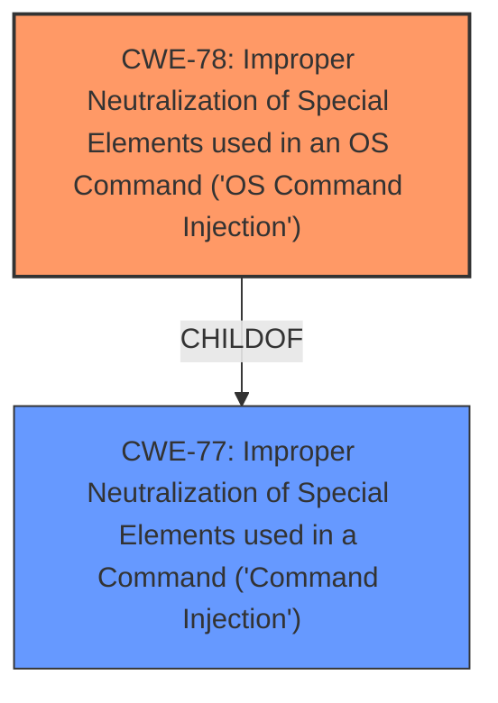

# Analysis for CVE-2024-57036

# Summary
| CWE ID | CWE Name | Confidence | CWE Abstraction Level | CWE Vulnerability Mapping Label | CWE-Vulnerability Mapping Notes |
|---|---|---|---|---|---|
| CWE-78 | Improper Neutralization of Special Elements used in an OS Command ('OS Command Injection') | 1.0 | Base | Allowed | Primary CWE. The vulnerability allows an attacker to execute arbitrary commands by sending an HTTP request due to **improper neutralization of special elements** in the OS command.|

## Evidence and Confidence

*   **Confidence Score:** 1.0
*   **Evidence Strength:** HIGH

## Relationship Analysis
The primary relationship influencing the selection was the child-of relationship between CWE-78 and CWE-77. CWE-78 is a more specific version of CWE-77, as it explicitly refers to OS commands. The vulnerability description specifically mentions command execution via HTTP request, pointing to an OS command context.

## Vulnerability Chain
The vulnerability chain starts with **improper neutralization of special elements** in the `downloadFile.cgi` function, leading to the ability to execute arbitrary commands via an HTTP request.

## Summary of Analysis
The initial assessment strongly suggests CWE-78 as the most appropriate classification. The vulnerability description clearly states that the root cause is a **command injection** vulnerability, which is further refined to the execution of arbitrary commands. The high retriever score for CWE-78 and its alignment with the vulnerability details solidify this decision. The relationship graph reinforces this by showing CWE-78 as a specific type of CWE-77, which is a more general command injection weakness. The provided evidence is strong, with explicit mentions of command injection and arbitrary command execution.

Relevant CWE Information:

*   CWE-77: Improper Neutralization of Special Elements used in a Command ('Command Injection') - Considered but not used because CWE-78 is more specific. It is a Class-level CWE, while CWE-78 is a Base-level CWE.
*   CWE-790: Improper Filtering of Special Elements - Considered but not used. Filtering is one method of neutralization so this is related but not the core issue.
*   CWE-259: Use of Hard-coded Password - Considered but not used. This is unrelated to the vulnerability description.
*   CWE-93: Improper Neutralization of CRLF Sequences ('CRLF Injection') - Considered but not used. This is related to CRLF injection, which is not mentioned in the vulnerability description.
*   CWE-138: Improper Neutralization of Special Elements - Considered but not used. Too general and discouraged.
*   CWE-94: Improper Control of Generation of Code ('Code Injection') - Considered but not used. This is a code injection issue, but command injection is more specific.
*   CWE-96: Improper Neutralization of Directives in Statically Saved Code ('Static Code Injection') - Considered but not used. This is static code injection which is not mentioned in the vulnerability description.
*   CWE-184: Incomplete List of Disallowed Inputs - Considered but not used. This is about having an incomplete list of disallowed inputs, but there is no mention about lists or disallowed inputs.