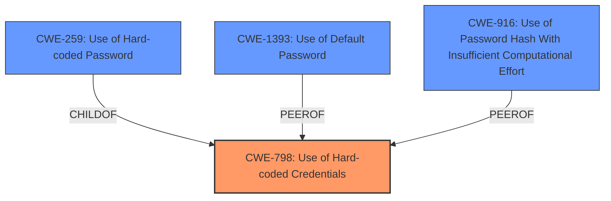

# Analysis for CVE-2024-57040

# Summary
| CWE ID | CWE Name | Confidence | CWE Abstraction Level | CWE Vulnerability Mapping Label | CWE-Vulnerability Mapping Notes |
|---|---|---|---|---|---|
| CWE-798 | Use of Hard-coded Credentials | 1.0 | Base | Primary | Allowed |
| CWE-259 | Use of Hard-coded Password | 0.9 | Variant | Secondary | Allowed |
| CWE-1393 | Use of Default Password | 0.8 | Base | Secondary | Allowed |
| CWE-916 | Use of Password Hash With Insufficient Computational Effort | 0.7 | Base | Secondary | Allowed |

## Evidence and Confidence

*   **Confidence Score:** 0.9
*   **Evidence Strength:** HIGH

## Relationship Analysis
The primary weakness is the **use of hard-coded credentials** (CWE-798). CWE-259 is a more specific variant, representing the use of a hard-coded password. CWE-1393 represents the use of default passwords, which aligns with the vulnerability. The password hash with insufficient computational effort is also present since the password was easily cracked.

## Vulnerability Chain
The vulnerability chain starts with the **hard-coded credentials** (CWE-798), specifically a **hard-coded password** (CWE-259) and a **default password** (CWE-1393). The use of password hash with insufficient computational effort (CWE-916) led to the attacker gaining root user privileges.

## Summary of Analysis
The analysis is based on the vulnerability description, which clearly states the presence of a **hardcoded password** for the root account. The CVE Reference Links Content Summary provides further evidence, mentioning "hardcoded, easily crackable credentials (username "admin" and password "1234") within the router's firmware."

CWE-798 (Use of Hard-coded Credentials) is the primary CWE because it represents the root cause of the vulnerability. CWE-259 (Use of Hard-coded Password) is a more specific variant, which is also applicable. CWE-1393 (Use of Default Password) is applicable because the credentials are "admin" and "1234," which can be considered default values. Since the password was easily cracked, CWE-916 (Use of Password Hash With Insufficient Computational Effort) is also applicable. The selected CWEs are at the optimal level of specificity, with CWE-798 being the base and CWE-259 being a more specific variant.

CWE-522 (Insufficiently Protected Credentials), CWE-425 (Direct Request ('Forced Browsing')), CWE-471 (Modification of Assumed-Immutable Data (MAID)), CWE-1390 (Weak Authentication), and CWE-326 (Inadequate Encryption Strength) were considered but deemed less relevant. While the credentials were "insufficiently protected," the root cause was the **hardcoding** itself, making CWE-798 a more accurate representation. The other CWEs did not directly align with the core issue of hardcoded credentials.