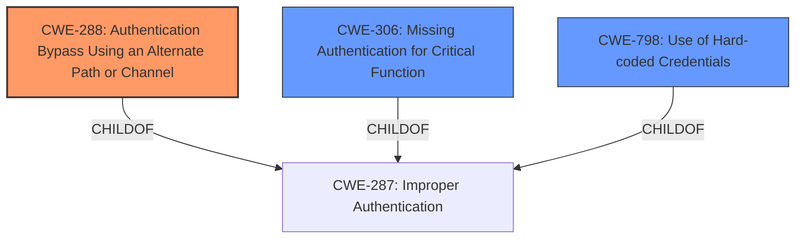

# Analysis Report for CVE-2024-57045

# Vulnerability Analysis Report: CVE-2024-57045

## Description

A vulnerability in the D-Link DIR-859 router with firmware version A3 1.05 and earlier permits unauthorized individuals to bypass the authentication. An attacker can obtain a user name and password by forging a post request to the / getcfg.php page.

## Vulnerability Description Key Phrases

- **Vector:** forging a post request to /getcfg.php
- **Weakness:** authentication bypass
- **Product:** D-Link DIR-859 router
- **Impact:** bypass the authentication, obtain a user name and password
- **Attacker:** unauthorized individuals
- **Version:** A3 1.05 and earlier

## Analysis (with Relationship Data)

# Summary
| CWE ID | CWE Name | Confidence | CWE Abstraction Level | CWE Vulnerability Mapping Label | CWE-Vulnerability Mapping Notes |
|---|---|---|---|---|---|
| CWE-288 | Authentication Bypass Using an Alternate Path or Channel | 0.9 | Base | Allowed | Primary CWE - The attacker bypasses authentication by forging a POST request to a specific page, thus using an alternate path. |
| CWE-306 | Missing Authentication for Critical Function | 0.7 | Base | Allowed | Secondary Candidate - The vulnerability could be due to a missing authentication check for the /getcfg.php page. |
| CWE-798 | Use of Hard-coded Credentials | 0.6 | Base | Allowed | Secondary Candidate - obtaining user name and password may suggest the page is revealing hard-coded credentials. |

## Evidence and Confidence

*   **Confidence Score:** 0.8
*   **Evidence Strength:** MEDIUM

## Relationship Analysis
The primary CWE is CWE-288 (Authentication Bypass Using an Alternate Path or Channel). This has a parent-child relationship with CWE-306 (Missing Authentication for Critical Function) and peer relationships with other authentication bypass CWEs. The selection of CWE-288 as primary is based on the explicit mention of forging a POST request to a specific, unprotected page, indicating the use of an alternate path or channel. The abstraction level (Base) is optimal for mapping the root cause.



## Vulnerability Chain
The vulnerability chain starts with the **weakness** in the D-Link DIR-859 router, specifically the **lack of proper authentication** on the `/getcfg.php` page, leading to **authentication bypass**. This allows an attacker to **obtain usernames and passwords**.

Vulnerability Chain: **Missing Authentication** (CWE-288) -> **Authentication Bypass** -> **Information Disclosure** (username and password).

## Summary of Analysis
The initial analysis focused on the **authentication bypass** due to forging a POST request to `/getcfg.php`. The primary CWE, CWE-288 (Authentication Bypass Using an Alternate Path or Channel), was chosen because it precisely describes the attack vector. The evidence from the vulnerability description key phrases clearly indicates this: "**vector:** forging a post request to /getcfg.php" and "**weakness:** **authentication bypass**".

CWE-306 (Missing Authentication for Critical Function) was considered because the `/getcfg.php` page might be lacking any authentication, but CWE-288 is more specific since it involves using an alternate path. CWE-798 (Use of Hard-coded Credentials) was also considered because the attacker obtains a username and password, which could imply hard-coded credentials being revealed, but the primary issue is the **authentication bypass**.

The graph relationships influenced the selection by highlighting the connection between authentication bypass and missing authentication, but the more specific CWE-288 was favored due to the details of the attack vector. The selected CWEs are at the optimal level of specificity, with CWE-288 being a Base level CWE that directly addresses the root cause. The guidance on Authentication vs Authorization helped to solidify the choice of authentication-related CWEs.

# Relevant CWE Information:

# Enhanced Context (25 CWEs)
The following CWEs were identified as potentially relevant to this vulnerability:

## CWE-288: Authentication Bypass Using an Alternate Path or Channel
**Abstraction Level**: Base
**Similarity Score**: 0.78
**Source**: dense

**Description**:
The product requires authentication, but the product has an alternate path or channel that does not require authentication.

**Mapping Guidance**:
- Usage: Allowed
- Rationale: This CWE entry is at the Base level of abstraction, which is a preferred level of abstraction for mapping to the root causes of vulnerabilities.


## CWE Relationship Analysis

Current CWEs represent these abstraction levels: .


### Vulnerability Chain Analysis

**Chain starting from CWE-288:**
- 288 (Authentication Bypass Using an Alternate Path or Channel) - ROOT


**Chain starting from CWE-306:**
- 306 (Missing Authentication for Critical Function) - ROOT


### CWE Relationship Diagram

```mermaid
graph TD
    classDef primary fill:#f96,stroke:#333,stroke-width:2px
    classDef secondary fill:#69f,stroke:#333
    classDef tertiary fill:#9e9,stroke:#333
```


*Report generated on 2025-07-14 00:03:30*
