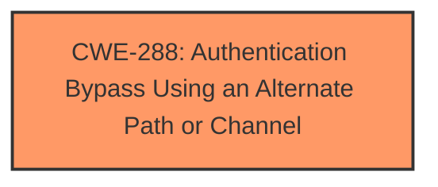

# Enhanced Analysis for CVE-2024-57046

# Summary
| CWE ID | CWE Name | Confidence | CWE Abstraction Level | CWE Vulnerability Mapping Label | CWE-Vulnerability Mapping Notes |
|---|---|---|---|---|---|
| CWE-288 | Authentication Bypass Using an Alternate Path or Channel | 0.9 | Base | Allowed | Primary CWE. The vulnerability allows bypassing authentication by adding "?x=1.gif" to the requested URL, which acts as an alternate path that doesn't require proper authentication. |

## Evidence and Confidence

*   **Confidence Score:** 0.9
*   **Evidence Strength:** HIGH

## Relationship Analysis
The primary CWE selected is CWE-288, which is a Base level CWE. The analysis didn't require navigating a complex hierarchy because the vulnerability description closely aligns with the definition of CWE-288. There were no other parent-child or chain relationships that significantly influenced the decision.



## Vulnerability Chain
The vulnerability chain consists of a single step: the **incorrectly** configured authentication mechanism that allows a bypass via an alternate URL path.

## Summary of Analysis
The analysis is primarily based on the vulnerability description, which states that adding "?x=1.gif" to the URL bypasses authentication. This directly matches the definition of CWE-288: Authentication Bypass Using an Alternate Path or Channel. The high confidence stems from the clear and direct evidence within the description.

# Enhanced Context (25 CWEs)
The following CWEs were identified as potentially relevant to this vulnerability:

## CWE-288: Authentication Bypass Using an Alternate Path or Channel
**Abstraction Level**: Base
**Similarity Score**: 0.77
**Source**: dense

**Description**:
The product requires authentication, but the product has an alternate path or channel that does not require authentication.

**Mapping Guidance**:
- Usage: Allowed
- Rationale: This CWE entry is at the Base level of abstraction, which is a preferred level of abstraction for mapping to the root causes of vulnerabilities.

CWE-287: Improper Authentication
CWE-798: Use of Hard-coded Credentials
CWE-306: Missing Authentication for Critical Function
CWE-259: Use of Hard-coded Password
CWE-121: Stack-based Buffer Overflow
CWE-425: Direct Request ('Forced Browsing')
CWE-201: Insertion of Sensitive Information Into Sent Data
CWE-291: Reliance on IP Address for Authentication
CWE-184: Incomplete List of Disallowed Inputs

The retriever results and the CWE Classification Guidance both helped to refine and confirm the final selection of CWE-288, focusing on the **authentication bypass** aspect through an alternate path. The CWE is at the optimal level of specificity (Base) and is directly supported by the provided evidence.


## CWE Relationship Analysis

Current CWEs represent these abstraction levels: .


### Vulnerability Chain Analysis

**Chain starting from CWE-288:**
- 288 (Authentication Bypass Using an Alternate Path or Channel) - ROOT


**Chain starting from CWE-121:**
- 121 (Stack-based Buffer Overflow) - ROOT


### CWE Relationship Diagram

```mermaid
graph TD
    classDef primary fill:#f96,stroke:#333,stroke-width:2px
    classDef secondary fill:#69f,stroke:#333
    classDef tertiary fill:#9e9,stroke:#333
```