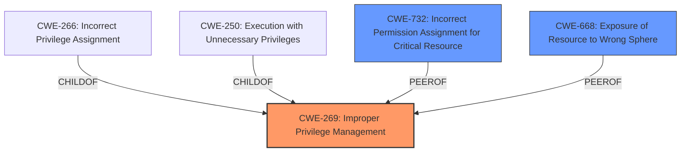

# Analysis Report for CVE-2024-57062

# Vulnerability Analysis Report: CVE-2024-57062

## Description

An issue in SoundCloud IOS application v.7.65.2 allows a local attacker to escalate privileges and obtain sensitive information via the session handling component.

## Vulnerability Description Key Phrases

- **Component:** session handling component
- **Product:** SoundCloud IOS application
- **Impact:** escalate privileges, obtain sensitive information
- **Attacker:** local attacker
- **Version:** v.7.65.2

## Analysis (with Relationship Data)

# Summary
| CWE ID | CWE Name | Confidence | CWE Abstraction Level | CWE Vulnerability Mapping Label | CWE-Vulnerability Mapping Notes |
|---|---|---|---|---|---|
| CWE-269 | Improper Privilege Management | 0.6 | Class | Primary CWE | Discouraged |
| CWE-732 | Incorrect Permission Assignment for Critical Resource | 0.5 | Class | Secondary Candidate | Allowed-with-Review |
| CWE-668 | Exposure of Resource to Wrong Sphere | 0.3 | Class | Secondary Candidate | Discouraged |

## Evidence and Confidence

*   **Confidence Score:** 0.6
*   **Evidence Strength:** LOW

## Relationship Analysis
The primary relationship that influenced the decision was the hierarchical structure of CWEs related to privilege management. Specifically, CWE-269 (Improper Privilege Management) as a Class is a parent of more specific Base CWEs like CWE-266 (Incorrect Privilege Assignment) and CWE-250 (Execution with Unnecessary Privileges). The vulnerability description suggests a privilege escalation issue, which aligns with the general scope of CWE-269, though lacking the specifics to pinpoint a more precise Base CWE.



## Vulnerability Chain
The vulnerability chain for this description is somewhat incomplete due to the lack of specific root cause information. However, the chain can be inferred as follows:
1.  **Initial Flaw:** **Improper Privilege Management** (CWE-269) in the session handling component, but the exact reason is unknown.
2.  **Weakness Progression:** The **improper privilege management** allows a local attacker to escalate privileges.
3.  **Impact:** The attacker can obtain sensitive information.

Missing links: The specific mechanism of how the **improper privilege management** leads to privilege escalation is not detailed.

## Summary of Analysis
The initial assessment focused on identifying the root cause of the privilege escalation and sensitive information disclosure. The vulnerability description mentions a "session handling component" and the ability to "escalate privileges" and "obtain sensitive information."

The primary selection is CWE-269 (Improper Privilege Management). This is a class-level CWE, and the guidance discourages its use, but given the limited information about the root cause, and since the vulnerability involves privilege escalation, CWE-269 serves as a starting point. The evidence for this is the phrase "escalate privileges" in the Vulnerability Description.

CWE-732 (Incorrect Permission Assignment for Critical Resource) was considered because it involves incorrect permission assignments, however the description doesn't explicitly mention resource permissions, so it's a secondary candidate.

CWE-668 (Exposure of Resource to Wrong Sphere) was also considered, since sensitive information is obtained, but the description doesn't provide enough details to confirm this, making it a secondary candidate as well.

The selected CWEs are at a higher level of abstraction (Class) due to the lack of specific details in the vulnerability description. More information about the root cause would allow for a more precise mapping to a Base or Variant CWE.

Relevant CWE Information:
- Vulnerability Description Key Phrases:
  - **impact:** escalate privileges, obtain sensitive information
  - **component:** session handling component


## CWE Relationship Analysis

Current CWEs represent these abstraction levels: .


### Vulnerability Chain Analysis

**Chain starting from CWE-732:**
- 732 (Incorrect Permission Assignment for Critical Resource) - ROOT


**Chain starting from CWE-269:**
- 269 (Improper Privilege Management) - ROOT


### CWE Relationship Diagram

```mermaid
graph TD
    classDef primary fill:#f96,stroke:#333,stroke-width:2px
    classDef secondary fill:#69f,stroke:#333
    classDef tertiary fill:#9e9,stroke:#333
```


*Report generated on 2025-07-14 00:04:37*
