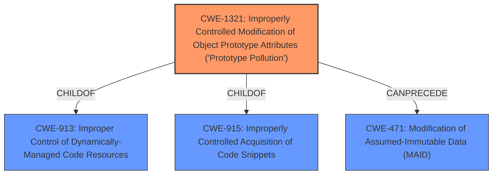

# Analysis Report for CVE-2024-57074

# Vulnerability Analysis Report: CVE-2024-57074

## Description

A **prototype pollution** in the lib.merge function of xe-utils v3.5.31 allows attackers to cause a Denial of Service (DoS) via supplying a crafted payload.

## Vulnerability Description Key Phrases

- **Rootcause:** prototype pollution
- **Impact:** Denial of Service (DoS)
- **Vector:** supplying a crafted payload
- **Attacker:** attackers
- **Product:** xe-utils
- **Version:** v3.5.31
- **Component:** lib.merge function

## Analysis (with Relationship Data)

# Summary
| CWE ID | CWE Name | Confidence | CWE Abstraction Level | CWE Vulnerability Mapping Label | CWE-Vulnerability Mapping Notes |
|---|---|---|---|---|---|
| CWE-1321 | Improperly Controlled Modification of Object Prototype Attributes ('Prototype Pollution') | 1.0 | Variant | Allowed | Primary CWE. The vulnerability description explicitly mentions **prototype pollution**, and the CVE reference links confirm that the vulnerability is due to a lack of proper input validation when merging or setting properties, allowing an attacker to pollute the prototype chain. |

## Evidence and Confidence

*   **Confidence Score:** 1.0
*   **Evidence Strength:** HIGH

## Relationship Analysis
The primary CWE is CWE-1321. There are some relationships to consider.
*   CWE-1321 is a child of CWE-913 and CWE-915. This means that CWE-1321 is a specific type of weakness related to the broader categories they represent.
*   CWE-1321 can precede CWE-471 which means that prototype pollution can lead to modification of assumed immutable data.



## Vulnerability Chain
The vulnerability chain starts with **prototype pollution** (CWE-1321), which can lead to a Denial of Service (DoS).

CWE-1321 (Root Cause) -> DoS (Impact)

## Summary of Analysis
The vulnerability is clearly a **prototype pollution** issue, as stated in the vulnerability description and confirmed by the CVE reference links. The `lib.merge` and `lib.set` functions are vulnerable due to the lack of proper input validation. This allows an attacker to pollute the prototype chain, leading to a Denial of Service (DoS). The primary CWE is CWE-1321, which is the most specific and relevant CWE for this vulnerability.

The retriever results also support this classification, with CWE-1321 being the top result. The MITRE mapping guidance allows for the use of CWE-1321, as it is at the Variant level of abstraction.

Other CWEs were considered but not used because they were either too general or not directly related to the **prototype pollution** issue. For example, CWE-400 (Uncontrolled Resource Consumption) could be a consequence of the DoS, but it is not the root cause. Similarly, CWE-674 (Uncontrolled Recursion) and CWE-776 (Improper Restriction of Recursive Entity References in DTDs ('XML Entity Expansion')) are related to resource consumption but not directly to **prototype pollution**.


## CWE Relationship Analysis

Current CWEs represent these abstraction levels: .


### Vulnerability Chain Analysis

**Chain starting from CWE-471:**
- 471 (Modification of Assumed-Immutable Data (MAID)) - ROOT


**Chain starting from CWE-400:**
- 400 (Uncontrolled Resource Consumption) - ROOT


### CWE Relationship Diagram

```mermaid
graph TD
    classDef primary fill:#f96,stroke:#333,stroke-width:2px
    classDef secondary fill:#69f,stroke:#333
    classDef tertiary fill:#9e9,stroke:#333
```


*Report generated on 2025-07-14 00:05:09*
