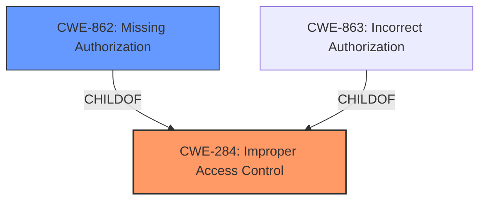

# Analysis Report for CVE-2024-5710

# Vulnerability Analysis Report: CVE-2024-5710

## Description

berriai/litellm version 1.34.34 is vulnerable to **improper access control** in its team management functionality. This vulnerability allows attackers to perform unauthorized actions such as creating, updating, viewing, deleting, blocking, and unblocking any teams, as well as adding or deleting any member to or from any teams. The vulnerability stems from **insufficient access control** checks in various team management endpoints, enabling attackers to exploit these functionalities without proper authorization.

## Vulnerability Description Key Phrases

- **Rootcause:** ['improper access control', 'insufficient access control']
- **Impact:** ['add or delete team members', 'block', 'create', 'delete', 'perform unauthorized actions', 'unblock teams', 'update', 'view']
- **Attacker:** attackers
- **Product:** berriai/litellm
- **Version:** 1.34.34
- **Component:** team management functionality

## Analysis (with Relationship Data)

# Summary
| CWE ID | CWE Name | Confidence | CWE Abstraction Level | CWE Vulnerability Mapping Label | CWE-Vulnerability Mapping Notes |
|---|---|---|---|---|---|
| CWE-284 | Improper Access Control | 0.9 | Class | Primary | Allowed |
| CWE-862 | Missing Authorization | 0.7 | Class | Secondary | Allowed-with-Review |

## Evidence and Confidence

*   **Confidence Score:** 0.8
*   **Evidence Strength:** HIGH

## Relationship Analysis
The primary relationship that impacted my decision was the hierarchical relationship between CWE-284 and its potential children, specifically CWE-862 and CWE-863. Given that the vulnerability description explicitly mentions **insufficient access control** leading to unauthorized actions, selecting the class-level CWE-284 is appropriate, but CWE-862 is a more precise root cause.



## Vulnerability Chain
The vulnerability chain starts with **improper access control**/**insufficient access control** (CWE-284), which leads to the ability to perform unauthorized actions such as creating, updating, viewing, deleting, blocking, and unblocking teams, as well as adding or deleting team members. A more precise root cause for the **improper access control** is **missing authorization** (CWE-862) because the product does not perform an authorization check when an actor attempts to access a resource or perform an action.

## Summary of Analysis
The initial analysis identified several candidate CWEs, but after considering the specific vulnerability details and the relationships between CWEs, CWE-284 and CWE-862 were selected.

The vulnerability description clearly states that the root cause is **improper access control**/**insufficient access control**: "This vulnerability allows attackers to perform unauthorized actions such as creating, updating, viewing, deleting, blocking, and unblocking any teams, as well as adding or deleting any member to or from any teams. The vulnerability stems from **insufficient access control** checks in various team management endpoints, enabling attackers to exploit these functionalities without proper authorization." This statement directly supports the selection of CWE-284 and CWE-862.

The graph relationships influenced the final selection by highlighting the hierarchical structure and the importance of choosing the most specific CWE. CWE-862 is a more specific child of CWE-284 and represents the vulnerability better.

The selected CWEs are at the optimal level of specificity because they accurately represent the weakness and provide valuable information for mitigation efforts.

Relevant CWE Information:

# Enhanced Context (25 CWEs)
The following CWEs were identified as potentially relevant to this vulnerability:

## CWE-284: Improper Access Control
**Abstraction Level**: Class
**Similarity Score**: 372.49/407.92
**Source**: dense

**Description**:
The product does not restrict or incorrectly restricts access to a resource from an unauthorized actor.

**Mapping Guidance**:
- Usage: Allowed
- Rationale: This CWE entry is at the Class level of abstraction.

## CWE-862: Missing Authorization
**Abstraction Level**: Class
**Similarity Score**: 372.74/383.77
**Source**: sparse

**Description**:
The product does not perform an authorization check when an actor attempts to access a resource or perform an action.

**Mapping Guidance**:
- Usage: Allowed-with-Review
- Rationale: This CWE entry is a Class and might have Base-level children that would be more appropriate

## CWE-863: Incorrect Authorization
**Abstraction Level**: Class
**Similarity Score**: 383.77
**Source**: sparse

**Description**:
The product performs an authorization check when an actor attempts to access a resource or perform an action, but it does not correctly perform the check.

**Mapping Guidance**:
- Usage: Allowed-with-Review
- Rationale: This CWE entry is a Class and might have Base-level children that would be more appropriate


## CWE Relationship Analysis

Current CWEs represent these abstraction levels: .


### Vulnerability Chain Analysis

**Chain starting from CWE-284:**
- 284 (Improper Access Control) - ROOT


**Chain starting from CWE-863:**
- 863 (Incorrect Authorization) - ROOT


### CWE Relationship Diagram

```mermaid
graph TD
    classDef primary fill:#f96,stroke:#333,stroke-width:2px
    classDef secondary fill:#69f,stroke:#333
    classDef tertiary fill:#9e9,stroke:#333
```


*Report generated on 2025-07-14 00:07:20*
