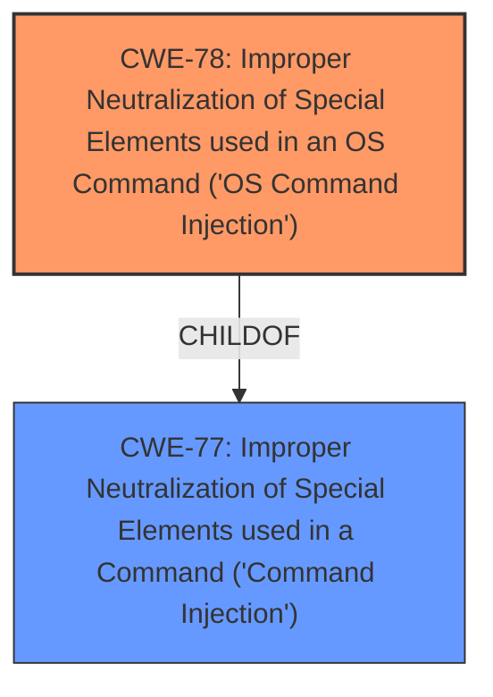

# Analysis Report for CVE-2024-57224

# Vulnerability Analysis Report: CVE-2024-57224

## Description

Linksys E7350 1.1.00.032 was discovered to contain a **command injection** vulnerability via the ifname parameter in the apcli_do_enr_pin_wps function.

## Vulnerability Description Key Phrases

- **Weakness:** command injection
- **Product:** Linksys E7350
- **Version:** 1.1.00.032
- **Component:** apcli_do_enr_pin_wps function

## Analysis (with Relationship Data)

# Summary
| CWE ID | CWE Name | Confidence | CWE Abstraction Level | CWE Vulnerability Mapping Label | CWE-Vulnerability Mapping Notes |
|---|---|---|---|---|---|
| CWE-78 | Improper Neutralization of Special Elements used in an OS Command ('OS Command Injection') | 1.0 | Base | Allowed | Primary CWE |
| CWE-77 | Improper Neutralization of Special Elements used in a Command ('Command Injection') | 0.7 | Class | Allowed-with-Review | Secondary Candidate |

## Evidence and Confidence

*   **Confidence Score:** 1.0
*   **Evidence Strength:** HIGH

## Relationship Analysis
The primary relationship that influenced the decision was the ChildOf relationship between CWE-78 and CWE-77. Since the **command injection** is specifically within the OS, CWE-78, which is a child of CWE-77, is the better and more specific choice.



## Vulnerability Chain
The vulnerability chain starts with the **improper neutralization** of special elements within the ifname parameter, leading to the **command injection** vulnerability. The chain is as follows:
1.  CWE-78 Improper Neutralization of Special Elements used in an OS Command ('OS Command Injection')

## Summary of Analysis
The vulnerability description clearly states a **command injection** vulnerability. The retriever results list CWE-77 and CWE-78 as top candidates. CWE-78 is selected as the primary CWE because the **command injection** occurs specifically within the OS command context. This aligns with the description of CWE-78, which is a more specific case of CWE-77. The evidence is strong, and the selection is based on the vulnerability description and the CWE specifications.

Relevant CWE Information:

# Enhanced Context (25 CWEs)
The following CWEs were identified as potentially relevant to this vulnerability:

## CWE-78: Improper Neutralization of Special Elements used in an OS Command ('OS Command Injection')
**Abstraction Level**: Base
**Similarity Score**: 0.72
**Source**: dense

**Description**:
The product constructs all or part of an OS command using externally-influenced input from an upstream component, but it does not neutralize or incorrectly neutralizes special elements that could modify the intended OS command when it is sent to a downstream component.

**Mapping Guidance**:
- Usage: Allowed
- Rationale: This CWE entry is at the Base level of abstraction, which is a preferred level of abstraction for mapping to the root causes of vulnerabilities.

## CWE-77: Improper Neutralization of Special Elements used in a Command ('Command Injection')
**Abstraction Level**: Class
**Similarity Score**: 0.70
**Source**: dense

**Description**:
The product constructs all or part of a command using externally-influenced input from an upstream component, but it does not neutralize or incorrectly neutralizes special elements that could modify the intended command when it is sent to a downstream component.

**Mapping Guidance**:
- Usage: Allowed-with-Review
- Rationale: CWE-77 is often misused when OS command injection (CWE-78) was intended instead [REF-1287].


## CWE Relationship Analysis

Current CWEs represent these abstraction levels: .


### Vulnerability Chain Analysis

**Chain starting from CWE-77:**
- 77 (Improper Neutralization of Special Elements used in a Command ('Command Injection')) - ROOT


**Chain starting from CWE-78:**
- 78 (Improper Neutralization of Special Elements used in an OS Command ('OS Command Injection')) - ROOT


### CWE Relationship Diagram

```mermaid
graph TD
    classDef primary fill:#f96,stroke:#333,stroke-width:2px
    classDef secondary fill:#69f,stroke:#333
    classDef tertiary fill:#9e9,stroke:#333
```


*Report generated on 2025-07-14 00:11:15*
