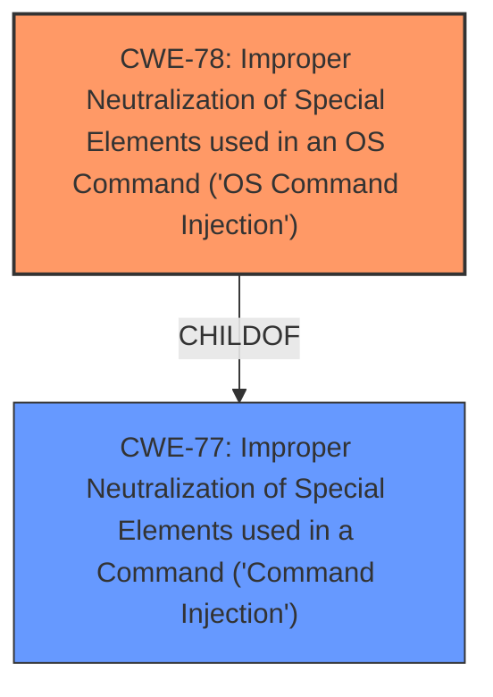

# Analysis Report for CVE-2024-57225

# Vulnerability Analysis Report: CVE-2024-57225

## Description

Linksys E7350 1.1.00.032 was discovered to contain a **command injection vulnerability** via the devname parameter in the reset_wifi function.

## Vulnerability Description Key Phrases

- **Weakness:** command injection vulnerability
- **Product:** Linksys E7350
- **Version:** 1.1.00.032
- **Component:** reset_wifi function

## Analysis (with Relationship Data)

# Summary

| CWE ID | CWE Name | Confidence | CWE Abstraction Level | CWE Vulnerability Mapping Label | CWE-Vulnerability Mapping Notes |
|---|---|---|---|---|---|
| CWE-78 | Improper Neutralization of Special Elements used in an OS Command ('OS Command Injection') | 1.0 | Base | Allowed | Primary CWE. The vulnerability description explicitly states a command injection vulnerability. CWE-78 is the most specific and appropriate CWE for OS command injection. |

## Evidence and Confidence

*   **Confidence Score:** 1.0
*   **Evidence Strength:** HIGH

## Relationship Analysis
The primary relationship considered was the ChildOf relationship, specifically how CWE-78 (OS Command Injection) relates to its parent CWE-77 (Command Injection). While CWE-77 is a broader category, the vulnerability description explicitly mentions OS commands, making CWE-78 the more specific and accurate choice.



## Vulnerability Chain
The vulnerability chain consists of a single step:

1.  **Root Cause:** **Improper Neutralization of Special Elements** in the `devname` parameter within the `reset_wifi` function (CWE-78). This leads directly to...
2.  **Impact:** Command injection, allowing an attacker to execute arbitrary OS commands.

## Summary of Analysis
The initial analysis correctly identified the presence of a **command injection vulnerability** in the Linksys E7350 router. The vulnerability description clearly states this **weakness**, and the affected parameter and function are identified.

The Retriever Results listed CWE-77 as the top result. However, CWE-78 is more specific since the vulnerability is related to OS commands, making it a better fit.

The final decision to use CWE-78 is based on the explicit mention of "command injection" in the vulnerability description, combined with the understanding that this refers to OS commands in the context of a network device. This makes CWE-78 the most accurate and specific CWE to describe the vulnerability.

Relevant CWE Information:
- **Vulnerability Description Key Phrases**: **weakness: command injection vulnerability**

I am confident in this assessment because the evidence directly supports the classification. The selection of CWE-78 is at the optimal level of specificity because it accurately reflects the type of command injection present in the vulnerability.


## CWE Relationship Analysis

Current CWEs represent these abstraction levels: .


### Vulnerability Chain Analysis

**Chain starting from CWE-77:**
- 77 (Improper Neutralization of Special Elements used in a Command ('Command Injection')) - ROOT


**Chain starting from CWE-78:**
- 78 (Improper Neutralization of Special Elements used in an OS Command ('OS Command Injection')) - ROOT


### CWE Relationship Diagram

```mermaid
graph TD
    classDef primary fill:#f96,stroke:#333,stroke-width:2px
    classDef secondary fill:#69f,stroke:#333
    classDef tertiary fill:#9e9,stroke:#333
```


*Report generated on 2025-07-14 00:11:27*
