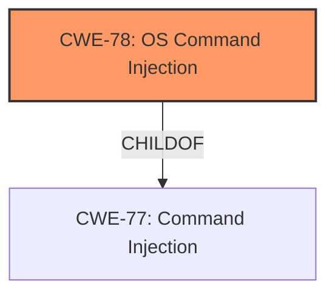

# Raw Analyzer Response for CVE-2024-57226

# Summary

| CWE ID  | CWE Name                                                                                    | Confidence | CWE Abstraction Level | CWE Vulnerability Mapping Label | CWE-Vulnerability Mapping Notes |
| :-------- | :------------------------------------------------------------------------------------------ | :--------- | :---------------------- | :------------------------------ | :------------------------------ |
| CWE-78  | Improper Neutralization of Special Elements used in an OS Command ('OS Command Injection') | 1          | Base                    | Primary                         | Allowed                         |

## Evidence and Confidence

*   **Confidence Score:** 1
*   **Evidence Strength:** HIGH

## Relationship Analysis

The primary relationship that influenced the decision was the ChildOf relationship between CWE-78 and CWE-77. While CWE-77 is a broader category, the vulnerability description specifically points to OS command injection, making CWE-78 a more precise and appropriate choice.

## Vulnerability Chain

The vulnerability chain is straightforward:

1.  **Root Cause:** **Command injection** due to **improper neutralization** of special elements in the `iface` parameter.
2.  **Impact:** Execution of arbitrary OS commands.

## Summary of Analysis

The vulnerability description clearly states a **command injection** vulnerability in the `iface` parameter of the `vif_enable` function. The description contains "**command injection**" which maps directly to CWE-78 Improper Neutralization of Special Elements used in an OS Command ('OS Command Injection').

The Retriever Results also lists CWE-77 Improper Neutralization of Special Elements used in a Command ('Command Injection') which is a parent of CWE-78. However, since the vulnerability specifically involves OS commands, CWE-78 is the more accurate and specific choice.

Therefore, the final decision is to assign CWE-78 as the primary CWE with high confidence.

# Relevant CWE Information:

# Enhanced Context (25 CWEs)
The following CWEs were identified as potentially relevant to this vulnerability:

## CWE-78: Improper Neutralization of Special Elements used in an OS Command ('OS Command Injection')
**Abstraction Level**: Base
**Similarity Score**: 0.72
**Source**: dense

**Description**:
The product constructs all or part of an OS command using externally-influenced input from an upstream component, but it does not neutralize or incorrectly neutralizes special elements that could modify the intended OS command when it is sent to a downstream component.

**Mapping Guidance**:
- Usage: Allowed
- Rationale: This CWE entry is at the Base level of abstraction, which is a preferred level of abstraction for mapping to the root causes of vulnerabilities.

**Relationships**:
- CANFOLLOW -> CWE-184
- CANALSOBE -> CWE-88
- CHILDOF -> CWE-77
- CHILDOF -> CWE-77
- CHILDOF -> CWE-74