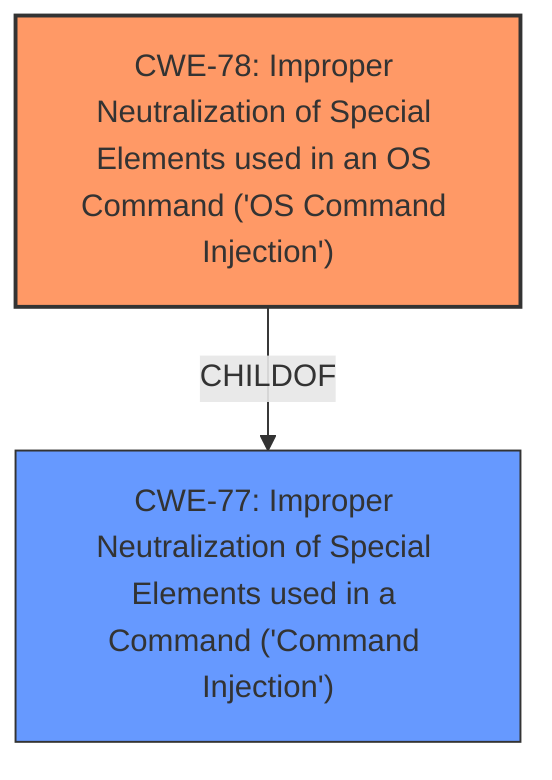

# Analysis for CVE-2024-57228

# Summary
| CWE ID | CWE Name | Confidence | CWE Abstraction Level | CWE Vulnerability Mapping Label | CWE-Vulnerability Mapping Notes |
|---|---|---|---|---|---|
| CWE-78 | Improper Neutralization of Special Elements used in an OS Command ('OS Command Injection') | 1.0 | Base | Allowed | Primary CWE |

## Evidence and Confidence

*   **Confidence Score:** 1.0
*   **Evidence Strength:** HIGH

## Relationship Analysis
The primary relationship that influenced the decision was the hierarchical relationship between CWE-77 (Improper Neutralization of Special Elements used in a Command ('Command Injection')) and CWE-78 (Improper Neutralization of Special Elements used in an OS Command ('OS Command Injection')). CWE-78 is a child of CWE-77, representing a more specific case of command injection targeting the operating system. Given the vulnerability description explicitly mentions "command injection" and is related to operating system commands, CWE-78 was chosen for its specificity.

## Vulnerability Chain
The vulnerability chain consists of a single point: the **improper neutralization** of special elements in the `iface` parameter, leading directly to OS command injection.

## Summary of Analysis
The vulnerability description clearly states a **command injection** vulnerability in the `iface` parameter of the `vif_disable` function. The retriever results also highly suggest CWE-77 and CWE-78. Given that this command injection specifically relates to operating system commands, CWE-78 (Improper Neutralization of Special Elements used in an OS Command ('OS Command Injection')) is the most appropriate choice. This CWE is a Base level weakness, which is the preferred level of abstraction. The evidence is strong, and the confidence is high.

The other CWEs were considered but not selected:

*   CWE-77 (Improper Neutralization of Special Elements used in a Command ('Command Injection')): While also related to command injection, it is a more general case than CWE-78, which specifically targets OS commands. Therefore, CWE-78 is more precise.
*   CWE-790 (Improper Filtering of Special Elements): This is a Class-level CWE and less specific than CWE-78. Also, the description mentions **improper neutralization**, not filtering.
*   CWE-89 (Improper Neutralization of Special Elements used in an SQL Command ('SQL Injection')): This is specific to SQL commands, which is not relevant to the vulnerability description.
*   CWE-96 (Improper Neutralization of Directives in Statically Saved Code ('Static Code Injection')): This is related to static code injection, which is not the case here.
*   CWE-88 (Improper Neutralization of Argument Delimiters in a Command ('Argument Injection')): This is related to argument injection, but the description indicates general command injection.
*   CWE-74 (Improper Neutralization of Special Elements in Output Used by a Downstream Component ('Injection')): This is a high-level CWE and is often misused when lower-level weaknesses are more appropriate.
*   CWE-138 (Improper Neutralization of Special Elements): This is a Class-level CWE and less specific.
*   CWE-184 (Incomplete List of Disallowed Inputs): This CWE is not directly related to the described vulnerability.