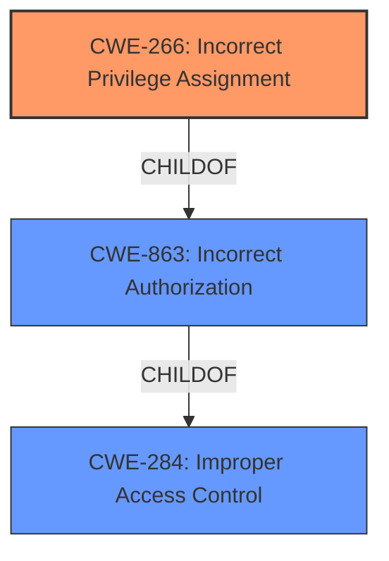

# Analysis Report for CVE-2024-57360

# Vulnerability Analysis Report: CVE-2024-57360

## Description

https//www.gnu.org/software/binutils/ nm >=2.43 is affected by **Incorrect Access Control**. The type of exploitation is local. The component is `nm --without-symbol-version` function.

## Vulnerability Description Key Phrases

- **Rootcause:** Incorrect Access Control
- **Product:** binutils
- **Version:** >2.43
- **Component:** nm --without-symbol-version function

## Analysis (with Relationship Data)

# Summary
| CWE ID   | CWE Name                                                       | Confidence | CWE Abstraction Level | CWE Vulnerability Mapping Label | CWE-Vulnerability Mapping Notes |
| :-------- | :------------------------------------------------------------- | :--------- | :-------------------- | :------------------------------ | :------------------------------ |
| CWE-266 | Incorrect Privilege Assignment                                             | 0.8       | Base                   | Primary CWE                     | Allowed |
| CWE-284   | Improper Access Control                                        | 0.6       | Pillar                | Secondary Candidate                    | Discouraged                    |
| CWE-863   | Incorrect Authorization                                        | 0.5       | Class                 | Secondary Candidate                     | Allowed-with-Review                    |

## Evidence and Confidence

*   **Confidence Score:** 0.7
*   **Evidence Strength:** MEDIUM

## Relationship Analysis
The primary CWE selected is CWE-266 (Incorrect Privilege Assignment) at the Base level. CWE-284 (Improper Access Control) and CWE-863 (Incorrect Authorization) were also considered, but ultimately deemed less specific. CWE-284 is a high-level Pillar, while CWE-863 is a Class. The relationship between these CWEs shows a hierarchy, with CWE-284 being the most general and CWE-266 being more specific to privilege assignment issues.



## Vulnerability Chain
The vulnerability chain starts with **Incorrect Access Control**, which leads to unintended access.

## Summary of Analysis
The initial assessment pointed to CWE-284 as a general access control issue. However, after reviewing the retriever results and guidance, CWE-266 (Incorrect Privilege Assignment) was selected as the primary CWE because it more specifically addresses the **root cause** of the vulnerability. The vulnerability description indicates an **incorrect access control** issue within the `nm` function. Given the available information, CWE-266 best fits the scenario where a privilege is incorrectly assigned, leading to the access control issue.

Relevant CWE Information:

# Enhanced Context (25 CWEs)
The following CWEs were identified as potentially relevant to this vulnerability:

## CWE Classification Guidance

The following guidance has been automatically included because relevant keywords were detected in the vulnerability description:

### Authentication vs Authorization vs Access Control Guidance

## Vulnerability Analysis

**CWE-266: Incorrect Privilege Assignment**

*   **Description**: A product incorrectly assigns a privilege to a particular actor, creating an unintended sphere of control for that actor.
*   **How it matches**: The vulnerability description states "**Incorrect Access Control**" in the `nm --without-symbol-version` function. This suggests that the function might be assigning privileges incorrectly, leading to the access control issue.
*   **Security Implications**: This can lead to unauthorized access to sensitive information or functionality.
*   **Relationship**: Child of CWE-863 (Incorrect Authorization), which is a child of CWE-284 (Improper Access Control).
*   **Mapping Guidance**: Allowed.
*   **Confidence**: 0.8

**CWE-284: Improper Access Control**

*   **Description**: The product does not adequately control access to resources or functions, allowing unintended access.
*   **How it matches**: The vulnerability description explicitly mentions "**Incorrect Access Control**".
*   **Security Implications**: This can lead to unauthorized access to sensitive information or functionality.
*   **Relationship**: Pillar-level CWE. Parent of CWE-863 and others.
*   **Mapping Guidance**: Discouraged if a more specific CWE is available.
*   **Confidence**: 0.6. While the description mentions "**Incorrect Access Control**", it's too generic.

**CWE-863: Incorrect Authorization**

*   **Description**: The product performs an authorization check when an actor attempts to access a resource or perform an action, but it does not correctly perform the check.
*   **How it matches**: While the description mentions "**Incorrect Access Control**", it can be inferred that the authorization check might be performed incorrectly.
*   **Security Implications**: This can lead to unauthorized access to sensitive information or functionality.
*   **Relationship**: Child of CWE-284.
*   **Mapping Guidance**: Allowed-with-Review.
*   **Confidence**: 0.5. This is a possibility, but not as directly supported as CWE-266.

**CWEs Considered but Not Used:**

*   CWE-306 (Missing Authentication for Critical Function): This CWE was not used because the vulnerability description does not explicitly mention missing authentication, but rather an access control problem. The vulnerability description does not provide any information related to the authentication mechanism in the affected component.
*   CWE-639 (Authorization Bypass Through User-Controlled Key): This CWE was not used because the description doesn't indicate a user-controlled key is involved in the authorization process.
*   CWE-732 (Incorrect Permission Assignment for Critical Resource): This CWE was not used because the description indicates a privilege assignment problem, not a permission assignment problem.


## CWE Relationship Analysis

Current CWEs represent these abstraction levels: .


### Vulnerability Chain Analysis

**Chain starting from CWE-863:**
- 863 (Incorrect Authorization) - ROOT


**Chain starting from CWE-732:**
- 732 (Incorrect Permission Assignment for Critical Resource) - ROOT


### CWE Relationship Diagram

```mermaid
graph TD
    classDef primary fill:#f96,stroke:#333,stroke-width:2px
    classDef secondary fill:#69f,stroke:#333
    classDef tertiary fill:#9e9,stroke:#333
```


*Report generated on 2025-07-14 00:19:12*
