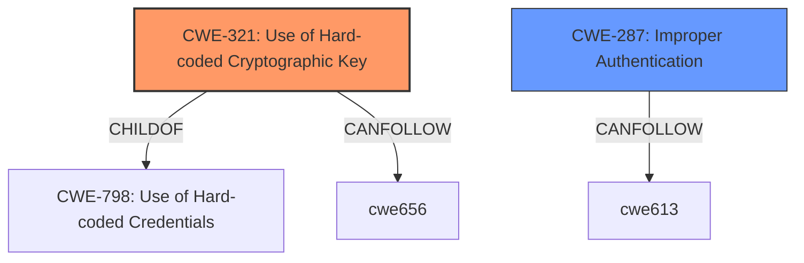

# Analysis Report for CVE-2024-57432

# Vulnerability Analysis Report: CVE-2024-57432

## Description

macrozheng mall-tiny 1.0.1 suffers from **Insecure Permissions**. The applications **JWT signing keys are hardcoded and do not change**. User information is explicitly written into the JWT and used for subsequent privilege management, making it is possible to forge the JWT of any user to achieve authentication bypass.

## Vulnerability Description Key Phrases

- **Rootcause:** JWT signing keys are hardcoded and do not change
- **Weakness:** Insecure Permissions
- **Impact:** authentication bypass
- **Product:** macrozheng mall-tiny
- **Version:** 1.0.1

## Analysis (with Relationship Data)

# Summary
| CWE ID  | CWE Name                                      | Confidence | CWE Abstraction Level | CWE Vulnerability Mapping Label | CWE-Vulnerability Mapping Notes |
| ------- | --------------------------------------------- | ---------- | --------------------- | ------------------------------- | --------------------------------- |
| CWE-321 | Use of Hard-coded Cryptographic Key           | 1          | Variant               | Primary                         | Allowed                           |
| CWE-287 | Improper Authentication                       | 0.6        | Class                 | Secondary                       | Discouraged                       |

## Evidence and Confidence

*   **Confidence Score:** 0.8
*   **Evidence Strength:** HIGH

## Relationship Analysis
The primary relationship influencing the CWE selection is the ChildOf relationship, where CWE-321 is a child of CWE-798 (Use of Hard-coded Credentials). This more specific variant is preferred. While CWE-287 (Improper Authentication) is related to authentication bypass, the root cause is the hardcoded key, making CWE-321 more appropriate as the primary CWE. CWE-259 (Use of Hard-coded Password) is a peer of CWE-321, but the vulnerability description specifies cryptographic keys, making CWE-321 more accurate.



## Vulnerability Chain
The vulnerability chain starts with the **hardcoded JWT signing key (CWE-321)**, which allows an attacker to forge JWTs. This leads to **authentication bypass (CWE-287)**, granting unauthorized access. The root cause is the hardcoded key, making it the primary weakness.

## Summary of Analysis
The analysis is based on the vulnerability description, which explicitly states that the **JWT signing keys are hardcoded and do not change**. This directly corresponds to CWE-321 (Use of Hard-coded Cryptographic Key). The resulting authentication bypass is a consequence of this weakness, supporting CWE-287 as a secondary consideration. The selection of CWE-321 is based on its specific match to the root cause. The evidence is strong, and the CWE is at the appropriate level of specificity (Variant). The guidance around Authentication vs Authorization helped to clarify the difference.

Relevant CWE Information:

# Enhanced Context (2 CWEs)

## CWE-321: Use of Hard-coded Cryptographic Key
**Abstraction Level**: Variant
**Similarity Score**: 3.88
**Source**: graph

**Description**:
CWE-321: Use of Hard-coded Cryptographic Key

**Mapping Guidance**:
- Usage: Allowed
- Rationale: This CWE entry is at the Variant level of abstraction, which is a preferred level of abstraction for mapping to the root causes of vulnerabilities.

**Relationships**:
- CANFOLLOW -> CWE-656
- CHILDOF -> CWE-798
- PARENTOF -> CWE-321

## CWE-287: Improper Authentication
**Abstraction Level**: Class
**Similarity Score**: 1935.88
**Source**: sparse

**Description**:
When an actor claims to have a given identity, the product does not prove or insufficiently proves that the claim is correct.

**Mapping Guidance**:
- Usage: Discouraged
- Rationale: This CWE entry might be misused when lower-level CWE entries are likely to be applicable. It is a level-1 Class (i.e., a child of a Pillar).


## CWE Relationship Analysis

Current CWEs represent these abstraction levels: .


### Vulnerability Chain Analysis

**Chain starting from CWE-321:**
- 321 (Use of Hard-coded Cryptographic Key) - ROOT


**Chain starting from CWE-798:**
- 798 (Use of Hard-coded Credentials) - ROOT


### CWE Relationship Diagram

```mermaid
graph TD
    classDef primary fill:#f96,stroke:#333,stroke-width:2px
    classDef secondary fill:#69f,stroke:#333
    classDef tertiary fill:#9e9,stroke:#333
```


*Report generated on 2025-07-14 00:20:27*
