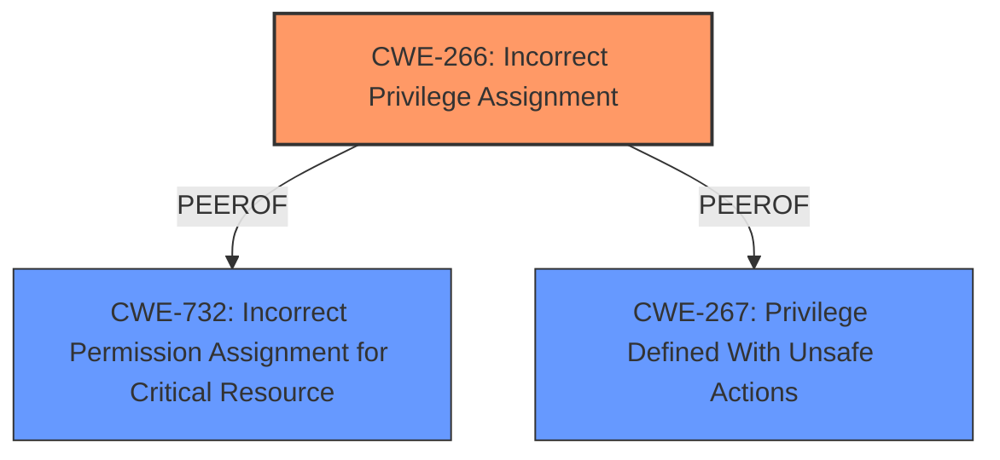

# Raw Analyzer Response for CVE-2024-57438

# Summary
| CWE ID | CWE Name | Confidence | CWE Abstraction Level | CWE Vulnerability Mapping Label | CWE-Vulnerability Mapping Notes |
|---|---|---|---|---|---|
| **CWE-266** | **Incorrect Privilege Assignment** | 0.9 | Base | Primary CWE | Allowed |
| CWE-732 | Incorrect Permission Assignment for Critical Resource | 0.7 | Class | Secondary Candidate | Allowed-with-Review |
| CWE-267 | Privilege Defined With Unsafe Actions | 0.6 | Base | Secondary Candidate | Allowed |

## Evidence and Confidence

*   **Confidence Score:** 0.9
*   **Evidence Strength:** MEDIUM

## Relationship Analysis
The primary relationship that influenced the selection was the differentiation between privileges and permissions. The vulnerability description explicitly states that authenticated attackers can "escalate privileges by assigning themselves higher level roles," indicating an issue with privilege assignment rather than resource permissions. CWE-266, with its focus on incorrect assignment of privileges to actors, directly addresses this root cause.

The graph relationships were not directly applicable as the primary focus was on privilege assignment rather than file access, inheritance, or symbolic name mapping.

## Vulnerability Chain
The vulnerability chain starts with **insecure permissions** (likely a configuration issue or a flaw in the privilege assignment logic). This leads to the impact of authenticated attackers being able to escalate their privileges by assigning themselves higher level roles.
  - **Root Cause:** **Insecure permissions** leading to **incorrect privilege assignment**
  - **Impact:** Privilege escalation

## Summary of Analysis
The initial analysis focused on identifying the root cause of the vulnerability based on the provided description. The key phrase "**insecure permissions**" and the impact of "escalate privileges by assigning themselves higher level roles" strongly suggested a problem with privilege assignment.

The retriever results provided several candidate CWEs, including CWE-732, CWE-266, and CWE-267. After careful consideration and referencing the provided CWE Classification Guidance differentiating privileges from permissions, CWE-266 was chosen as the primary CWE because it directly addresses the **incorrect privilege assignment**, aligning with the vulnerability's root cause of **insecure permissions** leading to the ability to assign oneself higher-level roles.

CWE-732 was considered but deemed less appropriate as it focuses on incorrect permission assignments for *resources*, whereas this vulnerability centers on the assignment of *privileges* to users. The CWE Classification Guidance also indicates that while the name of CWE-732 suggests resource permission assignments, it is often misused for vulnerabilities in which "permissions" are not checked, which is more in line with authorization weaknesses. However, it can be a secondary candidate, as the underlying issue might involve how permissions are handled internally during privilege assignment.

CWE-267 was also considered as a secondary candidate, as the vulnerability might involve privileges being defined with unsafe actions. However, the description leans more toward the incorrect assignment of privileges rather than the definition of unsafe privileges.

The selection of CWE-266 is at the optimal level of specificity (Base) as it directly addresses the root cause of the vulnerability.

Relevant CWE Information:

# Enhanced Context (25 CWEs)
The following CWEs were identified as potentially relevant to this vulnerability:

## CWE-266: Incorrect Privilege Assignment
**Abstraction Level**: Base
**Similarity Score**: 0.79
**Source**: dense

**Description**:
A product incorrectly assigns a privilege to a particular actor, creating an unintended sphere of control for that actor.

**Mapping Guidance**:
- Usage: Allowed
- Rationale: This CWE entry is at the Base level of abstraction, which is a preferred level of abstraction for mapping to the root causes of vulnerabilities.

## CWE-732: Incorrect Permission Assignment for Critical Resource
**Abstraction Level**: Class
**Similarity Score**: 1773.65
**Source**: sparse

**Description**:
The product specifies permissions for a security-critical resource in a way that allows that resource to be read or modified by unintended actors.

**Mapping Guidance**:
- Usage: Allowed-with-Review
- Rationale: While the name itself indicates an assignment of permissions for resources, this is often misused for vulnerabilities in which "permissions" are not checked, which is an "authorization" weakness (CWE-285 or descendants) within CWE's model [REF-1287].

## CWE-267: Privilege Defined With Unsafe Actions
**Abstraction Level**: Base
**Similarity Score**: 0.77
**Source**: dense

**Description**:
A particular privilege, role, capability, or right can be used to perform unsafe actions that were not intended, even when it is assigned to the correct entity.

**Mapping Guidance**:
- Usage: Allowed
- Rationale: This CWE entry is at the Base level of abstraction, which is a preferred level of abstraction for mapping to the root causes of vulnerabilities.