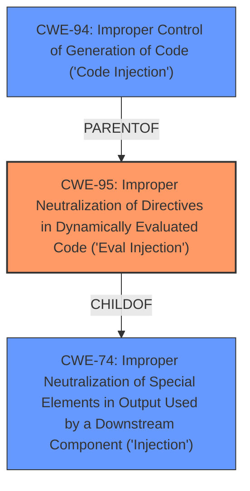

# Raw Analyzer Response for CVE-2024-5751

# Summary
| CWE ID | CWE Name | Confidence | CWE Abstraction Level | CWE Vulnerability Mapping Label | CWE-Vulnerability Mapping Notes |
|---|---|---|---|---|---|
| CWE-95 | Improper Neutralization of Directives in Dynamically Evaluated Code ('Eval Injection') | 0.9 | Variant | Primary | Allowed |
| CWE-74 | Improper Neutralization of Special Elements in Output Used by a Downstream Component ('Injection') | 0.6 | Class | Secondary Candidate | Discouraged |
| CWE-94 | Improper Control of Generation of Code ('Code Injection') | 0.5 | Base | Secondary Candidate | Allowed-with-Review |

## Evidence and Confidence

*   **Confidence Score:** 0.8
*   **Evidence Strength:** MEDIUM

## Relationship Analysis
The primary relationship influencing the decision is the parent-child relationship between CWE-74 (Improper Neutralization of Special Elements in Output Used by a Downstream Component ('Injection')) and CWE-95 (Improper Neutralization of Directives in Dynamically Evaluated Code ('Eval Injection')). CWE-95 is a variant of CWE-74, providing a more specific classification for the vulnerability involving dynamic code evaluation.

## Vulnerability Chain
The vulnerability chain starts with the receipt of a malicious payload via the `/config/update` endpoint. The **improper neutralization** of directives in this payload when processed by the `add_deployment` function, specifically during the decoding and decryption of environment variables, leads to the execution of arbitrary code. The root cause is the **lack of proper input validation** and sanitization before the dynamic evaluation takes place.

## Summary of Analysis
The primary classification is CWE-95 (Improper Neutralization of Directives in Dynamically Evaluated Code ('Eval Injection')) because the vulnerability description explicitly states that the `add_deployment` function decodes and decrypts environment variables from base64 and assigns them to `os.environ`, leading to remote code execution. This aligns directly with the CWE-95 description, which involves **improper neutralization** of code syntax before dynamic evaluation. The vulnerability occurs when a malicious payload is sent to the `/config/update` endpoint, processed, and executed by the server when the `get_secret` function is triggered. This is strong evidence of dynamic evaluation of untrusted input.

CWE-74 (Improper Neutralization of Special Elements in Output Used by a Downstream Component ('Injection')) was considered due to its broader scope encompassing various injection vulnerabilities. However, CWE-95 is more specific as it focuses on dynamic code evaluation, making it a better fit.

CWE-94 (Improper Control of Generation of Code ('Code Injection')) was also considered because the vulnerability leads to code execution. However, CWE-95 is a more precise description of the root cause, which involves **improper neutralization** during dynamic evaluation rather than a general code injection scenario.

The decision is based on the provided evidence, particularly the vulnerability description's emphasis on dynamic evaluation and the **improper neutralization** of directives. The hierarchical relationships between CWEs, specifically the child-of relationship between CWE-95 and CWE-74, influenced the selection of the more specific CWE-95. The retriever results also show that CWE-95 is a strong candidate with a high score based on the description.