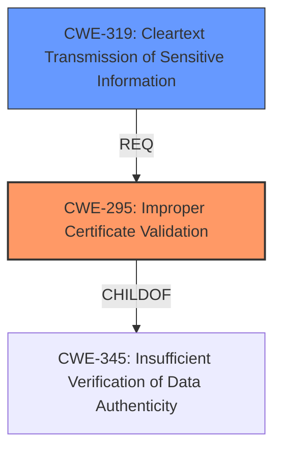

# Enhanced Analysis for CVE-2024-5754

# Summary
| CWE ID | CWE Name | Confidence | CWE Abstraction Level | CWE Vulnerability Mapping Label | CWE-Vulnerability Mapping Notes |
|---|---|---|---|---|---|
| CWE-295 | Improper Certificate Validation | 0.9 | Base | Allowed | Primary CWE. The Bluetooth host **incorrectly trusts** the `error_code` field of the encryption change event, instead of the `encrypt` field, resulting in **improper validation** of the encryption status. |
| CWE-319 | Cleartext Transmission of Sensitive Information | 0.7 | Base | Allowed | Secondary CWE. If the encryption is not properly validated, sensitive information might be transmitted in cleartext.|

## Evidence and Confidence

*   **Confidence Score:** 0.8
*   **Evidence Strength:** MEDIUM

## Relationship Analysis
The primary CWE selected is CWE-295, "Improper Certificate Validation," because the vulnerability stems from the incorrect handling of the encryption change event status, leading to ineffective certificate validation. A secondary CWE, CWE-319, "Cleartext Transmission of Sensitive Information," is also considered because the failure to validate the encryption status can result in sensitive data being transmitted without encryption.



## Vulnerability Chain
The vulnerability chain starts with **improper validation** of the encryption status (CWE-295), which leads to a failure to establish a secure, encrypted connection. This failure can then result in sensitive information being transmitted in cleartext (CWE-319), exposing the data to potential eavesdropping or interception.

## Summary of Analysis
The primary weakness, as stated in the CVE Reference Links Content Summary, is that "The Zephyr Bluetooth host **incorrectly trusts** the `error_code` field of the encryption change event, instead of the `encrypt` field." This aligns directly with CWE-295, Improper Certificate Validation, as the host is not properly validating the encryption status. The evidence supports this classification because it describes a scenario where a malicious peripheral can falsely indicate a successful encryption procedure.

CWE-319 (Cleartext Transmission of Sensitive Information) is included as a potential impact of the primary weakness. If the encryption is not properly validated (CWE-295), sensitive information may be transmitted without encryption.

CWE-295 is at the Base level of abstraction, and CWE-319 is at the Base level of abstraction, which is the preferred level.

Other CWEs Considered but Not Used:

*   CWE-297: Improper Validation of Certificate with Host Mismatch - While related to certificate validation, the core issue is not a mismatch between the host and the certificate, but rather the **improper handling** of the encryption status itself.
*   CWE-327: Use of a Broken or Risky Cryptographic Algorithm - The description doesn't indicate a weak or broken algorithm, but rather a **failure to validate** whether encryption is actually active.
*   CWE-311: Missing Encryption of Sensitive Data - Similar to CWE-319 but more general. CWE-319 is preferred because it explicitly mentions cleartext transmission, which aligns better with the potential impact.
*   CWE-345: Insufficient Verification of Data Authenticity - While related, CWE-295 is more specific to the certificate validation aspect of the vulnerability.


## CWE Relationship Analysis

Current CWEs represent these abstraction levels: .


### Vulnerability Chain Analysis

**Chain starting from CWE-327:**
- 327 (Use of a Broken or Risky Cryptographic Algorithm) - ROOT


**Chain starting from CWE-345:**
- 345 (Insufficient Verification of Data Authenticity) - ROOT


### CWE Relationship Diagram

```mermaid
graph TD
    classDef primary fill:#f96,stroke:#333,stroke-width:2px
    classDef secondary fill:#69f,stroke:#333
    classDef tertiary fill:#9e9,stroke:#333
```