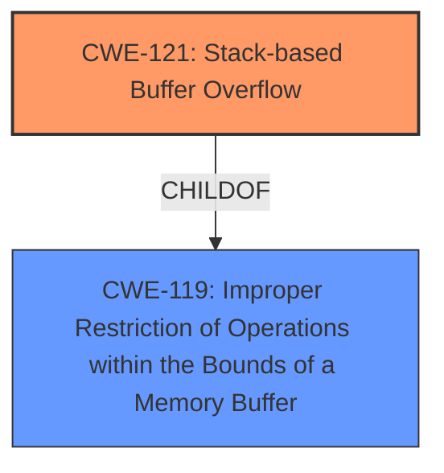

# Analysis Report for CVE-2024-57582

# Vulnerability Analysis Report: CVE-2024-57582

## Description

Tenda AC18 V15.03.05.19 was discovered to contain a **stack overflow** via the startIP parameter in the formSetPPTPServer function.

## Vulnerability Description Key Phrases

- **Weakness:** stack overflow
- **Product:** Tenda AC18
- **Version:** V15.03.05.19
- **Component:** formSetPPTPServer function

## Analysis (with Relationship Data)

# Summary
| CWE ID | CWE Name | Confidence | CWE Abstraction Level | CWE Vulnerability Mapping Label | CWE-Vulnerability Mapping Notes |
|---|---|---|---|---|---|
| CWE-121 | Stack-based Buffer Overflow | 1.0 | Variant | Primary | Allowed |

## Evidence and Confidence

*   **Confidence Score:** 1.0
*   **Evidence Strength:** HIGH

## Relationship Analysis
The primary relationship is that CWE-121 is a variant of CWE-119 (Improper Restriction of Operations within the Bounds of a Memory Buffer). CWE-121 is more specific because it identifies the buffer as being on the stack. The relationship influences the selection by ensuring the most specific CWE is chosen.



## Vulnerability Chain
The vulnerability chain starts with the **stack overflow** in the `formSetPPTPServer` function due to the `startIP` parameter, leading to a potential out-of-bounds write and potentially code execution. The root cause is the lack of proper input validation that results in CWE-121.

## Summary of Analysis
The analysis is based on the provided vulnerability description, which explicitly states a **stack overflow** condition.

The vulnerability description clearly indicates a **stack overflow** in the `formSetPPTPServer` function due to the `startIP` parameter. This aligns directly with CWE-121: Stack-based Buffer Overflow, which is a variant of buffer overflow where the buffer being overwritten is allocated on the stack. The retriever results also list CWE-121 as the top candidate with a score of 1.0, further supporting this selection.

The choice of CWE-121 is at the optimal level of specificity, as it accurately captures the location of the buffer (stack) and the nature of the overflow. Other CWEs, such as CWE-119 (Improper Restriction of Operations within the Bounds of a Memory Buffer), are more general and do not provide the same level of detail.

Relevant CWE Information:

# Enhanced Context (25 CWEs)
The following CWEs were identified as potentially relevant to this vulnerability:

## CWE-121: Stack-based Buffer Overflow
**Abstraction Level**: Variant
**Similarity Score**: 0.73
**Source**: dense

**Description**:
A stack-based buffer overflow condition is a condition where the buffer being overwritten is allocated on the stack (i.e., is a local variable or, rarely, a parameter to a function).

**Mapping Guidance**:
- Usage: Allowed
- Rationale: This CWE entry is at the Variant level of abstraction, which is a preferred level of abstraction for mapping to the root causes of vulnerabilities.

## CWE-190: Integer Overflow or Wraparound
**Abstraction Level**: Base
**Similarity Score**: 469.47
**Source**: sparse

**Description**:
The product performs a calculation that can
         produce an integer overflow or wraparound when the logic
         assumes that the resulting value will always be larger than
         the original value. This occurs when an integer value is
         incremented to a value that is too large to store in the
         associated representation. When this occurs, the value may
         become a very small or negative number.

**Mapping Guidance**:
- Usage: Allowed
- Rationale: This CWE entry is at the Base level of abstraction, which is a preferred level of abstraction for mapping to the root causes of vulnerabilities.

## CWE-120: Buffer Copy without Checking Size of Input ('Classic Buffer Overflow')
**Abstraction Level**: Base
**Similarity Score**: 409.53
**Source**: sparse

**Description**:
The product copies an input buffer to an output buffer without verifying that the size of the input buffer is less than the size of the output buffer, leading to a buffer overflow.

**Mapping Guidance**:
- Usage: Allowed-with-Review
- Rationale: There are some indications that this CWE ID might be misused and selected simply because it mentions "buffer overflow" - an increasingly vague term. This CWE entry is only appropriate for "Buffer Copy" operations (not buffer reads), in which where there is no "Checking [the] Size of Input", and (by implication of the copy) writing past the end of the buffer.

## CWE-119: Improper Restriction of Operations within the Bounds of a Memory Buffer
**Abstraction Level**: Class
**Similarity Score**: 409.95
**Source**: sparse

**Description**:
The product performs operations on a memory buffer, but it reads from or writes to a memory location outside the buffer's intended boundary. This may result in read or write operations on unexpected memory locations that could be linked to other variables, data structures, or internal program data.

**Mapping Guidance**:
- Usage: Discouraged
- Rationale: CWE-119 is commonly misused in low-information vulnerability reports when lower-level CWEs could be used instead, or when more details about the vulnerability are available.

**CWEs Considered but Not Used:**

*   **CWE-190: Integer Overflow or Wraparound**: While present in the retriever results, the vulnerability description doesn't suggest any integer overflow issues. It is solely focused on the **stack overflow**.
*   **CWE-120: Buffer Copy without Checking Size of Input ('Classic Buffer Overflow')**: This CWE relates to copying buffers without size checks. The description doesn't provide sufficient information to conclude that a buffer copy operation is the root cause.
*   **CWE-119: Improper Restriction of Operations within the Bounds of a Memory Buffer**: This is a more general case of buffer overflow. Since the description specifies a **stack overflow**, CWE-121 is more appropriate.


## CWE Relationship Analysis

Current CWEs represent these abstraction levels: .


### Vulnerability Chain Analysis

**Chain starting from CWE-190:**
- 190 (Integer Overflow or Wraparound) - ROOT


**Chain starting from CWE-119:**
- 119 (Improper Restriction of Operations within the Bounds of a Memory Buffer) - ROOT


### CWE Relationship Diagram

```mermaid
graph TD
    classDef primary fill:#f96,stroke:#333,stroke-width:2px
    classDef secondary fill:#69f,stroke:#333
    classDef tertiary fill:#9e9,stroke:#333
```


*Report generated on 2025-07-14 00:25:44*
