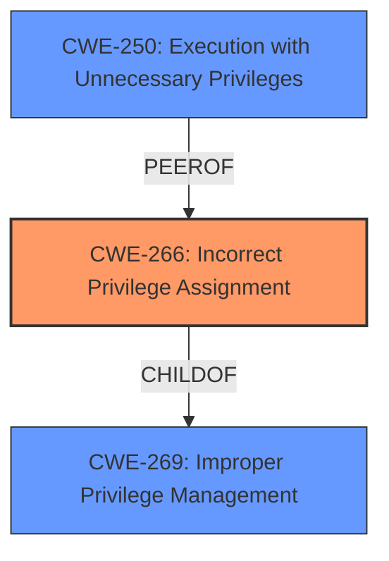

# Analysis Report for CVE-2024-5760

# Vulnerability Analysis Report: CVE-2024-5760

## Description

The Samsung Universal Print Driver for Windows is potentially vulnerable to escalation of privilege allowing the creation of a reverse shell in the tool. This is only applicable for products in the application released or manufactured before 2018.

## Vulnerability Description Key Phrases

- **Impact:** escalation of privilege
- **Product:** Samsung Universal Print Driver for Windows

## Analysis (with Relationship Data)

# Summary
| CWE ID | CWE Name | Confidence | CWE Abstraction Level | CWE Vulnerability Mapping Label | CWE-Vulnerability Mapping Notes |
|---|---|---|---|---|---|
| CWE-266 | Incorrect Privilege Assignment | 0.8 | Base | Allowed | Primary CWE. The vulnerability allows for **escalation of privilege** which suggests incorrect privilege assignment. |
| CWE-250 | Execution with Unnecessary Privileges | 0.6 | Base | Allowed | Secondary candidate. The system might be running with higher privileges than necessary, which could amplify the impact of the vulnerability. |
| CWE-269 | Improper Privilege Management | 0.4 | Class | Discouraged | Secondary candidate. This is a high-level CWE, but the vulnerability involves privilege management issues. |

## Evidence and Confidence

*   **Confidence Score:** 0.7
*   **Evidence Strength:** LOW

## Relationship Analysis
The primary relationship that influenced the decision was the parent-child relationship between CWE-269 (Improper Privilege Management) and CWE-266 (Incorrect Privilege Assignment). CWE-266 is a more specific Base-level CWE that better captures the root cause of the vulnerability, namely, the **incorrect assignment of privileges** leading to privilege escalation. The guidance provided emphasized focusing on the root cause rather than the impact (privilege escalation itself). CWE-250 was considered as a possible secondary issue, where the component might be running with unnecessary privileges, amplifying the impact of the primary weakness.



## Vulnerability Chain
The vulnerability chain starts with an **incorrect privilege assignment** (CWE-266). This leads to a situation where an attacker can **escalate privileges**, potentially creating a reverse shell. CWE-250 might be a contributing factor, as running with unnecessary privileges could amplify the impact of the incorrect assignment.

## Summary of Analysis
The analysis is primarily based on the vulnerability description's mention of "**escalation of privilege**". This strongly suggests an issue with privilege management. The enhanced context guidance clearly advises against mapping directly to privilege escalation and instead focusing on the root cause. CWE-266 (Incorrect Privilege Assignment) best fits the root cause, as it describes a scenario where a product incorrectly assigns privileges. The retriever results also listed CWE-266 but with a lower score compared to CWE-250 and CWE-269. However, considering the guidance and the nature of the vulnerability, CWE-266 is the most appropriate choice. CWE-250 is a secondary factor and relates to the service running with elevated privileges.

The selected CWEs are at the optimal level of specificity. CWE-266 is a Base-level CWE, which is preferred for mapping root causes. While CWE-269 is related, it is a Class-level CWE and too generic. The evidence is somewhat limited due to the brief nature of the vulnerability description, reducing the confidence level. However, the key phrase "**escalation of privilege**" provides a strong indication of incorrect privilege assignment.

Relevant CWE Information:


## CWE Relationship Analysis

Current CWEs represent these abstraction levels: .


### Vulnerability Chain Analysis

**Chain starting from CWE-266:**
- 266 (Incorrect Privilege Assignment) - ROOT


**Chain starting from CWE-269:**
- 269 (Improper Privilege Management) - ROOT


### CWE Relationship Diagram

```mermaid
graph TD
    classDef primary fill:#f96,stroke:#333,stroke-width:2px
    classDef secondary fill:#69f,stroke:#333
    classDef tertiary fill:#9e9,stroke:#333
```


*Report generated on 2025-07-14 00:26:50*
