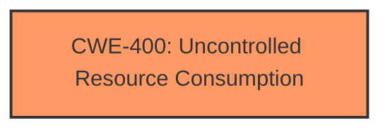

# Raw Analyzer Response for CVE-2024-57673

# Summary
| CWE ID | CWE Name | Confidence | CWE Abstraction Level | CWE Vulnerability Mapping Label | CWE-Vulnerability Mapping Notes |
|---|---|---|---|---|---|
| CWE-400 | Uncontrolled Resource Consumption | 0.7 | Class | Primary | Allowed. The vulnerability description indicates a denial-of-service due to the Topology Manager and Linkdiscovery modules, which aligns with the characteristics of uncontrolled resource consumption. |

## Evidence and Confidence

*   **Confidence Score:** 0.7
*   **Evidence Strength:** MEDIUM

## Relationship Analysis
The primary CWE identified is CWE-400: Uncontrolled Resource Consumption. This is a Class-level CWE. While more specific Base or Variant level CWEs might exist, the current description does not provide enough detail to pinpoint the precise resource that is being exhausted or how the resource consumption is uncontrolled.

## Vulnerability Chain
The vulnerability chain is relatively simple:
1.  Unspecified flaw in Topology Manager and Linkdiscovery module leads to
2.  CWE-400: Uncontrolled Resource Consumption
3.  Denial of Service

## Summary of Analysis
The vulnerability description points to a denial-of-service issue caused by a local attacker in the floodlight v1.2 software, specifically within the Topology Manager and Linkdiscovery modules. The key phrase "denial of service" and the retriever results suggest that CWE-400: Uncontrolled Resource Consumption is a plausible mapping.

The retriever results list CWE-400 with a relatively high score. While it's a Class-level CWE and therefore less specific than a Base or Variant, the limited information available makes it difficult to pinpoint a more precise weakness. The description clearly indicates that the attacker is causing a denial of service through some mechanism related to these modules, which aligns with the general concept of uncontrolled resource consumption.

Other CWEs were considered but ultimately deemed less suitable due to the lack of specific evidence in the vulnerability description. For example, CWE-770: Allocation of Resources Without Limits or Throttling is related, but there's no explicit mention of resource allocation. Similarly, CWE-1284: Improper Validation of Specified Quantity in Input is relevant to resource management, but the description doesn't mention any specific input validation issues. CWE-78: Improper Neutralization of Special Elements used in an OS Command ('OS Command Injection') is also in the retriever results but it is not applicable because there is no mention of command injection.