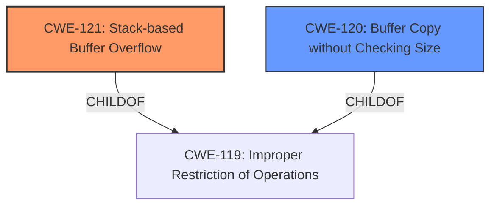

# Analysis Report for CVE-2024-57704

# Vulnerability Analysis Report: CVE-2024-57704

## Description

Tenda AC8v4 V16.03.34.06 has a **stack overflow** vulnerability. Affected by this vulnerability is the function setSchedWifi of the file /goform/openSchedWifi. The manipulation of the argument schedStartTime leads to **stack-based buffer overflow**.

## Vulnerability Description Key Phrases

- **Weakness:** ['stack-based buffer overflow', 'stack overflow']
- **Vector:** manipulation of argument schedStartTime
- **Product:** Tenda AC8v4
- **Version:** V16.03.34.06
- **Component:** setSchedWifi of /goform/openSchedWifi

## Analysis (with Relationship Data)

# Summary
| CWE ID  | CWE Name                                                              | Confidence | CWE Abstraction Level | CWE Vulnerability Mapping Label | CWE-Vulnerability Mapping Notes |
| :-------- | :-------------------------------------------------------------------- | :----------- | :---------------------- | :------------------------------ | :------------------------------ |
| CWE-121   | Stack-based Buffer Overflow                                          | 1          | Base                    | Primary CWE                     | Allowed                         |
| CWE-120   | Buffer Copy without Checking Size of Input ('Classic Buffer Overflow') | 0.7          | Base                    | Secondary Candidate             | Allowed-with-Review           |

## Evidence and Confidence

*   **Confidence Score:** 0.9
*   **Evidence Strength:** HIGH

## Relationship Analysis
The primary relationship is that CWE-121 is a specific type of buffer overflow, and both CWE-121 and CWE-120 are children of CWE-119 (Improper Restriction of Operations within the Bounds of a Memory Buffer). The vulnerability description specifically mentions a "stack-based buffer overflow," making CWE-121 a more precise match than the general CWE-120.



## Vulnerability Chain
The vulnerability chain starts with the **improper handling of the argument schedStartTime** which leads to a **stack-based buffer overflow**. The root cause is the **lack of input validation** on the `schedStartTime` argument, allowing an attacker to write beyond the boundaries of the stack buffer.

## Summary of Analysis
The initial assessment, based on the vulnerability description and key phrases, strongly points to a stack-based buffer overflow. The description explicitly mentions "stack overflow vulnerability" and "stack-based buffer overflow" due to manipulation of the `schedStartTime` argument. This aligns perfectly with CWE-121 (Stack-based Buffer Overflow).

CWE-120 (Buffer Copy without Checking Size of Input) was considered as a secondary candidate because it represents a classic buffer overflow scenario. However, the explicit mention of "stack-based" makes CWE-121 the more accurate and specific choice.

The decision is based on direct evidence from the vulnerability description. The retriever scores also support this decision, with CWE-121 consistently scoring higher across different keyphrase analyses.

The selected CWEs are at the optimal level of specificity. CWE-121 is a Base level CWE that accurately reflects the stack-based nature of the buffer overflow.
# Enhanced Context (25 CWEs)
The following CWEs were identified as potentially relevant to this vulnerability:

## CWE-696: Incorrect Behavior Order
**Abstraction Level**: Class
**Similarity Score**: 0.74
**Source**: dense

**Description**:
The product performs multiple related behaviors, but the behaviors are performed in the wrong order in ways which may produce resultant weaknesses.

**Mapping Guidance**:
- Usage: Allowed-with-Review
- Rationale: This CWE entry is a Class and might have Base-level children that would be more appropriate

NOT USED: This CWE is too high level and doesn't accurately describe the root cause of the vulnerability, which is a buffer overflow, not an ordering issue.

## CWE-703: Improper Check or Handling of Exceptional Conditions
**Abstraction Level**: Pillar
**Similarity Score**: 0.74
**Source**: dense

**Description**:
The product does not properly anticipate or handle exceptional conditions that rarely occur during normal operation of the product.

**Mapping Guidance**:
- Usage: Discouraged
- Rationale: This CWE entry is extremely high-level, a Pillar.

NOT USED: This CWE is a Pillar and too general. A buffer overflow is a specific type of error, not just a general exceptional condition.

## CWE-134: Use of Externally-Controlled Format String
**Abstraction Level**: Base
**Similarity Score**: 0.74
**Source**: dense

**Description**:
The product uses a function that accepts a format string as an argument, but the format string originates from an external source.

**Mapping Guidance**:
- Usage: Allowed
- Rationale: This CWE entry is at the Base level of abstraction, which is a preferred level of abstraction for mapping to the root causes of vulnerabilities.

NOT USED: There is no mention of format string usage in the description.

## CWE-754: Improper Check for Unusual or Exceptional Conditions
**Abstraction Level**: Class
**Similarity Score**: 0.74
**Source**: dense

**Description**:
The product does not check or incorrectly checks for unusual or exceptional conditions that are not expected to occur frequently during day to day operation of the product.

**Mapping Guidance**:
- Usage: Allowed-with-Review
- Rationale: This CWE entry is a Class and might have Base-level children that would be more appropriate

NOT USED: Too general; the issue is specifically a buffer overflow, not a general lack of checks.

## CWE-41: Improper Resolution of Path Equivalence
**Abstraction Level**: Base
**Similarity Score**: 0.73
**Source**: dense

**Description**:
The product is vulnerable to file system contents disclosure through path equivalence. Path equivalence involves the use of special characters in file and directory names. The associated manipulations are intended to generate multiple names for the same object.

**Mapping Guidance**:
- Usage: Allowed
- Rationale: This CWE entry is at the Base level of abstraction, which is a preferred level of abstraction for mapping to the root causes of vulnerabilities.

NOT USED: The vulnerability does not involve path manipulation.

## CWE-824: Access of Uninitialized Pointer
**Abstraction Level**: Base
**Similarity Score**: 0.73
**Source**: dense

**Description**:
The product accesses or uses a pointer that has not been initialized.

**Mapping Guidance**:
- Usage: Allowed
- Rationale: This CWE entry is at the Base level of abstraction, which is a preferred level of abstraction for mapping to the root causes of vulnerabilities.

NOT USED: The vulnerability description does not indicate any issues with uninitialized pointers.

## CWE-345: Insufficient Verification of Data Authenticity
**Abstraction Level**: Class
**Similarity Score**: 0.73
**Source**: dense

**Description**:
The product does not sufficiently verify the origin or authenticity of data, in a way that causes it to accept invalid data.

**Mapping Guidance**:
- Usage: Discouraged
- Rationale: This CWE entry is a level-1 Class (i.e., a child of a Pillar). It might have lower-level children that would be more appropriate

NOT USED: The vulnerability does not involve data authenticity.

## CWE-755: Improper Handling of Exceptional Conditions
**Abstraction Level**: Class
**Similarity Score**: 0.73
**Source**: dense

**Description**:
The product does not handle or incorrectly handles an exceptional condition.

**Mapping Guidance**:
- Usage: Discouraged
- Rationale: This CWE entry is a level-1 Class (i.e., a child of a Pillar). It might have lower-level children that would be more appropriate

NOT USED: Too general; the issue is specifically a buffer overflow.

## CWE-138: Improper Neutralization of Special Elements
**Abstraction Level**: Class
**Similarity Score**: 0.73
**Source**: dense

**Description**:
The product receives input from an upstream component, but it does not neutralize or incorrectly neutralizes special elements that could be interpreted as control elements or syntactic markers when they are sent to a downstream component.

**Mapping Guidance**:
- Usage: Discouraged
- Rationale: This CWE entry is a level-1 Class (i.e., a child of a Pillar). It might have lower-level children that would be more appropriate

NOT USED: There is no mention of special elements or neutralization.

## CWE-131: Incorrect Calculation of Buffer Size
**Abstraction Level**: Base
**Similarity Score**: 0.73
**Source**: dense

**Description**:
The product does not correctly calculate the size to be used when allocating a buffer, which could lead to a buffer overflow.

**Mapping Guidance**:
- Usage: Allowed
- Rationale: This CWE entry is at the Base level of abstraction, which is a preferred level of abstraction for mapping to the root causes of vulnerabilities.

NOT USED: The vulnerability description focuses on the lack of input validation causing the overflow, not the calculation of buffer size.

## CWE-120: Buffer Copy without Checking Size of Input ('Classic Buffer Overflow')
**Abstraction Level**: Base
**Similarity Score**: 2861.37
**Source**: sparse

**Description**:
The product copies an input buffer to an output buffer without verifying that the size of the input buffer is less than the size of the output buffer, leading to a buffer


## CWE Relationship Analysis

Current CWEs represent these abstraction levels: .


### Vulnerability Chain Analysis

**Chain starting from CWE-121:**
- 121 (Stack-based Buffer Overflow) - ROOT


**Chain starting from CWE-41:**
- 41 (Improper Resolution of Path Equivalence) - ROOT


### CWE Relationship Diagram

```mermaid
graph TD
    classDef primary fill:#f96,stroke:#333,stroke-width:2px
    classDef secondary fill:#69f,stroke:#333
    classDef tertiary fill:#9e9,stroke:#333
```


*Report generated on 2025-07-14 00:29:49*
