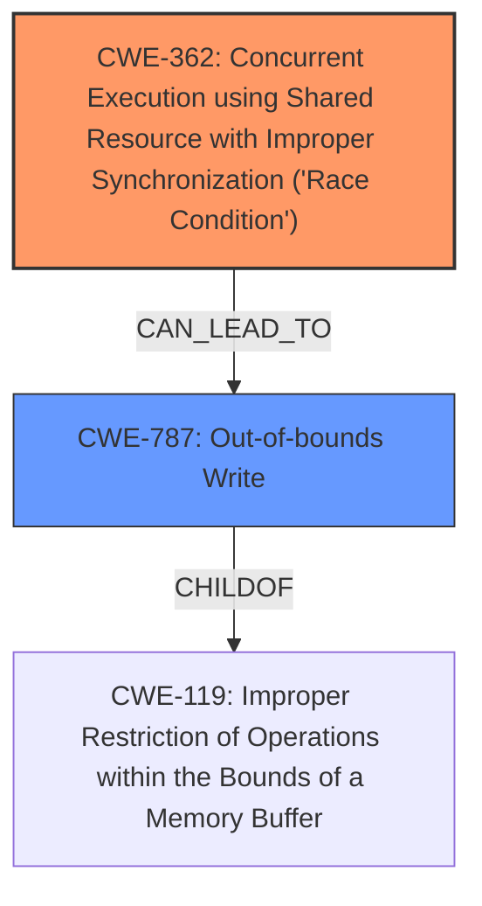

# Analysis Report for CVE-2024-57893

# Vulnerability Analysis Report: CVE-2024-57893

## Description

In the Linux kernel, the following vulnerability has been resolved ALSA seq oss Fix races at processing SysEx messages OSS sequencer handles the SysEx messages split in 6 bytes packets, and ALSA sequencer OSS layer tries to combine those. It stores the data in the internal buffer and this access is racy as of now, which may lead to the out-of-bounds access. As a temporary band-aid fix, introduce a mutex for serializing the process of the SysEx message packets.

## Vulnerability Description Key Phrases

- **Component:** ALSA seq oss
- **Rootcause:** race condition
- **Weakness:** out-of-bounds access, race condition
- **Product:** Linux kernel

## Analysis (with Relationship Data)

# Summary
| CWE ID | CWE Name | Confidence | CWE Abstraction Level | CWE Vulnerability Mapping Label | CWE-Vulnerability Mapping Notes |
|---|---|---|---|---|---|
| CWE-362 | Concurrent Execution using Shared Resource with Improper Synchronization ('Race Condition') | 0.9 | Class | Allowed-with-Review | Primary CWE: The vulnerability is caused by a **race condition** when handling SysEx messages in the ALSA seq oss component. |
| CWE-787 | Out-of-bounds Write | 0.7 | Base | Allowed | Secondary Candidate: The **race condition** leads to **out-of-bounds access**, which is a type of out-of-bounds write. |

## Evidence and Confidence

*   **Confidence Score:** 0.8
*   **Evidence Strength:** HIGH

## Relationship Analysis
The primary weakness is CWE-362, a Class-level CWE describing a **race condition**. The resulting **out-of-bounds access** is best described by CWE-787, Out-of-bounds Write. CWE-362 is a broader category, while CWE-787 is a more specific consequence of the **race condition**. The relationship between the two is that the **race condition** can lead to an out-of-bounds write.



## Vulnerability Chain
The vulnerability chain starts with a **race condition** (CWE-362) in the ALSA seq oss component when processing SysEx messages. This **race condition** can lead to **out-of-bounds access** (CWE-787), where data is written outside the intended buffer.

## Summary of Analysis
The vulnerability description clearly states that a **race condition** exists in the ALSA seq oss component when handling SysEx messages. This aligns with CWE-362, Concurrent Execution using Shared Resource with Improper Synchronization ('Race Condition'). The description also mentions that this **race condition** may lead to **out-of-bounds access**. This is best represented by CWE-787, Out-of-bounds Write.

The evidence supporting CWE-362 is "OSS sequencer handles the SysEx messages split in 6 bytes packets, and ALSA sequencer OSS layer tries to combine those. It stores the data in the internal buffer and this access is racy as of now". The evidence supporting CWE-787 is "which may lead to the **out-of-bounds access**".

CWE-119, Improper Restriction of Operations within the Bounds of a Memory Buffer, was considered as a general category for memory buffer errors, but CWE-787 is a more specific and accurate description of the **out-of-bounds write** that may occur. Other CWEs related to resource management and synchronization were considered, but the primary issue is the **race condition** leading to the out-of-bounds write, making CWE-362 and CWE-787 the most relevant.

The selected CWEs are at the optimal level of specificity. CWE-362 is a Class that accurately captures the concurrent execution issue. CWE-787 is a Base CWE that accurately reflects the **out-of-bounds write** that may occur as a result of the **race condition**.

Relevant CWE Information:
# Enhanced Context (25 CWEs)
The following CWEs were identified as potentially relevant to this vulnerability:

## CWE-362: Concurrent Execution using Shared Resource with Improper Synchronization ('Race Condition')
**Abstraction Level**: Class
**Similarity Score**: 0.78
**Source**: dense

**Description**:
The product contains a concurrent code sequence that requires temporary, exclusive access to a shared resource, but a timing window exists in which the shared resource can be modified by another code sequence operating concurrently.

**Mapping Guidance**:
- Usage: Allowed-with-Review
- Rationale: This CWE entry is a Class and might have Base-level children that would be more appropriate


## CWE Relationship Analysis

Current CWEs represent these abstraction levels: .


### Vulnerability Chain Analysis

**Chain starting from CWE-119:**
- 119 (Improper Restriction of Operations within the Bounds of a Memory Buffer) - ROOT


**Chain starting from CWE-787:**
- 787 (Out-of-bounds Write) - ROOT


### CWE Relationship Diagram

```mermaid
graph TD
    classDef primary fill:#f96,stroke:#333,stroke-width:2px
    classDef secondary fill:#69f,stroke:#333
    classDef tertiary fill:#9e9,stroke:#333
```


*Report generated on 2025-07-14 00:34:46*
