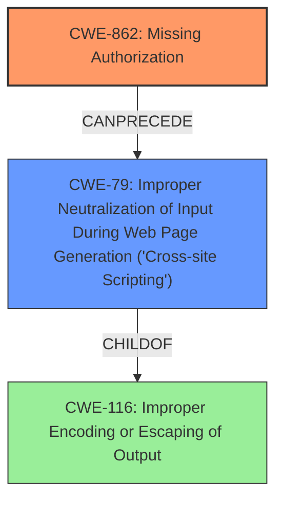

# Raw Analyzer Response for CVE-2024-5791

# Summary

| CWE ID  | CWE Name                                                                  | Confidence | CWE Abstraction Level | CWE Vulnerability Mapping Label | CWE-Vulnerability Mapping Notes |
| :-------- | :------------------------------------------------------------------------ | :--------- | :---------------------- | :------------------------------ | :------------------------------ |
| CWE-862   | Missing Authorization                                                     | 0.95       | Base                    | Primary                         | Allowed                       |
| CWE-79    | Improper Neutralization of Input During Web Page Generation ('Cross-site Scripting') | 0.95       | Base                    | Secondary                       | Allowed                       |

## Evidence and Confidence

*   **Confidence Score:** 0.95
*   **Evidence Strength:** HIGH

## Relationship Analysis

The primary weakness is the **missing authorization** check (CWE-862), which allows unauthenticated attackers to perform actions they should not be able to. The secondary weakness stems from **insufficient input sanitization and output escaping**, leading to the injection of arbitrary web scripts (CWE-79). CWE-862 can precede CWE-79 because **missing authorization** allows for malicious input to be processed, and if that input is not properly neutralized, it can lead to cross-site scripting.

## Vulnerability Chain

The vulnerability chain begins with **missing authorization** checks in the `processAction` function (CWE-862). This allows unauthenticated attackers to inject arbitrary web scripts due to **insufficient input sanitization and output escaping**. This leads to stored cross-site scripting (CWE-79), where the injected scripts are executed whenever a user accesses a wp-admin dashboard.

CWE-862 (Missing Authorization) -> CWE-79 (Improper Neutralization of Input During Web Page Generation) -> Impact: Execution of arbitrary web scripts.

## Summary of Analysis

The analysis is based on the provided vulnerability description, which explicitly states the **missing authorization checks** and **insufficient input sanitization and output escaping** as the root causes. The description also clearly states the resulting stored cross-site scripting vulnerability.

The vulnerability description explicitly mentions "missing authorization checks" as the primary issue, making CWE-862 the most suitable choice. The subsequent **insufficient input sanitization and output escaping** leads directly to the stored XSS vulnerability, making CWE-79 a strong secondary candidate.

The CWEs selected are at the Base level of abstraction, providing the most specific representation of the weaknesses described.

The provided text clearly states: "The Online Booking & Scheduling Calendar for WordPress by vcita plugin for WordPress is vulnerable to Stored Cross-Site Scripting via the wp_id parameter in all versions up to, and including, 4.4.2 due to **missing authorization checks** on processAction function, as well as **insufficient input sanitization and output escaping**."

Relevant CWE Information:

*   **CWE-862: Missing Authorization:** The product does not perform an authorization check when an actor attempts to access a resource or perform an action. This aligns directly with the "**missing authorization checks**" mentioned in the vulnerability description.
*   **CWE-79: Improper Neutralization of Input During Web Page Generation ('Cross-site Scripting'):** The product does not neutralize or incorrectly neutralizes user-controllable input before it is placed in output that is used as a web page that is served to other users. This aligns with the "**insufficient input sanitization and output escaping**" and the resulting stored XSS vulnerability.

CWE-116, CWE-352, CWE-138, CWE-89, CWE-425, CWE-472, CWE-184, CWE-303, CWE-1391, CWE-707, CWE-494, CWE-471, CWE-113, CWE-94, CWE-78, CWE-120, and CWE-73 were considered but not selected. CWE-116, CWE-138, and CWE-707 are too general. CWE-352 is not directly applicable as CSRF is not the primary issue. CWE-89, CWE-78, CWE-94, CWE-120, CWE-73, CWE-425, CWE-472, CWE-184, CWE-303, CWE-1391, CWE-494, CWE-471, and CWE-113 do not accurately reflect the specific weaknesses described in the vulnerability.