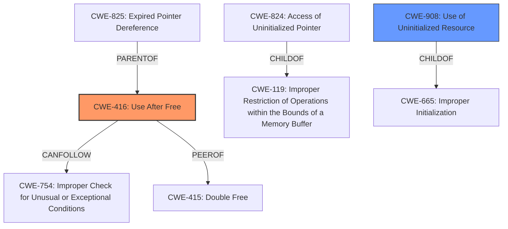

# Analysis Report for CVE-2024-57951

# Vulnerability Analysis Report: CVE-2024-57951

## Description

In the Linux kernel, the following vulnerability has been resolved hrtimers Handle CPU state correctly on hotplug Consider a scenario where a CPU transitions from CPUHP_ONLINE to halfway through a CPU hotunplug down to CPUHP_HRTIMERS_PREPARE, and then back to CPUHP_ONLINE Since hrtimers_prepare_cpu() does not run, cpu_base.hres_active remains set to 1 throughout. However, during a CPU unplug operation, the tick and the clockevents are shut down at CPUHP_AP_TICK_DYING. On return to the online state, for instance CFS incorrectly assumes that the hrtick is already active, and the chance of the clockevent device to transition to oneshot mode is also lost forever for the CPU, unless it goes back to a lower state than CPUHP_HRTIMERS_PREPARE once. This round-trip reveals another issue cpu_base.online is not set to 1 after the transition, which appears as a WARN_ON_ONCE in enqueue_hrtimer(). Aside of that, the bulk of the per CPU state is not reset either, which means there are dangling pointers in the worst case. Address this by adding a corresponding startup() callback, which resets the stale per CPU state and sets the online flag. [ tglx Make the new callback unconditionally available, remove the online modification in the prepare() callback and clear the remaining state in the starting callback instead of the prepare callback ]

## Vulnerability Description Key Phrases

- **Vector:** hotplug
- **Weakness:** dangling pointers, hres_active remains set to 1
- **Product:** Linux kernel
- **Impact:** kernel panic

## Analysis (with Relationship Data)

# Summary
| CWE ID | CWE Name | Confidence | CWE Abstraction Level | CWE Vulnerability Mapping Label | CWE-Vulnerability Mapping Notes |
|---|---|---|---|---|---|
| CWE-416 | Use After Free | 0.8 | Variant | Allowed | Primary CWE |
| CWE-908 | Use of Uninitialized Resource | 0.6 | Base | Allowed | Secondary Candidate |

## Evidence and Confidence

*   **Confidence Score:** 0.7
*   **Evidence Strength:** MEDIUM

## Relationship Analysis
The primary relationship influencing the decision is the hierarchical one. CWE-416 is a variant of higher-level classes related to resource management. The description mentions **dangling pointers**, which is a key indicator of a use-after-free condition. Also, CWE-908: Use of Uninitialized Resource is also considered because the hrtimers are not initialized correctly during CPU hotplug transitions, potentially leading to accessing uninitialized resources.



## Vulnerability Chain
The vulnerability chain starts with a CPU hotplug transition that doesn't properly reset the HRTimer state. This leads to `hres_active` remaining set, and the per CPU state is not reset, which causes **dangling pointers**. Consequently, code may access these dangling pointers, leading to a use-after-free condition and a potential kernel panic.

## Summary of Analysis
The primary assessment is based on the description of **dangling pointers** and the potential for accessing freed memory. The "Retriever Results" also show CWE-416 as a top candidate. The evidence in the vulnerability description points strongly towards CWE-416 as the root cause. The mention of "hrtimers Handle CPU state correctly on hotplug" and the "Address this by adding a corresponding startup() callback, which resets the stale per CPU state and sets the online flag" are key indicators.

I also considered CWE-908: Use of Uninitialized Resource because the state is not being initialized properly after the CPU transitions back to online state.

The abstraction level of CWE-416 (Variant) is suitable as it specifically describes the condition of using memory after it has been freed, which directly aligns with the vulnerability description.

Relevant CWE Information:

## CWE-824: Access of Uninitialized Pointer
**Abstraction Level**: Base
**Similarity Score**: 0.74
**Source**: dense

**Description**:
The product accesses or uses a pointer that has not been initialized.

**Mapping Guidance**:
- Usage: Allowed
- Rationale: This CWE entry is at the Base level of abstraction, which is a preferred level of abstraction for mapping to the root causes of vulnerabilities.

*Reason for not using CWE-824:* While uninitialized resources could be a factor, the primary issue is the use of resources after they've been freed.

## CWE-667: Improper Locking
**Abstraction Level**: Class
**Similarity Score**: 0.74
**Source**: dense

**Description**:
The product does not properly acquire or release a lock on a resource, leading to unexpected resource state changes and behaviors.

**Mapping Guidance**:
- Usage: Allowed-with-Review
- Rationale: This CWE entry is a Class and might have Base-level children that would be more appropriate

*Reason for not using CWE-667:* Locking issues aren't explicitly mentioned in the description.

## CWE-252: Unchecked Return Value
**Abstraction Level**: Base
**Similarity Score**: 0.73
**Source**: dense

**Description**:
The product does not check the return value from a method or function, which can prevent it from detecting unexpected states and conditions.

**Mapping Guidance**:
- Usage: Allowed
- Rationale: This CWE entry is at the Base level of abstraction, which is a preferred level of abstraction for mapping to the root causes of vulnerabilities.

*Reason for not using CWE-252:* This CWE is not relevant to the vulnerability description.

## CWE-908: Use of Uninitialized Resource
**Abstraction Level**: Base
**Similarity Score**: 0.73
**Source**: dense

**Description**:
The product uses or accesses a resource that has not been initialized.

**Mapping Guidance**:
- Usage: Allowed
- Rationale: This CWE entry is at the Base level of abstraction, which is a preferred level of abstraction for mapping to the root causes of vulnerabilities.

*Reason for considering CWE-908:* This is considered because the hrtimers are not initialized correctly during CPU hotplug transitions, potentially leading to accessing uninitialized resources.

## CWE-362: Concurrent Execution using Shared Resource with Improper Synchronization ('Race Condition')
**Abstraction Level**: Class
**Similarity Score**: 0.73
**Source**: dense

**Description**:
The product contains a concurrent code sequence that requires temporary, exclusive access to a shared resource, but a timing window exists in which the shared resource can be modified by another code sequence operating concurrently.

**Mapping Guidance**:
- Usage: Allowed-with-Review
- Rationale: This CWE entry is a Class and might have Base-level children that would be more appropriate

*Reason for not using CWE-362:* While concurrency is involved with hotplug operations, a race condition isn't the primary weakness described.

## CWE-909: Missing Initialization of Resource
**Abstraction Level**: Class
**Similarity Score**: 0.73
**Source**: dense

**Description**:
The product does not initialize a critical resource.

**Mapping Guidance**:
- Usage: Allowed-with-Review
- Rationale: This CWE entry is a Class and might have Base-level children that would be more appropriate

*Reason for not using CWE-909:* While related to initialization issues, it doesn't fully capture the essence of the use-after-free condition.

## CWE-755: Improper Handling of Exceptional Conditions
**Abstraction Level**: Class
**Similarity Score**: 0.72
**Source**: dense

**Description**:
The product does not handle or incorrectly handles an exceptional condition.

**Mapping Guidance**:
- Usage: Discouraged
- Rationale: This CWE entry is a level-1 Class (i.e., a child of a Pillar). It might have lower-level children that would be more appropriate

*Reason for not using CWE-755:* This is too broad and doesn't accurately reflect the specific weakness.

## CWE-367: Time-of-check Time-of-use (TOCTOU) Race Condition
**Abstraction Level**: Base
**Similarity Score**: 0.72
**Source**: dense

**Description**:
The product checks the state of a resource before using that resource, but the resource's state can change between the check and the use in a way that invalidates the results of the check. This can cause the product to perform invalid actions when the resource is in an unexpected state.

**Mapping Guidance**:
- Usage: Allowed
- Rationale: This CWE entry is at the Base level of abstraction, which is a preferred level of abstraction for mapping to the root causes of vulnerabilities.

*Reason for not using CWE-367:* A TOCTOU race condition isn't the primary issue.

## CWE-665: Improper Initialization
**Abstraction Level**: Class
**Similarity Score**: 0.72
**Source**: dense

**Description**:
The product does not initialize or incorrectly initializes a resource, which might leave the resource in an unexpected state when it is accessed or used.

**Mapping Guidance**:
- Usage: Discouraged
- Rationale: This CWE entry is a level-1 Class (i.e., a child of a Pillar). It might have lower-level children that would be more appropriate

*Reason for not using CWE-665:* While related to initialization, it is too high level.

## CWE-404: Improper Resource Shutdown or Release
**Abstraction Level**: Class
**Similarity Score**: 0.72
**Source**: dense

**Description**:
The product does not release or incorrectly releases a resource before it is made available for re-use


## CWE Relationship Analysis

Current CWEs represent these abstraction levels: .


### Vulnerability Chain Analysis

**Chain starting from CWE-665:**
- 665 (Improper Initialization) - ROOT


**Chain starting from CWE-416:**
- 416 (Use After Free) - ROOT


### CWE Relationship Diagram

```mermaid
graph TD
    classDef primary fill:#f96,stroke:#333,stroke-width:2px
    classDef secondary fill:#69f,stroke:#333
    classDef tertiary fill:#9e9,stroke:#333
```


*Report generated on 2025-07-14 00:37:50*
