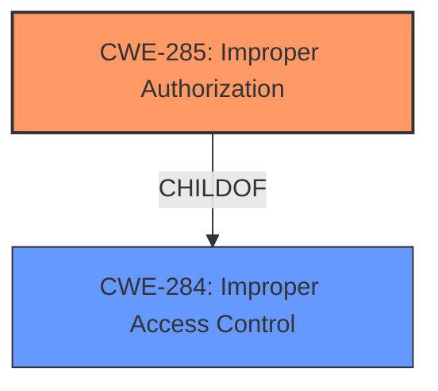

# Raw Analyzer Response for CVE-2024-57954

# Summary
| CWE ID | CWE Name | Confidence | CWE Abstraction Level | CWE Vulnerability Mapping Label | CWE-Vulnerability Mapping Notes |
|---|---|---|---|---|---|
| CWE-285 | Improper Authorization | 0.8 | Class | Primary CWE | Allowed-with-Review |

## Evidence and Confidence

*   **Confidence Score:** 0.8
*   **Evidence Strength:** MEDIUM

## Relationship Analysis
The primary relationship that influenced my decision was the parent-child relationship between CWE-284 (Improper Access Control) and CWE-285 (Improper Authorization). Since the description specifically mentions a permission verification **vulnerability**, it suggests a problem within the authorization process itself, thus making CWE-285 a more precise and fitting choice than the more generic CWE-284. The guidance also suggests that if the authorization logic is present but flawed **CWE-863** should be considered. However, **CWE-863** is also a Class and doesn't seem to fit the root cause as well as **CWE-285**.

## Vulnerability Chain
The **vulnerability** chain starts with the **Improper Authorization** (CWE-285) in the media library module which leads to the impact of affecting service confidentiality.
  - The root cause is the **Improper Authorization**.
  - The impact is service confidentiality.

## Summary of Analysis
The initial assessment identified CWE-285 as the most suitable classification based on the provided evidence. The vulnerability description explicitly mentions "Permission verification **vulnerability**," which aligns well with the definition of CWE-285 (Improper Authorization). This CWE indicates that the product incorrectly performs an authorization check, allowing unauthorized access or actions.

The selection of CWE-285 is further justified by the "Privileges vs Permissions Guidance," which highlights that "Permissions are improperly checked" and a possible CWE is "CWE-285".

The evidence for the selection is primarily from the "Vulnerability Description" itself, which points to a "Permission verification **vulnerability**." This evidence is direct and supports the choice of CWE-285.

The "Retriever Results" also lists CWE-285.

I considered other CWEs from the provided list, but these were deemed less appropriate:

*   CWE-284: Improper Access Control - This is a more general case and less specific than CWE-285, since the description mentions "Permission verification", which is authorization.
*   CWE-266: Incorrect Privilege Assignment - The description does not indicate a misassignment of privileges, but rather a problem with the verification of permissions.
*   CWE-863: Incorrect Authorization - This is also a possibility, but since this is a Class, I chose the higher level Class.
*   CWE-119, CWE-125, CWE-787, CWE-822, CWE-823, CWE-824 - These are related to memory corruption, and there is no evidence to suggest memory corruption.
*   CWE-61, CWE-41 - These are related to file system issues, and there is no evidence to suggest file system issues.

Ultimately, CWE-285 was selected as the most accurate and specific representation of the vulnerability, aligning with both the provided evidence and the MITRE mapping guidance.