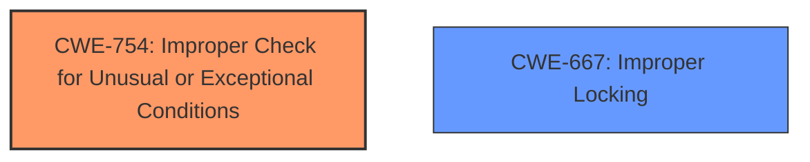

# Analysis Report for CVE-2024-58001

# Vulnerability Analysis Report: CVE-2024-58001

## Description

In the Linux kernel, the following vulnerability has been resolved ocfs2 handle a symlink read error correctly Patch series Convert ocfs2 to use folios. Mark did a conversion of ocfs2 to use folios and sent it to me as a giant patch for review -) So Ive redone it as individual patches, and credited Mark for the patches where his code is substantially the same. Its not a bad way to do it his patch had some bugs and my patches had some bugs. Hopefully all our bugs were different from each other. And hopefully Mark likes all the changes I made to his code! This patch (of 23) If we cant read the buffer, be sure to unlock the page before returning.

## Vulnerability Description Key Phrases

- **Product:** Linux kernel
- **Component:** ocfs2

## Analysis (with Relationship Data)

# Summary
| CWE ID | CWE Name | Confidence | CWE Abstraction Level | CWE Vulnerability Mapping Label | CWE-Vulnerability Mapping Notes |
|---|---|---|---|---|---|
| CWE-754 | Improper Check for Unusual or Exceptional Conditions | 0.8 | Class | Allowed-with-Review | Primary CWE |
| CWE-667 | Improper Locking | 0.6 | Class | Allowed-with-Review | Secondary Candidate |

## Evidence and Confidence

*   **Confidence Score:** 0.7
*   **Evidence Strength:** MEDIUM

## Relationship Analysis
The primary relationship that influenced the decision was the parent-child relationship between CWE-754 and its children. The vulnerability description points to a specific type of exceptional condition, namely a read error while handling a symlink. However, since the description doesn't specify the exact nature of the improper check or handling, mapping to the parent class CWE-754 is more appropriate than trying to pinpoint a specific child. The relationship with CWE-667 was also considered due to the mention of unlocking the page but ultimately was deemed secondary.



## Vulnerability Chain
The vulnerability chain involves the following:
1.  A read error occurs during symlink handling.
2.  The system **fails to properly check** or handle this **exceptional condition**.
3.  The page is not unlocked before returning, leading to potential issues like deadlocks or resource contention (possibly related to improper locking)

The root cause is the **improper handling** of the read error (CWE-754). The potential lack of unlocking is a consequence (potentially CWE-667).

## Summary of Analysis
The initial assessment considered several CWEs from the Retriever Results, especially those related to race conditions and locking. However, the core issue described in the vulnerability report is that the system **does not properly handle** a read error during symlink processing. This aligns well with CWE-754, which covers **improper checks** for or **handling** of unusual or **exceptional conditions**. The "Improper Locking" (CWE-667) was a secondary consideration because if the page is not unlocked, it might cause locking issues but the root cause is the missing check or handling of the exceptional condition. The evidence explicitly states "*If we cant read the buffer, be sure to unlock the page before returning.*" which means that the kernel failed to do so. The other suggestions were not relevant to the **lack of a proper check**.

The chosen CWE (CWE-754) is at the Class level, which is appropriate given that the description doesn't provide enough detail to pinpoint a specific Base or Variant. It accurately captures the **improper handling** of the exceptional condition.

Relevant CWE Information:

# Enhanced Context (25 CWEs)
The following CWEs were identified as potentially relevant to this vulnerability:

## CWE-667: Improper Locking
**Abstraction Level**: Class
**Similarity Score**: 0.73
**Source**: dense

**Description**:
The product does not properly acquire or release a lock on a resource, leading to unexpected resource state changes and behaviors.

**Mapping Guidance**:
- Usage: Allowed-with-Review
- Rationale: This CWE entry is a Class and might have Base-level children that would be more appropriate

## CWE-754: Improper Check for Unusual or Exceptional Conditions
**Abstraction Level**: Class
**Similarity Score**: 0.69
**Source**: dense

**Description**:
The product does not check or incorrectly checks for unusual or exceptional conditions that are not expected to occur frequently during day to day operation of the product.

**Mapping Guidance**:
- Usage: Allowed-with-Review
- Rationale: This CWE entry is a Class and might have Base-level children that would be more appropriate


## CWE Relationship Analysis

Current CWEs represent these abstraction levels: .


### Vulnerability Chain Analysis

**Chain starting from CWE-667:**
- 667 (Improper Locking) - ROOT


**Chain starting from CWE-754:**
- 754 (Improper Check for Unusual or Exceptional Conditions) - ROOT


### CWE Relationship Diagram

```mermaid
graph TD
    classDef primary fill:#f96,stroke:#333,stroke-width:2px
    classDef secondary fill:#69f,stroke:#333
    classDef tertiary fill:#9e9,stroke:#333
```


*Report generated on 2025-07-14 00:42:10*
