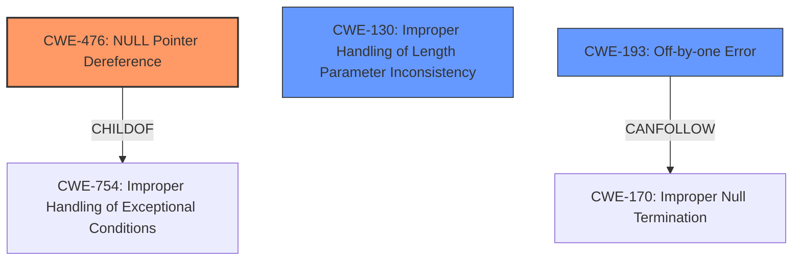

# Analysis Report for CVE-2024-58019

# Vulnerability Analysis Report: CVE-2024-58019

## Description

In the Linux kernel, the following vulnerability has been resolved nvkm/gsp correctly advance the read pointer of GSP message queue A GSP event message consists three parts message header, RPC header, message body. GSP calculates the number of pages to write from the total size of a GSP message. This behavior can be observed from the movement of the write pointer. However, nvkm takes only the size of RPC header and message body as the message size when advancing the read pointer. When handling a two-page GSP message in the non rollback case, It wrongly takes the message body of the previous message as the message header of the next message. As the message length tends to be zero, in the calculation of size needs to be copied (0 - size of (message header)), the size needs to be copied will be 0xffffffxx. It also triggers a kernel panic due to a **NULL pointer error**. [ 547.614102] msg 00000f90 ff ff ff ff ff ff ff ff 40 d7 18 fb 8b 00 00 00 ........@....... [ 547.622533] msg 00000fa0 00 00 00 00 ff ff ff ff ff ff ff ff 00 00 00 00 ................ [ 547.630965] msg 00000fb0 ff ff ff ff ff ff ff ff 00 00 00 00 ff ff ff ff ................ [ 547.639397] msg 00000fc0 ff ff ff ff 00 00 00 00 ff ff ff ff ff ff ff ff ................ [ 547.647832] nvkm 0000c100.0 gsp peek msg rpc fn0 len0x0/0xffffffffffffffe0 [ 547.655225] nvkm 0000c100.0 gsp get msg rpc fn0 len0x0/0xffffffffffffffe0 [ 547.662532]

## Vulnerability Description Key Phrases

- **Weakness:** NULL pointer error
- **Impact:** kernel panic
- **Product:** Linux kernel
- **Component:** nvkm/gsp

## Analysis (with Relationship Data)

# Summary

| CWE ID  | CWE Name                                                                | Confidence | CWE Abstraction Level | CWE Vulnerability Mapping Label | CWE-Vulnerability Mapping Notes |
| :-------- | :---------------------------------------------------------------------- | :--------- | :-------------------- | :------------------------------ | :------------------------------ |
| CWE-476 | NULL Pointer Dereference                                                | 0.75       | Base                  | Primary                         | Allowed                         |
| CWE-130 | Improper Handling of Length Parameter Inconsistency                   | 0.60       | Base                  | Secondary                       | Allowed                         |
| CWE-193 | Off-by-one Error                                                        | 0.50       | Base                  | Secondary                       | Allowed                         |

## Evidence and Confidence

*   **Confidence Score:** 0.70
*   **Evidence Strength:** MEDIUM

## Relationship Analysis

The primary CWE is CWE-476, **NULL Pointer Dereference**. This is caused by an incorrect calculation of the message size, which could be related to **Improper Handling of Length Parameter Inconsistency** (CWE-130) or an **Off-by-one Error** (CWE-193).
CWE-476 is a child of CWE-754: Improper Handling of Exceptional Conditions. CWE-130 has a peer relationship with other CWEs related to buffer size issues.
CWE-193 can follow CWE-170: Improper Null Termination, which indicates a potential chain involving string handling.



## Vulnerability Chain

1.  **Improper Handling of Length Parameter Inconsistency** (CWE-130) or **Off-by-one Error** (CWE-193) leads to:
2.  Incorrect message size calculation.
3.  This results in a **NULL Pointer Dereference** (CWE-476).
4.  The final impact is a kernel panic.

## Summary of Analysis

The analysis indicates that the vulnerability is primarily due to a **NULL pointer error** (CWE-476), which is triggered by incorrect handling of the message size during GSP message queue processing. The incorrect message size calculation may be due to **Improper Handling of Length Parameter Inconsistency** (CWE-130) or an **Off-by-one Error** (CWE-193).

The evidence from the vulnerability description key phrases clearly points to a **NULL pointer error**. The retriever results also suggest CWE-476, although it is not the top result. The kernel panic confirms the severity of the **NULL pointer dereference**.

The relationships between CWEs suggest that the root cause is likely related to incorrect size calculations, which then leads to the **NULL pointer dereference**. The selected CWEs are at the base level of abstraction, which is the most appropriate level for this vulnerability.

Relevant CWE Information:

*   CWE-476: NULL Pointer Dereference
    *   Description: The product dereferences a pointer that it expects to be valid but is NULL.
    *   This aligns with the **NULL pointer error** mentioned in the vulnerability description.
*   CWE-130: Improper Handling of Length Parameter Inconsistency
    *   Description: The product parses a formatted message or structure, but it does not handle or incorrectly handles a length field that is inconsistent with the actual length of the associated data.
    *   This aligns with the description where the length of the message is calculated incorrectly.
* CWE-193: Off-by-one Error
    * Description: A product calculates or uses an incorrect maximum or minimum value that is 1 more, or 1 less, than the correct value.
    * The message size calculation may be off by one.

CWEs Considered but Not Used:

*   CWE-770: Allocation of Resources Without Limits or Throttling, CWE-74: Improper Neutralization of Special Elements in Output Used by a Downstream Component ('Injection'), CWE-306: Missing Authentication for Critical Function, CWE-158: Improper Neutralization of Null Byte or NUL Character, CWE-1284: Improper Validation of Specified Quantity in Input, and other high-scoring CWEs from the retriever results were considered but deemed less relevant as the primary issue is a **NULL pointer dereference** caused by incorrect size calculations, not resource allocation, injection, or authentication issues. They are likely false positives.


## CWE Relationship Analysis

Current CWEs represent these abstraction levels: .


### Vulnerability Chain Analysis

**Chain starting from CWE-1284:**
- 1284 (Improper Validation of Specified Quantity in Input) - ROOT


**Chain starting from CWE-130:**
- 130 (Improper Handling of Length Parameter Inconsistency) - ROOT


### CWE Relationship Diagram

```mermaid
graph TD
    classDef primary fill:#f96,stroke:#333,stroke-width:2px
    classDef secondary fill:#69f,stroke:#333
    classDef tertiary fill:#9e9,stroke:#333
```


*Report generated on 2025-07-14 00:43:07*
