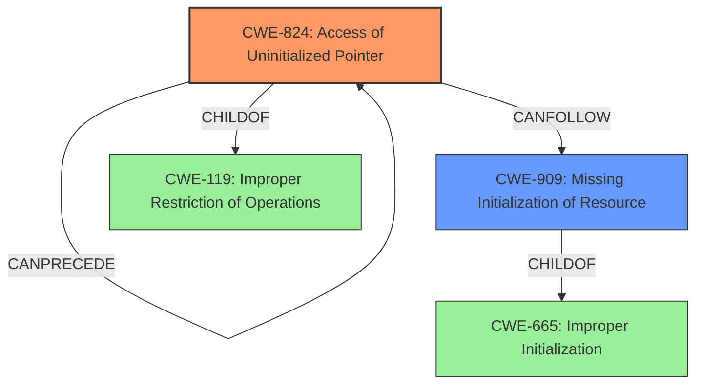

# Enhanced Analysis for CVE-2024-58091

# Summary
| CWE ID | CWE Name | Confidence | CWE Abstraction Level | CWE Vulnerability Mapping Label | CWE-Vulnerability Mapping Notes |
|---|---|---|---|---|---|
| CWE-824 | Access of Uninitialized Pointer | 0.75 | Base | Allowed | Primary CWE. The **impact** was a kernel NULL pointer dereference, which directly relates to accessing an uninitialized pointer. |
| CWE-909 | Missing Initialization of Resource | 0.60 | Class | Allowed-with-Review | Secondary CWE. The root cause likely stems from a **missing initialization** of the DMA area, leading to the uninitialized pointer. |

## Evidence and Confidence

*   **Confidence Score:** 0.70
*   **Evidence Strength:** MEDIUM

## Relationship Analysis
The primary weakness is CWE-824 Access of Uninitialized Pointer, which is a direct consequence of accessing a pointer that hasn't been properly initialized. This is often preceded by CWE-909 Missing Initialization of Resource, which represents the root cause. CWE-824 is a child of CWE-119 Improper Restriction of Operations within the Bounds of a Memory Buffer, while CWE-909 is a class-level weakness.



## Vulnerability Chain
The vulnerability chain starts with the **missing initialization** of a DMA area (CWE-909), leading to an uninitialized pointer being accessed (CWE-824), and finally resulting in a kernel NULL pointer dereference.

## Summary of Analysis
The analysis is primarily based on the vulnerability description, which clearly states the **impact** as a "kernel NULL pointer dereference". This directly points to CWE-824 Access of Uninitialized Pointer as the primary weakness. The phrase "DMA areas are not necessarily backed by struct page, so we cannot rely on it for deferred I/O" suggests a **missing initialization** issue, making CWE-909 Missing Initialization of Resource a likely contributing factor. The patch addresses this by allocating a "shadow buffer," further supporting the idea that the original DMA area was not being properly initialized.

CWE-824 is chosen as the primary CWE because it directly reflects the observed **impact** of the vulnerability. CWE-909 is included as a secondary CWE to represent the potential root cause of the uninitialized pointer. Both CWEs are at appropriate levels of specificity, with CWE-824 being a Base level and CWE-909 a Class Level.

Other CWEs Considered and Rejected:

*   CWE-908 Use of Uninitialized Resource: While similar to CWE-824, CWE-824 is more specific to pointers, which aligns better with the "kernel NULL pointer dereference" **impact**.
*   CWE-119 Improper Restriction of Operations within the Bounds of a Memory Buffer: This is a broader category, and while relevant, CWE-824 provides a more precise description of the vulnerability.
*   CWE-770 Allocation of Resources Without Limits or Throttling: This CWE does not fit the description of the vulnerability.
*   CWE-362 Concurrent Execution using Shared Resource with Improper Synchronization ('Race Condition'): There is no mention of concurrency issues in the vulnerability description.
*   CWE-1284 Improper Validation of Specified Quantity in Input: This CWE does not fit the description of the vulnerability.
*   CWE-667 Improper Locking: There is no mention of locking issues in the vulnerability description.
*   CWE-125 Out-of-bounds Read: The vulnerability description does not indicate an out-of-bounds read.
*   CWE-782 Exposed IOCTL with Insufficient Access Control: This CWE does not fit the description of the vulnerability.
*   CWE-1190 DMA Device Enabled Too Early in Boot Phase: This CWE does not fit the description of the vulnerability.
*   CWE-1325 Improperly Controlled Sequential Memory Allocation: This CWE does not fit the description of the vulnerability.


## CWE Relationship Analysis

Current CWEs represent these abstraction levels: .


### Vulnerability Chain Analysis

**Chain starting from CWE-1284:**
- 1284 (Improper Validation of Specified Quantity in Input) - ROOT


**Chain starting from CWE-770:**
- 770 (Allocation of Resources Without Limits or Throttling) - ROOT


### CWE Relationship Diagram

```mermaid
graph TD
    classDef primary fill:#f96,stroke:#333,stroke-width:2px
    classDef secondary fill:#69f,stroke:#333
    classDef tertiary fill:#9e9,stroke:#333
```