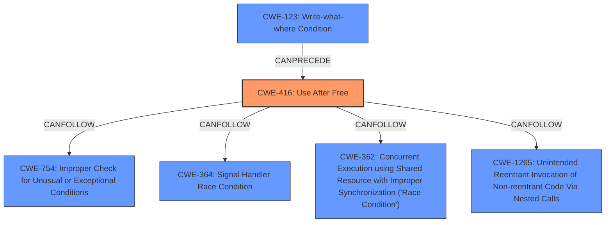

# Analysis for CVE-2024-58093

# Summary

| CWE ID | CWE Name | Confidence | CWE Abstraction Level | CWE Vulnerability Mapping Label | CWE-Vulnerability Mapping Notes |
|---|---|---|---|---|---|
| CWE-416 | Use After Free | 1.0 | Variant | Primary CWE | Allowed |

## Evidence and Confidence

*   **Confidence Score:** 1.0
*   **Evidence Strength:** HIGH

## Relationship Analysis
The primary relationship is that CWE-416 is a variant. There are CANFOLLOW relationships that are less relevant. The graph relationships did not influence the selection.

## Vulnerability Chain
The vulnerability chain starts with the **improper** freeing of the ASPM parent link state too early. This results in a **use-after-free** condition when other functions attempt to access the freed memory, leading to GPFs.

## Summary of Analysis
The primary weakness is a **use-after-free**, as explicitly stated in the vulnerability description. The "Vulnerability Description Key Phrases" section also identifies **use-after-free** as the **weakness**. The retriever results also list CWE-416 as the top candidate with a score of 1.0.

Relevant CWE Information:

# Enhanced Context (25 CWEs)
The following CWEs were identified as potentially relevant to this vulnerability:

## CWE-416: Use After Free
**Abstraction Level**: Variant
**Similarity Score**: 1.00
**Source**: alternate_terms

**Description**:
CWE-416: Use After Free

**Mapping Guidance**:
- Usage: Allowed
- Rationale: This CWE entry is at the Variant level of abstraction, which is a preferred level of abstraction for mapping to the root causes of vulnerabilities.