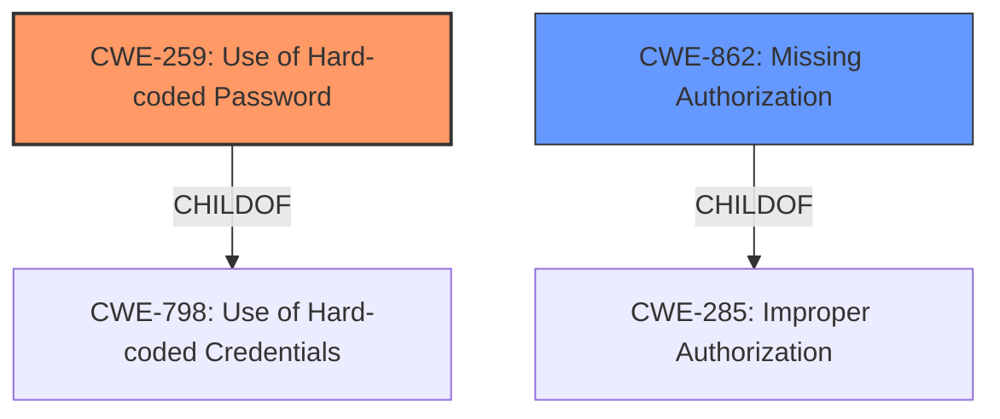

# Enhanced Analysis for CVE-2024-5810

# Summary

| CWE ID  | CWE Name                                           | Confidence | CWE Abstraction Level | CWE Vulnerability Mapping Label | CWE-Vulnerability Mapping Notes |
| ------- | -------------------------------------------------- | ---------- | --------------------- | ------------------------------- | ------------------------------- |
| CWE-259 | Use of Hard-coded Password                         | 0.9        | Variant               | Primary                         | Allowed                         |
| CWE-862 | Missing Authorization                              | 0.7        | Class                 | Secondary                       | Allowed-with-Review             |

## Evidence and Confidence

*   **Confidence Score:** 0.8
*   **Evidence Strength:** HIGH

## Relationship Analysis

The primary weakness is the **use of hardcoded credentials** (CWE-259), which directly leads to **missing authorization** (CWE-862) because the hardcoded credentials bypass normal authorization checks. CWE-259 is a child of CWE-798 (Use of Hard-coded Credentials), and CWE-862 is a child of CWE-285 (Improper Authorization). The relationship here is that the **use of hardcoded credentials** allows attackers to bypass authorization checks, leading to unauthorized access and actions.



## Vulnerability Chain

The vulnerability chain starts with the **use of hardcoded credentials** (CWE-259). This leads to **missing authorization** (CWE-862), allowing unauthenticated attackers to perform various actions, like CSS manipulation, trial setting updates, cache purging, and attachment data disclosure.

## Summary of Analysis

The initial analysis identified the **use of hardcoded credentials** as the root cause, with the resulting impact being unauthorized access. The evidence from the vulnerability description and CVE reference links strongly supports this. The hardcoded token is used to authenticate REST API requests, effectively bypassing any proper authorization checks.

CWE-259 (Use of Hard-coded Password) is the most specific and appropriate CWE to represent the root cause. It is a Variant level CWE, providing a detailed classification. CWE-862 (Missing Authorization) is also relevant because the **use of hardcoded credentials** directly leads to the absence of proper authorization checks. However, CWE-259 is considered the primary weakness since it's the root cause. The unauthorized actions (CSS manipulation, trial setting updates, cache purge, attachment data disclosure) are consequences of the **missing authorization**.

The selection is based on the direct evidence of the **use of hardcoded credentials** and the subsequent lack of authorization. The hierarchical relationships and chain relationships confirm that CWE-259 is the appropriate root cause, leading to CWE-862.

Relevant CWE Information:

*   **CWE-259 (Use of Hard-coded Password):** This CWE accurately describes the **use of hardcoded credentials** for authentication.
*   **CWE-862 (Missing Authorization):** This CWE describes the lack of authorization checks, which is a direct consequence of the **use of hardcoded credentials**.

Other CWEs Considered:

*   CWE-306 (Missing Authentication for Critical Function): While related, the vulnerability description explicitly mentions the **use of hardcoded credentials** for authentication, making CWE-259 a more accurate and specific classification.
*   CWE-639 (Authorization Bypass Through User-Controlled Key): This is similar, but CWE-259 more directly addresses the root cause of the **use of hardcoded credentials**.
*   CWE-863 (Incorrect Authorization): The authorization is not just incorrect; it is effectively bypassed due to the **hardcoded credentials**, making CWE-862 a more suitable choice.
*   CWE-321 (Use of Hard-coded Cryptographic Key): While the hardcoded token could be considered a key, CWE-259 is more specific to the context of authentication via a "password".


## CWE Relationship Analysis

Current CWEs represent these abstraction levels: .


### Vulnerability Chain Analysis

**Chain starting from CWE-863:**
- 863 (Incorrect Authorization) - ROOT


**Chain starting from CWE-321:**
- 321 (Use of Hard-coded Cryptographic Key) - ROOT


### CWE Relationship Diagram

```mermaid
graph TD
    classDef primary fill:#f96,stroke:#333,stroke-width:2px
    classDef secondary fill:#69f,stroke:#333
    classDef tertiary fill:#9e9,stroke:#333
```