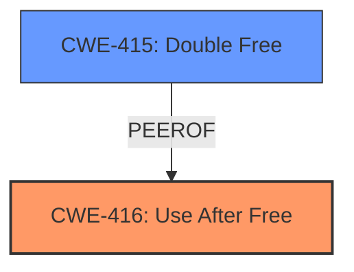

# Analysis Report for CVE-2024-5832

# Vulnerability Analysis Report: CVE-2024-5832

## Description

Use after free in Dawn in Google Chrome prior to 126.0.6478.54 allowed a remote attacker to potentially exploit heap corruption via a crafted HTML page. (Chromium security severity High)

## Vulnerability Description Key Phrases

- **Rootcause:** use after free
- **Impact:** potentially exploit heap corruption
- **Vector:** crafted HTML page
- **Attacker:** remote attacker
- **Product:** Google Chrome
- **Version:** prior to 126.0.6478.54
- **Component:** Dawn

## Analysis (with Relationship Data)

# Summary

| CWE ID  | CWE Name                                                                                                 | Confidence | CWE Abstraction Level | CWE Vulnerability Mapping Label | CWE-Vulnerability Mapping Notes |
| :-------- | :--------------------------------------------------------------------------------------------------------- | :--------- | :---------------------- | :-------------------------------- | :-------------------------------- |
| CWE-416 | Use After Free                                                                                           | 1          | Variant               | Primary                           | Allowed                           |
| CWE-415 | Double Free                                                                                            | 0.5        | Variant               | Secondary                         | Allowed                           |

## Evidence and Confidence

*   **Confidence Score:** 0.8
*   **Evidence Strength:** HIGH

## Relationship Analysis

The primary relationship influencing the decision is the direct identification of "**use after free**" in the vulnerability description. CWE-416 is a Variant-level CWE, which aligns with the goal of selecting the most specific CWE. While other CWEs like CWE-415 (Double Free) were considered due to their similarity, the explicit mention of "use after free" makes CWE-416 the most accurate choice.



## Vulnerability Chain

The vulnerability chain is relatively simple:

1.  **Root Cause:** **Use after free** (CWE-416)
2.  **Impact:** Potential heap corruption

## Summary of Analysis

The primary CWE, CWE-416, is directly supported by the vulnerability description, which explicitly mentions "**use after free**". The retriever results also strongly suggest CWE-416 as the most relevant. The evidence confirms that the vulnerability occurs when memory is accessed after it has been freed, leading to potential heap corruption. While other CWEs like CWE-415 (Double Free) and race conditions were considered, the explicit mention of "use after free" makes CWE-416 the most accurate and specific classification. The selection is at the Variant level, providing appropriate granularity.

Relevant CWE Information:

# Enhanced Context (25 CWEs)
The following CWEs were identified as potentially relevant to this vulnerability:

## CWE-416: Use After Free
**Abstraction Level**: Variant
**Similarity Score**: 0.78
**Source**: dense

**Description**:
The product reuses or references memory after it has been freed. At some point afterward, the memory may be allocated again and saved in another pointer, while the original pointer references a location somewhere within the new allocation. Any operations using the original pointer are no longer valid because the memory "belongs" to the code that operates on the new pointer.

**Mapping Guidance**:
- Usage: Allowed
- Rationale: This CWE entry is at the Variant level of abstraction, which is a preferred level of abstraction for mapping to the root causes of vulnerabilities.

## CWE-415: Double Free
**Abstraction Level**: Variant
**Similarity Score**: 0.73
**Source**: dense

**Description**:
The product calls free() twice on the same memory address, potentially leading to modification of unexpected memory locations.

**Mapping Guidance**:
- Usage: Allowed
- Rationale: This CWE entry is at the Variant level of abstraction, which is a preferred level of abstraction for mapping to the root causes of vulnerabilities.

### Candidate CWE Considerations:

*   **CWE-416 (Use After Free):** Selected as the primary CWE because the vulnerability description explicitly mentions "**use after free**" as the **rootcause**. The CWE description aligns perfectly with the vulnerability details. This is a Variant-level CWE, which is the preferred level of abstraction.
*   **CWE-415 (Double Free):** Considered as a secondary CWE because it is often related to use-after-free vulnerabilities. While a double free could lead to a use-after-free condition, the description does not explicitly state that a double free occurred.
*   **CWE-366 (Race Condition within a Thread) and CWE-362 (Concurrent Execution using Shared Resource with Improper Synchronization ('Race Condition')):** These were not selected because the description does not provide sufficient evidence of a race condition. The use-after-free may or may not involve concurrency.
*   **CWE-787 (Out-of-bounds Write):** This was not selected, as while it could be an impact of use-after-free, the root cause is the memory mismanagement.
*   **CWE-843 (Access of Resource Using Incompatible Type ('Type Confusion')):** This was not selected because there is no explicit mention of type confusion.
*   **CWE-911 (Improper Update of Reference Count):** This was not selected because there is no evidence of reference counting issues.


## CWE Relationship Analysis

Current CWEs represent these abstraction levels: .


### Vulnerability Chain Analysis

**Chain starting from CWE-416:**
- 416 (Use After Free) - ROOT


**Chain starting from CWE-911:**
- 911 (Improper Update of Reference Count) - ROOT


### CWE Relationship Diagram

```mermaid
graph TD
    classDef primary fill:#f96,stroke:#333,stroke-width:2px
    classDef secondary fill:#69f,stroke:#333
    classDef tertiary fill:#9e9,stroke:#333
```


*Report generated on 2025-07-14 00:52:15*
