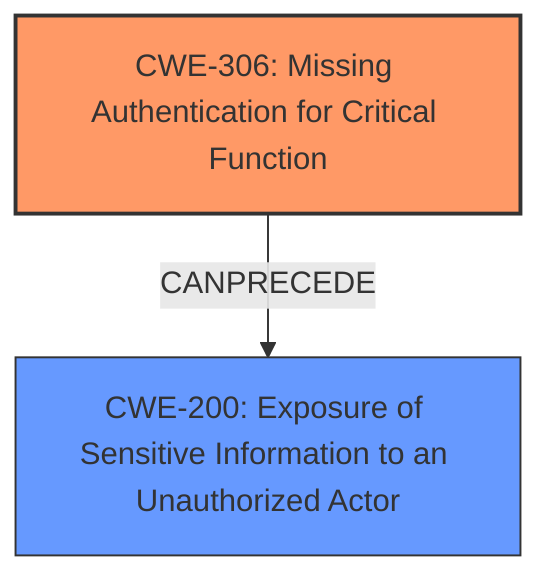

# Enhanced Analysis for CVE-2024-5880

# Summary
| CWE ID | CWE Name | Confidence | CWE Abstraction Level | CWE Vulnerability Mapping Label | CWE-Vulnerability Mapping Notes |
|---|---|---|---|---|---|
| CWE-306 | Missing Authentication for Critical Function | 1.0 | Base | Primary | Allowed |
| CWE-200 | Exposure of Sensitive Information to an Unauthorized Actor | 0.7 | Class | Secondary | Discouraged |

## Evidence and Confidence

*   **Confidence Score:** 0.9
*   **Evidence Strength:** HIGH

## Relationship Analysis
The primary relationship is that **CWE-306** Missing Authentication for Critical Function is a base CWE which can directly lead to **CWE-200** Exposure of Sensitive Information to an Unauthorized Actor. **CWE-200** is a class-level CWE, making **CWE-306** the more specific and appropriate root cause. Other CWEs considered were either too general (like **CWE-285** Improper Authorization) or focused on specific attack vectors or impacts rather than the fundamental **missing authentication**.



## Vulnerability Chain
The vulnerability chain starts with the **ROOT CAUSE**: the **failure to restrict access to the REST API when password protection is enabled (Missing Authentication)**. This leads directly to the **EXPOSURE of sensitive information** because unauthenticated users can access the API. The chain is therefore:

**CWE-306** (Missing Authentication for Critical Function) -> **CWE-200** (Exposure of Sensitive Information to an Unauthorized Actor)

## Summary of Analysis
The initial analysis focused on identifying the root cause of the vulnerability, which is the **plugin's failure to enforce authentication for the REST API when password protection is enabled**. This aligns perfectly with **CWE-306** Missing Authentication for Critical Function. The vulnerability description explicitly states that "**not restricting access to the REST API when password protection is enabled**" allows unauthenticated attackers to gain unauthorized access.

The retriever results also support this, with **CWE-306** being a top candidate. While **CWE-200** Exposure of Sensitive Information to an Unauthorized Actor is also relevant, it represents the impact of the vulnerability rather than the root cause. Therefore, **CWE-306** is the primary CWE.

The relationship analysis reinforces this decision, as **CWE-306** can directly lead to **CWE-200**. The abstraction levels also support this, as **CWE-306** is a Base-level CWE, which is preferred for mapping root causes, while **CWE-200** is a Class-level CWE.

I considered other CWEs like **CWE-862** Missing Authorization, but **CWE-306** is more specific because it highlights the missing authentication as the root cause, which then leads to the authorization bypass.

Relevant CWE Information:

# Enhanced Context (25 CWEs)
The following CWEs were identified as potentially relevant to this vulnerability:

## CWE-352: Cross-Site Request Forgery (CSRF)
**Abstraction Level**: Compound
**Similarity Score**: 0.74
**Source**: dense

**Description**:
The web application does not, or can not, sufficiently verify whether a well-formed, valid, consistent request was intentionally provided by the user who submitted the request.

**Mapping Guidance**:
- Usage: Allowed
- Rationale: This is a well-known Composite of multiple weaknesses that must all occur simultaneously, although it is attack-oriented in nature.
**NOT USED:** CSRF is not relevant as this vulnerability doesn't rely on tricking a user into performing actions. It's a direct access issue.

## CWE-425: Direct Request ('Forced Browsing')
**Abstraction Level**: Base
**Similarity Score**: 0.72
**Source**: dense

**Description**:
The web application does not adequately enforce appropriate authorization on all restricted URLs, scripts, or files.

**Mapping Guidance**:
- Usage: Allowed
- Rationale: This CWE entry is at the Base level of abstraction, which is a preferred level of abstraction for mapping to the root causes of vulnerabilities.
**NOT USED:** This is close, but it's about authorization, and the more direct problem is the missing authentication, which enables the direct request.

## CWE-538: Insertion of Sensitive Information into Externally-Accessible File or Directory
**Abstraction Level**: Base
**Similarity Score**: 0.70
**Source**: dense

**Description**:
The product places sensitive information into files or directories that are accessible to actors who are allowed to have access to the files, but not to the sensitive information.

**Mapping Guidance**:
- Usage: Allowed
- Rationale: This CWE entry is at the Base level of abstraction, which is a preferred level of abstraction for mapping to the root causes of vulnerabilities.
**NOT USED:** This vulnerability doesn't involve placing sensitive information into files or directories. It's about direct access to the API.

## CWE-639: Authorization Bypass Through User-Controlled Key
**Abstraction Level**: Base
**Similarity Score**: 0.70
**Source**: dense

**Description**:
The system's authorization functionality does not prevent one user from gaining access to another user's data or record by modifying the key value identifying the data.

**Mapping Guidance**:
- Usage: Allowed
- Rationale: This CWE entry is at the Base level of abstraction, which is a preferred level of abstraction for mapping to the root causes of vulnerabilities.
**NOT USED:** This vulnerability doesn't involve a user modifying a key to access another user's data.

## CWE-472: External Control of Assumed-Immutable Web Parameter
**Abstraction Level**: Base
**Similarity Score**: 0.70
**Source**: dense

**Description**:
The web application does not sufficiently verify inputs that are assumed to be immutable but are actually externally controllable, such as hidden form fields.

**Mapping Guidance**:
- Usage: Allowed
- Rationale: This CWE entry is at the Base level of abstraction, which is a preferred level of abstraction for mapping to the root causes of vulnerabilities.
**NOT USED:** This vulnerability doesn't involve the external control of immutable parameters.

## CWE-434: Unrestricted Upload of File with Dangerous Type
**Abstraction Level**: Base
**Similarity Score**: 0.70
**Source**: dense

**Description**:
The product allows the upload or transfer of dangerous file types that are automatically processed within its environment.

**Mapping Guidance**:
- Usage: Allowed
- Rationale: This CWE entry is at the Base level of abstraction, which is a preferred level of abstraction for mapping to the root causes of vulnerabilities.
**NOT USED:** This vulnerability doesn't involve unrestricted file uploads.

## CWE-359: Exposure of Private Personal Information to an Unauthorized Actor
**Abstraction Level**: Base
**Similarity Score**: 0.70
**Source**: dense

**Description**:
The product does not properly prevent a person's private, personal information from being accessed by actors who either (1) are not explicitly authorized to access the information or (2) do not have the implicit consent of the person about whom the information is collected.

**Mapping Guidance**:
- Usage: Allowed
- Rationale: This CWE entry is at the Base level of abstraction, which is a preferred level of abstraction for mapping to the root causes of vulnerabilities.
**NOT USED:** While information exposure occurs, the root cause is the missing authentication, making **CWE-306** more relevant.

## CWE-201: Insertion of Sensitive Information Into Sent Data
**Abstraction Level**: Base
**Similarity Score**: 0.69
**Source**: dense

**Description**:
The code transmits data to another actor, but a portion of the data includes sensitive information that should not be accessible to that actor.

**Mapping Guidance**:
- Usage: Allowed
- Rationale: This CWE entry is at the Base level of abstraction, which is a preferred level of abstraction for mapping to the root causes of vulnerabilities.
**NOT USED:** This is more about data transmission. The primary issue here is the lack of authentication.

## CWE-319: Cleartext Transmission of Sensitive Information
**Abstraction Level**: Base
**Similarity Score**: 0.69
**Source**: dense

**Description**:
The product transmits sensitive or security-critical data in cleartext in a communication channel that can be sniffed by unauthorized actors.

**Mapping Guidance**:
- Usage: Allowed
- Rationale: This CWE entry is at the Base level of abstraction, which is a preferred level of abstraction for mapping to the root causes of vulnerabilities.
**NOT USED:** This vulnerability doesn't specifically involve cleartext transmission.

## CWE-178: Improper Handling of Case Sensitivity
**Abstraction Level**: Base
**Similarity Score**: 0.69
**Source**:


## CWE Relationship Analysis

Current CWEs represent these abstraction levels: .


### Vulnerability Chain Analysis

**Chain starting from CWE-359:**
- 359 (Exposure of Private Personal Information to an Unauthorized Actor) - ROOT


**Chain starting from CWE-862:**
- 862 (Missing Authorization) - ROOT


### CWE Relationship Diagram

```mermaid
graph TD
    classDef primary fill:#f96,stroke:#333,stroke-width:2px
    classDef secondary fill:#69f,stroke:#333
    classDef tertiary fill:#9e9,stroke:#333
```