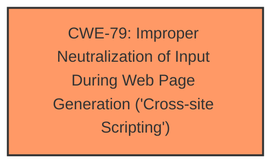

# Analysis Report for CVE-2024-5881

# Vulnerability Analysis Report: CVE-2024-5881

## Description

The Webico Slider Flatsome Addons plugin for WordPress is vulnerable to Stored Cross-Site Scripting via the plugins wbc_image shortcode in all versions up to, and including, 2.0.1 due to **insufficient input sanitization and output escaping on user supplied attributes**. This makes it possible for authenticated attackers, with contributor-level access and above, to inject arbitrary web scripts in pages that will execute whenever a user accesses an injected page.

## Vulnerability Description Key Phrases

- **Rootcause:** insufficient input sanitization and output escaping on user supplied attributes
- **Weakness:** cross-site scripting
- **Impact:** inject arbitrary web scripts
- **Attacker:** authenticated attackers with contributor-level access and above
- **Product:** Webico Slider Flatsome Addons plugin for WordPress
- **Version:** up to and including 2.0.1
- **Component:** wbc_image shortcode

## Analysis (with Relationship Data)

# Summary
| CWE ID | CWE Name | Confidence | CWE Abstraction Level | CWE Vulnerability Mapping Label | CWE-Vulnerability Mapping Notes |
|---|---|---|---|---|---|
| CWE-79 | Improper Neutralization of Input During Web Page Generation ('Cross-site Scripting') | 1.0 | Base | Primary | Allowed |

## Evidence and Confidence

*   **Confidence Score:** 1.0
*   **Evidence Strength:** HIGH

## Relationship Analysis
The primary relationship is the direct match of the vulnerability description to CWE-79, indicating **improper neutralization of input**. No other relationships significantly impacted the decision. CWE-79 is at the Base level of abstraction, which is appropriate for this vulnerability.



## Vulnerability Chain
The chain of events is as follows:
1.  **Root Cause:** Insufficient input sanitization and output escaping of user-supplied attributes in the `wbc_image` shortcode.
2.  **Weakness:** Stored Cross-Site Scripting (XSS) vulnerability.
3.  **Impact:** Attackers can inject arbitrary web scripts into pages, leading to potential session theft, redirection to malicious sites, or website defacement.

## Summary of Analysis
The primary vulnerability is Stored Cross-Site Scripting (XSS) due to **insufficient input sanitization and output escaping** on user-supplied attributes. This aligns directly with CWE-79 "Improper Neutralization of Input During Web Page Generation ('Cross-site Scripting')". The vulnerability description clearly states that the plugin fails to properly sanitize and escape user-provided attributes in the `wbc_image` shortcode, allowing attackers to inject arbitrary web scripts. The provided content gives more detailed information than the basic CVE description, particularly by identifying the affected shortcode, function, and the location of the vulnerable code within the plugin's files.

The evidence supporting this decision comes from the "Vulnerability Description Key Phrases" which includes "**insufficient input sanitization and output escaping on user supplied attributes**" as the root cause and "**cross-site scripting**" as the weakness. Additionally, the "CVE Reference Links Content Summary" explicitly mentions the lack of proper sanitization and escaping within the `wbc_image` shortcode. This confirms that the root cause is improper neutralization of input leading to XSS.

Other CWEs such as CWE-116 (Improper Encoding or Escaping of Output), CWE-352 (Cross-Site Request Forgery (CSRF)), CWE-434 (Unrestricted Upload of File with Dangerous Type) and CWE-96 (Improper Neutralization of Directives in Statically Saved Code ('Static Code Injection')) were considered. However, these CWEs do not accurately reflect the specific vulnerability of XSS resulting from the **insufficient input sanitization and output escaping** in the given context. Therefore, CWE-79 is the most appropriate and specific CWE for this vulnerability.


## CWE Relationship Analysis

Current CWEs represent these abstraction levels: .


### Vulnerability Chain Analysis

**Chain starting from CWE-116:**
- 116 (Improper Encoding or Escaping of Output) - ROOT


**Chain starting from CWE-79:**
- 79 (Improper Neutralization of Input During Web Page Generation ('Cross-site Scripting')) - ROOT


### CWE Relationship Diagram

```mermaid
graph TD
    classDef primary fill:#f96,stroke:#333,stroke-width:2px
    classDef secondary fill:#69f,stroke:#333
    classDef tertiary fill:#9e9,stroke:#333
```


*Report generated on 2025-07-14 00:57:01*
