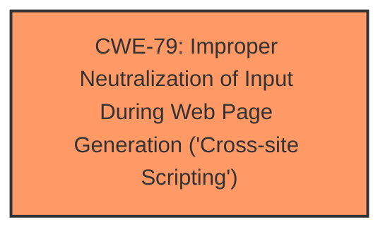

# Raw Analyzer Response for CVE-2024-5902

# Summary

| CWE ID | CWE Name | Confidence | CWE Abstraction Level | CWE Vulnerability Mapping Label | CWE-Vulnerability Mapping Notes |
|---|---|---|---|---|---|
| CWE-79 | Improper Neutralization of Input During Web Page Generation ('Cross-site Scripting') | 1.0 | Base | Allowed | Primary CWE: Root cause is **insufficient input sanitization and output escaping**, which directly leads to XSS. |

## Evidence and Confidence

*   **Confidence Score:** 1.0
*   **Evidence Strength:** HIGH

## Relationship Analysis

The primary relationship that influenced my decision was the direct match between the vulnerability description and the definition of CWE-79. The vulnerability involves **insufficient input sanitization and output escaping**, which allows attackers to inject arbitrary web scripts. This directly aligns with the description of CWE-79, which focuses on the improper neutralization of input during web page generation leading to Cross-Site Scripting. Other CWEs were considered but deemed less relevant as they represent either broader categories or different types of vulnerabilities.

## Vulnerability Chain

The vulnerability chain starts with **insufficient input sanitization and output escaping** (the root cause), which directly leads to the possibility of injecting arbitrary web scripts, resulting in Stored Cross-Site Scripting (XSS).

Root Cause: **Insufficient input sanitization and output escaping**
Weakness: Stored Cross-Site Scripting (XSS)
Impact: Arbitrary web scripts are injected and executed when a high-privileged user views the feedback, potentially leading to account compromise, data theft, or website defacement.

## Summary of Analysis

The analysis is based on the provided evidence, which clearly indicates that the User Feedback plugin for WordPress is vulnerable to Stored Cross-Site Scripting (XSS) due to **insufficient input sanitization and output escaping**. The vulnerability allows unauthenticated attackers to inject arbitrary web scripts in feedback form responses that will execute whenever a high-privileged user tries to view them.

The evidence supporting this conclusion is:

*   "The User Feedback - Create Interactive Feedback Form, User Surveys, and Polls in Seconds plugin for WordPress is vulnerable to Stored Cross-Site Scripting via the name parameter in all versions up to, and including, 1.0.15 due to **insufficient input sanitization and output escaping**."
*   "**Root Cause of Vulnerability:** Insufficient input sanitization and output escaping of the `name` parameter in feedback form responses. This allows an attacker to inject malicious scripts."
*   "**Weaknesses/Vulnerabilities Present:** Stored Cross-Site Scripting (XSS): The plugin fails to properly sanitize user-provided input, specifically the `name` parameter within feedback responses, before storing it in the database."

The graph relationships influenced the selection by confirming that CWE-79 is the most appropriate CWE for this type of vulnerability, focusing on the root cause of improper neutralization.

CWE-79 is selected because it is the most specific and accurate representation of the vulnerability.

Relevant CWE Information:

# Enhanced Context (25 CWEs)
The following CWEs were identified as potentially relevant to this vulnerability:

## CWE-352: Cross-Site Request Forgery (CSRF)
**Abstraction Level**: Compound
**Similarity Score**: 0.77
**Source**: dense

**Description**:
The web application does not, or can not, sufficiently verify whether a well-formed, valid, consistent request was intentionally provided by the user who submitted the request.

**Mapping Guidance**:
- Usage: Allowed
- Rationale: This is a well-known Composite of multiple weaknesses that must all occur simultaneously, although it is attack-oriented in nature.

*Not selected:* While CSRF could potentially be a related concern, the primary issue here is the lack of proper input sanitization and output escaping leading to XSS, making CWE-79 a more direct and accurate classification.

## CWE-472: External Control of Assumed-Immutable Web Parameter
**Abstraction Level**: Base
**Similarity Score**: 0.74
**Source**: dense

**Description**:
The web application does not sufficiently verify inputs that are assumed to be immutable but are actually externally controllable, such as hidden form fields.

**Mapping Guidance**:
- Usage: Allowed
- Rationale: This CWE entry is at the Base level of abstraction, which is a preferred level of abstraction for mapping to the root causes of vulnerabilities.

*Not selected:* While the `name` parameter is externally controlled, the core issue is not that it's assumed immutable, but that its contents are not properly sanitized.

## CWE-425: Direct Request ('Forced Browsing')
**Abstraction Level**: Base
**Similarity Score**: 0.73
**Source**: dense

**Description**:
The web application does not adequately enforce appropriate authorization on all restricted URLs, scripts, or files.

**Mapping Guidance**:
- Usage: Allowed
- Rationale: This CWE entry is at the Base level of abstraction, which is a preferred level of abstraction for mapping to the root causes of vulnerabilities.

*Not selected:* Authorization is not the primary concern here. The issue is that even if a user is authorized to submit feedback, the submitted data is not properly sanitized.

## CWE-434: Unrestricted Upload of File with Dangerous Type
**Abstraction Level**: Base
**Similarity Score**: 0.72
**Source**: dense

**Description**:
The product allows the upload or transfer of dangerous file types that are automatically processed within its environment.

**Mapping Guidance**:
- Usage: Allowed
- Rationale: This CWE entry is at the Base level of abstraction, which is a preferred level of abstraction for mapping to the root causes of vulnerabilities.

*Not selected:* This CWE is specific to file uploads, which is not the case in this vulnerability.

## CWE-116: Improper Encoding or Escaping of Output
**Abstraction Level**: Class
**Similarity Score**: 0.71
**Source**: dense

**Description**:
The product prepares a structured message for communication with another component, but encoding or escaping of the data is either missing or done incorrectly. As a result, the intended structure of the message is not preserved.

**Mapping Guidance**:
- Usage: Allowed-with-Review
- Rationale: This CWE entry is a Class and might have Base-level children that would be more appropriate

*Not selected:* While related, CWE-79 is a more specific child that better reflects the specific XSS vulnerability.

## CWE-80: Improper Neutralization of Script-Related HTML Tags in a Web Page (Basic XSS)
**Abstraction Level**: Variant
**Similarity Score**: 0.71
**Source**: dense

**Description**:
The product receives input from an upstream component, but it does not neutralize or incorrectly neutralizes special characters such as "<", ">", and "&" that could be interpreted as web-scripting elements when they are sent to a downstream component that processes web pages.

*Not selected:* CWE-79 is a more general, but adequately specific, description of the vulnerability.

## CWE-96: Improper Neutralization of Directives in Statically Saved Code ('Static Code Injection')
**Abstraction Level**: Base
**Similarity Score**: 0.70
**Source**: dense

**Description**:
The product receives input from an upstream component, but it does not neutralize or incorrectly neutralizes code syntax before inserting the input into an executable resource, such as a library, configuration file, or template.

**Mapping Guidance**:
- Usage: Allowed
- Rationale: This CWE entry is at the Base level of abstraction, which is a preferred level of abstraction for mapping to the root causes of vulnerabilities.

*Not selected:* This CWE is more applicable to code injection scenarios, not XSS.

## CWE-639: Authorization Bypass Through User-Controlled Key
**Abstraction Level**: Base
**Similarity Score**: 0.70
**Source**: dense

**Description**:
The system's authorization functionality does not prevent one user from gaining access to another user's data or record by modifying the key value identifying the data.

**Mapping Guidance**:
- Usage: Allowed
- Rationale: This CWE entry is at the Base level of abstraction, which is a preferred level of abstraction for mapping to the root causes of vulnerabilities.

*Not selected:* This CWE relates to authorization bypass, which is not the primary issue in this case.

## CWE-359: Exposure of Private Personal Information to an Unauthorized Actor
**Abstraction Level**: Base
**Similarity Score**: 0.69
**Source**: dense

**Description**:
The product does not properly prevent a person's private, personal information from being accessed by actors who either (1) are not explicitly authorized to access the information or (2) do not have the implicit consent of the person about whom the information is collected.

**Mapping Guidance**:
- Usage: Allowed
- Rationale: This CWE entry is at the Base level of abstraction, which is a preferred level of abstraction for mapping to the root causes of vulnerabilities.

*Not selected:* The vulnerability focuses on XSS due to **insufficient input sanitization and output escaping**, not direct exposure of private personal information.