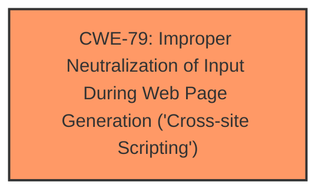

# Enhanced Analysis for CVE-2024-5937

# Summary
| CWE ID | CWE Name | Confidence | CWE Abstraction Level | CWE Vulnerability Mapping Label | CWE-Vulnerability Mapping Notes |
|---|---|---|---|---|---|
| CWE-79 | Improper Neutralization of Input During Web Page Generation ('Cross-site Scripting') | 1.0 | Base | Allowed | Primary CWE. The root cause is **insufficient input sanitization and output escaping**, leading to stored XSS. |

## Evidence and Confidence

*   **Confidence Score:** 1.0
*   **Evidence Strength:** HIGH

## Relationship Analysis
The primary relationship considered was the parent-child relationship between CWE-79 and its potential variants. While other CWEs like CWE-80 (Improper Neutralization of Script-Related HTML Tags in a Web Page (Basic XSS)) are related to XSS, the description doesn't provide enough specific information to pinpoint the exact type of improper neutralization. Therefore, sticking with the base CWE-79 is most appropriate.



## Vulnerability Chain
The vulnerability chain is straightforward:
1.  **Insufficient input sanitization and output escaping** (Root Cause).
2.  Stored Cross-Site Scripting (XSS) due to the root cause.
3.  Arbitrary web script execution in the user's browser (Impact).

## Summary of Analysis
The vulnerability description clearly states that the Simple Alert Boxes plugin is vulnerable to Stored Cross-Site Scripting due to **insufficient input sanitization and output escaping**. The CVE Reference Links Content Summary supports this by stating the "vulnerability stems from **insufficient input sanitization and output escaping** of user-supplied attributes within the `[alert]` shortcode of the Simple Alert Boxes plugin." The primary CWE match listed is CWE-79. Given this information, CWE-79 is the most appropriate mapping. The abstraction level is Base, which is preferred.

Other CWEs considered but not used:

*   CWE-80: While this is a more specific variant of XSS, the description doesn't provide enough information to confirm the specific type of improper neutralization.
*   CWE-116: This CWE focuses on improper encoding or escaping of output, which is part of the problem. However, it doesn't explicitly capture the XSS aspect as clearly as CWE-79.
*   CWE-352: Cross-Site Request Forgery (CSRF) is not applicable as the vulnerability is Stored XSS and not related to forging requests.
*   CWE-434: Unrestricted Upload of File with Dangerous Type is not applicable as this involves shortcode injection, not file uploads.
*   CWE-425: Direct Request ('Forced Browsing') is not applicable as the vulnerability is Stored XSS and not related to authorization issues.
*   CWE-96: Improper Neutralization of Directives in Statically Saved Code ('Static Code Injection') is not applicable as this is XSS, not code injection.
*   CWE-502: Deserialization of Untrusted Data is not applicable as this involves shortcode injection, not deserialization.
*   CWE-138: Improper Neutralization of Special Elements is a more general class of weakness. CWE-79 is a more specific and appropriate fit.
*   CWE-494: Download of Code Without Integrity Check is not applicable as this involves shortcode injection, not downloads.
Relevant CWE Information:


## CWE Relationship Analysis

Current CWEs represent these abstraction levels: .


### Vulnerability Chain Analysis

**Chain starting from CWE-502:**
- 502 (Deserialization of Untrusted Data) - ROOT


**Chain starting from CWE-116:**
- 116 (Improper Encoding or Escaping of Output) - ROOT


### CWE Relationship Diagram

```mermaid
graph TD
    classDef primary fill:#f96,stroke:#333,stroke-width:2px
    classDef secondary fill:#69f,stroke:#333
    classDef tertiary fill:#9e9,stroke:#333
```