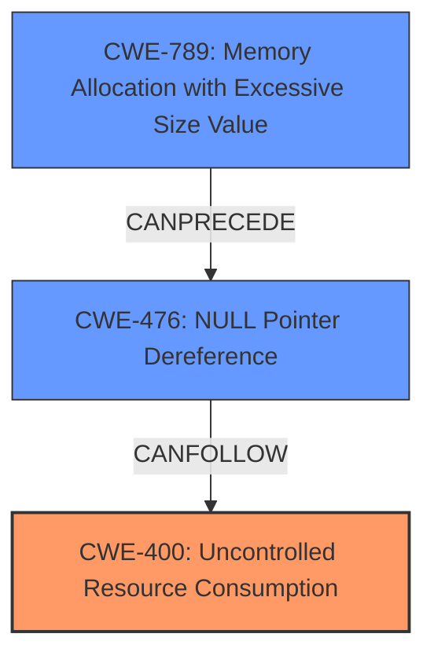

# Raw Analyzer Response for CVE-2024-5953

# Summary
| CWE ID | CWE Name | Confidence | CWE Abstraction Level | CWE Vulnerability Mapping Label | CWE-Vulnerability Mapping Notes |
|---|---|---|---|---|---|
| CWE-400 | Uncontrolled Resource Consumption | 0.8 | Class |  Primary | Allowed-with-Review |
| CWE-476 | NULL Pointer Dereference | 0.6 | Base | Secondary | Allowed |
| CWE-789 | Memory Allocation with Excessive Size Value | 0.5 | Variant | Secondary | Allowed |

## Evidence and Confidence

*   **Confidence Score:** 0.7
*   **Evidence Strength:** MEDIUM

## Relationship Analysis
The primary CWE, CWE-400 [Uncontrolled Resource Consumption], is a Class-level CWE, and more specific Base or Variant CWEs could potentially apply, but the description doesn't provide enough detail to pinpoint the exact resource being consumed. CWE-476 [NULL Pointer Dereference] and CWE-789 [Memory Allocation with Excessive Size Value] are considered as possible secondary CWEs, but their relation to the primary CWE is uncertain based on provided information. The relationships between CWEs were considered to identify potential vulnerability chains and alternative classifications.

## Vulnerability Chain
The vulnerability chain starts with a **malformed hash in password**. The subsequent sequence of weaknesses follows:

1.  **Malformed Hash:** The root cause is a **malformed hash** stored as the user's password.
2.  **Resource Consumption:** Attempting to authenticate with this **malformed hash** leads to **uncontrolled resource consumption** on the server. This could involve excessive CPU usage, memory allocation, or other resource exhaustion.
3.  **Denial of Service:** The **uncontrolled resource consumption** ultimately results in a denial of service (DoS), making the server unavailable.

The primary CWE is CWE-400 [Uncontrolled Resource Consumption].

## Summary of Analysis
The initial assessment focused on identifying the root cause and impact of the vulnerability. The evidence clearly points to a denial-of-service vulnerability triggered by a **malformed hash in the password**. The provided information indicates that an authenticated user can cause a server denial of service by attempting to log in with an account that has a **malformed hash**.

The retriever results suggested several CWEs, including CWE-476 [NULL Pointer Dereference], CWE-407 [Inefficient Algorithmic Complexity], CWE-204 [Observable Response Discrepancy], and CWE-328 [Use of Weak Hash]. However, CWE-400 [Uncontrolled Resource Consumption] aligns best with the observed behavior of the server being overwhelmed by the malformed hash, leading to a denial of service.

The graph relationships helped in understanding potential chains of vulnerabilities. While CWE-476 [NULL Pointer Dereference] and CWE-789 [Memory Allocation with Excessive Size Value] were considered, the evidence is insufficient to definitively link them to the root cause.

The selected CWEs are at an appropriate level of specificity, given the available evidence. CWE-400 [Uncontrolled Resource Consumption] accurately captures the core issue of the server being overwhelmed by the malformed hash.

Relevant CWE Information:

# Enhanced Context (25 CWEs)
The following CWEs were identified as potentially relevant to this vulnerability:

## CWE-90: Improper Neutralization of Special Elements used in an LDAP Query ('LDAP Injection')
**Abstraction Level**: Base
**Similarity Score**: 0.78
**Source**: dense

**Description**:
The product constructs all or part of an LDAP query using externally-influenced input from an upstream component, but it does not neutralize or incorrectly neutralizes special elements that could modify the intended LDAP query when it is sent to a downstream component.

**Mapping Guidance**:
- Usage: Allowed
- Rationale: This CWE entry is at the Base level of abstraction, which is a preferred level of abstraction for mapping to the root causes of vulnerabilities.

## CWE-204: Observable Response Discrepancy
**Abstraction Level**: Base
**Similarity Score**: 0.74
**Source**: dense

**Description**:
The product provides different responses to incoming requests in a way that reveals internal state information to an unauthorized actor outside of the intended control sphere.

**Mapping Guidance**:
- Usage: Allowed
- Rationale: This CWE entry is at the Base level of abstraction, which is a preferred level of abstraction for mapping to the root causes of vulnerabilities.

## CWE-303: Incorrect Implementation of Authentication Algorithm
**Abstraction Level**: Base
**Similarity Score**: 0.73
**Source**: dense

**Description**:
The requirements for the product dictate the use of an established authentication algorithm, but the implementation of the algorithm is incorrect.

**Mapping Guidance**:
- Usage: Allowed
- Rationale: This CWE entry is at the Base level of abstraction, which is a preferred level of abstraction for mapping to the root causes of vulnerabilities.

## CWE-1391: Use of Weak Credentials
**Abstraction Level**: Class
**Similarity Score**: 0.72
**Source**: dense

**Description**:
The product uses weak credentials (such as a default key or hard-coded password) that can be calculated, derived, reused, or guessed by an attacker.

**Mapping Guidance**:
- Usage: Allowed-with-Review
- Rationale: This CWE entry is a Class and might have Base-level children that would be more appropriate

## CWE-916: Use of Password Hash With Insufficient Computational Effort
**Abstraction Level**: Base
**Similarity Score**: 0.72
**Source**: dense

**Description**:
The product generates a hash for a password, but it uses a scheme that does not provide a sufficient level of computational effort that would make password cracking attacks infeasible or expensive.

**Mapping Guidance**:
- Usage: Allowed
- Rationale: This CWE entry is at the Base level of abstraction, which is a preferred level of abstraction for mapping to the root causes of vulnerabilities.

## CWE-328: Use of Weak Hash
**Abstraction Level**: Base
**Similarity Score**: 0.72
**Source**: dense

**Description**:
The product uses an algorithm that produces a digest (output value) that does not meet security expectations for a hash function that allows an adversary to reasonably determine the original input (preimage attack), find another input that can produce the same hash (2nd preimage attack), or find multiple inputs that evaluate to the same hash (birthday attack).

**Mapping Guidance**:
- Usage: Allowed
- Rationale: This CWE entry is at the Base level of abstraction, which is a preferred level of abstraction for mapping to the root causes of vulnerabilities.

## CWE-617: Reachable Assertion
**Abstraction Level**: Base
**Similarity Score**: 0.70
**Source**: dense

**Description**:
The product contains an assert() or similar statement that can be triggered by an attacker, which leads to an application exit or other behavior that is more severe than necessary.

**Mapping Guidance**:
- Usage: Allowed
- Rationale: This CWE entry is at the Base level of abstraction, which is a preferred level of abstraction for mapping to the root causes of vulnerabilities.

## CWE-305: Authentication Bypass by Primary Weakness
**Abstraction Level**: Base
**Similarity Score**: 0.70
**Source**: dense

**Description**:
The authentication algorithm is sound, but the implemented mechanism can be bypassed as the result of a separate weakness that is primary to the authentication error.

**Mapping Guidance**:
- Usage: Allowed
- Rationale: This CWE entry is at the Base level of abstraction, which is a preferred level of abstraction for mapping to the root causes of vulnerabilities.

## CWE-1390: Weak Authentication
**Abstraction Level**: Class
**Similarity Score**: 0.70
**Source**: dense

**Description**:
The product uses an authentication mechanism to restrict access to specific users or identities, but the mechanism does not sufficiently prove that the claimed identity is correct.

**Mapping Guidance**:
- Usage: Allowed-with-Review
- Rationale: This CWE entry is a Class and might have Base-level children that would be more appropriate

## CWE-288: Authentication Bypass Using an Alternate Path or Channel
**Abstraction Level**: Base
**Similarity Score**: 0.70
**Source**: dense

**Description**:
The product requires authentication, but the product has an alternate path or channel that does not require authentication.

**Mapping Guidance**:
- Usage: Allowed
- Rationale: This CWE entry is at the Base level of abstraction, which is a preferred level of abstraction for mapping to the root causes of vulnerabilities.

## CWE-