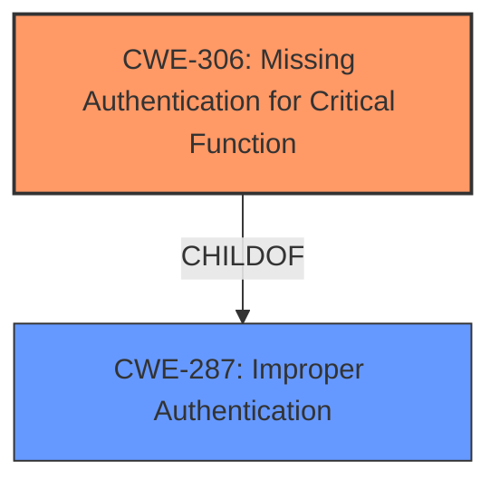

# Analysis for CVE-2024-5956

# Summary
| CWE ID | CWE Name | Confidence | CWE Abstraction Level | CWE Vulnerability Mapping Label | CWE-Vulnerability Mapping Notes |
|---|---|---|---|---|---|
| CWE-306 | Missing Authentication for Critical Function | 0.9 | Base | Primary | Allowed |
| CWE-287 | Improper Authentication | 0.6 | Class | Secondary | Discouraged |

## Evidence and Confidence

*   **Confidence Score:** 0.8
*   **Evidence Strength:** MEDIUM

## Relationship Analysis
The primary relationship influencing the selection was the parent-child relationship between CWE-287 (Improper Authentication) and CWE-306 (Missing Authentication for Critical Function). Since the vulnerability description explicitly states that the issue is a bypass of authentication, CWE-306, which is a child of CWE-287, is more appropriate as it is more specific.

## Vulnerability Chain
The vulnerability chain starts with the **missing authentication** for a critical function, which leads to the impact of unauthenticated remote attackers bypassing authentication and gaining partial data access.

## Summary of Analysis
The initial analysis focused on identifying the root cause of the vulnerability. The key phrase "bypass authentication" strongly suggests an authentication issue. The retriever results listed CWE-306 (Missing Authentication for Critical Function) and CWE-287 (Improper Authentication) as potential candidates. Given the provided context and the CWE specifications, CWE-306 was chosen as the primary CWE because it directly addresses the **missing authentication** aspect. CWE-287 was considered as a secondary CWE due to its broader nature, but CWE-306 provides a more precise classification.

The analysis is heavily based on the vulnerability description key phrases, specifically "bypass authentication". The CWE guidance on Authentication vs Authorization assisted in selecting the appropriate CWE.

Relevant CWE Information:

# Enhanced Context (25 CWEs)
The following CWEs were identified as potentially relevant to this vulnerability:

## CWE-306: Missing Authentication for Critical Function
**Abstraction Level**: Base
**Similarity Score**: 1101.96
**Source**: sparse

**Description**:
The product does not perform any authentication for functionality that requires a provable user identity or consumes a significant amount of resources.

**Mapping Guidance**:
- Usage: Allowed
- Rationale: This CWE entry is at the Base level of abstraction, which is a preferred level of abstraction for mapping to the root causes of vulnerabilities.

# Complete CWE Specifications

CWE-287: Improper Authentication
The product performs an authentication step, but it does not do it correctly, allowing an attacker to bypass it.

CWE-306: Missing Authentication for Critical Function
The product does not perform any authentication for functionality that requires a provable user identity or consumes a significant amount of resources.

**CWE-306: Missing Authentication for Critical Function**

*   **Technical Explanation:** The vulnerability description states that unauthenticated remote attackers can bypass authentication. This aligns directly with CWE-306, which describes a scenario where a product does not perform any authentication for critical functionality. The use of "garbage data" to achieve this bypass further suggests a **failure to validate** user identity, as mentioned in the CWE description.
*   **Security Implications:** The security implication is that attackers can gain unauthorized access to sensitive data without providing valid credentials. This could lead to data breaches, system compromise, and other severe security incidents.
*   **Relationship Analysis:** CWE-306 is a child of CWE-287 (Improper Authentication). While CWE-287 could be considered, CWE-306 is more specific as it explicitly states that authentication is missing, rather than merely being performed improperly.
*   **Mapping Guidance Influence:** The MITRE mapping guidance ALLOWS the use of CWE-306 and notes that it is a Base level of abstraction, which is preferred. The guidance helped prioritize CWE-306 since it aligns with the vulnerability's root cause.
*   **Confidence:** 0.9

**CWE-287: Improper Authentication**

*   **Technical Explanation:** While the vulnerability description primarily points to missing authentication, "Improper Authentication" could be considered a secondary classification. The root cause may be an authentication process exists but is flawed, allowing attackers to bypass it using garbage data.
*   **Security Implications:** Similar to CWE-306, the security implications involve unauthorized access to sensitive resources.
*   **Relationship Analysis:** CWE-287 is a parent of CWE-306. However, due to the specific mention of "bypass authentication," CWE-306 is the more precise and suitable primary mapping.
*   **Mapping Guidance Influence:** The MITRE mapping guidance DISCOURAGES direct mapping to CWE-287 if a more specific child CWE is applicable, which is the case here with CWE-306.
*   **Confidence:** 0.6

**CWEs Considered But Not Used:**

*   **CWE-798 (Use of Hard-coded Credentials)**: This CWE was considered due to the possibility of the authentication bypass being related to hard-coded credentials. However, the description mentions "garbage data" which is a better fit to the other CWEs.
*   **CWE-639 (Authorization Bypass Through User-Controlled Key)** and **CWE-863 (Incorrect Authorization)**: These were considered but deemed less relevant as the primary issue is about bypassing authentication rather than authorization.
*   **CWE-918 (Server-Side Request Forgery (SSRF))**: This was considered due to the data access, but it is not a request forgery, but a bypass of authentication.