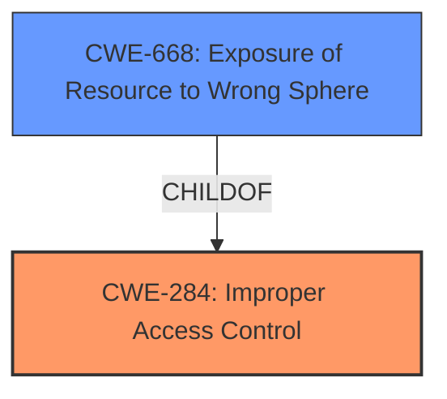

# Analysis for CVE-2024-6053

# Summary

| CWE ID  | CWE Name                       | Confidence | CWE Abstraction Level | CWE Vulnerability Mapping Label | CWE-Vulnerability Mapping Notes |
| :------- | :----------------------------- | :--------- | :-------------------- | :------------------------------ | :------------------------------ |
| CWE-284 | Improper Access Control        | 0.85       | Pillar                | Primary                         | Discouraged                     |
| CWE-668 | Exposure of Resource to Wrong Sphere | 0.65       | Class                 | Secondary                       | Discouraged                     |

## Evidence and Confidence

*   **Confidence Score:** 0.75
*   **Evidence Strength:** MEDIUM

## Relationship Analysis

The primary relationship influencing the decision is that CWE-284 is a high-level class (Pillar) encompassing various access control issues. While more specific CWEs exist (e.g., CWE-862, CWE-863, CWE-306), the provided information doesn't pinpoint the exact nature of the **improper access control**. CWE-668 is related, as it reflects exposing the clipboard data to the wrong entity, but it is still a Class level. Due to the lack of specific details, a more granular CWE cannot be confidently selected.

## Vulnerability Chain

The vulnerability chain starts with **improper access control** (CWE-284), leading to the unintentional sharing of the clipboard with the current meeting presenter. The chain is:

1.  **Improper Access Control** (CWE-284) - The root cause: the clipboard synchronization feature does not properly control access.
2.  Unintentional Sharing of Clipboard Data - The impact: sensitive information is exposed to an unintended recipient.

## Summary of Analysis

The initial assessment strongly leaned towards CWE-284 (Improper Access Control) due to the explicit mention of "**Improper access control**" in the vulnerability description and CVE summary. The retriever results also list CWE-284 as the top candidate. The guidance suggests that if more detail were known about whether authentication or authorization were the root cause, then a more specific child CWE might be more appropriate, but that information is lacking, so CWE-284 is the most appropriate choice.

CWE-668 (Exposure of Resource to Wrong Sphere) was considered because the vulnerability results in the clipboard data being exposed to the wrong entity (the meeting presenter). However, it's a consequence of the **improper access control** rather than the root cause itself.

The final decision is based on the evidence from the vulnerability description and CVE summary. The selected CWEs are at the optimal level of specificity given the available information.

Relevant CWE Information:

# Enhanced Context (25 CWEs)
The following CWEs were identified as potentially relevant to this vulnerability:

## CWE-668: Exposure of Resource to Wrong Sphere
**Abstraction Level**: Class
**Similarity Score**: 0.75
**Source**: dense

**Description**:
The product exposes a resource to the wrong control sphere, providing unintended actors with inappropriate access to the resource.

**Mapping Guidance**:
- Usage: Discouraged
- Rationale: CWE-668 is high-level and is often misused as a catch-all when lower-level CWE IDs might be applicable. It is sometimes used for low-information vulnerability reports [REF-1287]. It is a level-1 Class (i.e., a child of a Pillar). It is not useful for trend analysis.

## CWE-284: Improper Access Control
**Abstraction Level**: Pillar
**Similarity Score**: 1367.87
**Source**: sparse

**Description**:
The software does not restrict access to resources (files, data, actions, etc.) to only those authorized users.

**Mapping Guidance**:
- Usage: Discouraged
- Rationale: CWE-284 is high-level and is often misused as a catch-all when lower-level CWE IDs might be applicable. It is sometimes used for low-information vulnerability reports [REF-1287]. It is a level-1 Class (i.e., a child of a Pillar). It is not useful for trend analysis.

---