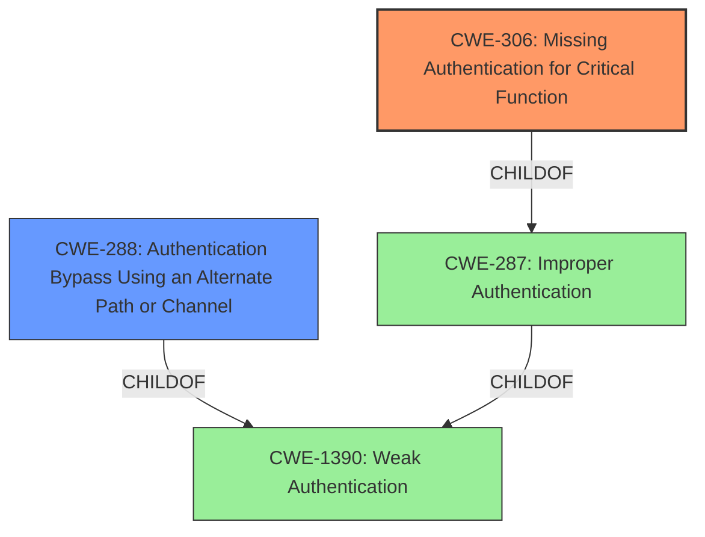

# Analysis for CVE-2024-6057

# Summary
| CWE ID  | CWE Name                                                                                                                   | Confidence | CWE Abstraction Level | CWE Vulnerability Mapping Label | CWE-Vulnerability Mapping Notes |
| :-------- | :------------------------------------------------------------------------------------------------------------------------- | :--------- | :---------------------- | :-------------------------------- | :------------------------------ |
| CWE-306 | Missing Authentication for Critical Function                                                                             | 0.9        | Base                    | Primary                           | Allowed                       |
| CWE-288 | Authentication Bypass Using an Alternate Path or Channel                                                               | 0.7        | Base                    | Secondary                         | Allowed                       |

## Evidence and Confidence

*   **Confidence Score:** 0.8
*   **Evidence Strength:** HIGH

## Relationship Analysis
The primary relationship that influenced the CWE selection was the ChildOf relationship between CWE-306 (Missing Authentication for Critical Function) and CWE-287 (Improper Authentication). CWE-306 is a more specific case of CWE-287, which is a class-level CWE. The vulnerability description explicitly mentions **improper authentication**, but further specifies it occurs because authentication is **missing** for a critical function (accessing the vault password in offline mode). Therefore, CWE-306 is the more appropriate and specific choice.

The relationship between CWE-288 (Authentication Bypass Using an Alternate Path or Channel) and its parent CWEs, such as CWE-287 (Improper Authentication), helped contextualize the bypass mechanism. The offline mode feature serves as an alternate path that lacks proper authentication, leading to the bypass. This justifies the inclusion of CWE-288 as a secondary CWE.

## Vulnerability Chain
The vulnerability chain starts with the **missing authentication** for accessing the vault password feature in offline mode (CWE-306). This allows an attacker with compromised access to an RDM instance to **bypass** the vault master password (CWE-288), ultimately leading to unauthorized access to stored secrets (impact).

CWE-306 (Root Cause) -> CWE-288 (Bypass) -> Unauthorized Access (Impact)

## Summary of Analysis
The initial assessment identified **improper authentication** as the **root cause**, aligning with the vulnerability description and CVE summary. The Retriever Results suggested several CWEs related to authentication and access control, but CWE-306 (Missing Authentication for Critical Function) emerged as the most suitable primary CWE due to its specificity. The offline mode feature acting as an alternate, unprotected channel further supported the inclusion of CWE-288 (Authentication Bypass Using an Alternate Path or Channel) as a secondary CWE.

The final decision is based on a thorough analysis of the vulnerability description, supporting evidence from the CVE summary, and consideration of relevant CWE relationships and mapping guidance. The selected CWEs are at the optimal level of specificity, accurately representing the **root cause** and mechanism of the vulnerability. The CWE-306 is the more precise choice because the **authentication** is entirely **missing** for the specified functionality.

Relevant CWE Information:

**CWE-306: Missing Authentication for Critical Function**
*   The product does not perform any authentication for functionality that requires a provable user identity or consumes a significant amount of resources.

    *The vulnerability description states the issue is with* ***improper authentication*** *in the vault password feature in offline mode, which equates to* ***missing authentication*** *when accessing the feature in this mode.*

**CWE-288: Authentication Bypass Using an Alternate Path or Channel**
*   The product requires authentication, but the product has an alternate path or channel that does not require authentication.

    *The vault master password should require authentication, but offline mode acts as an alternate channel where this* ***authentication*** *is* ***bypassed***. *An attacker who has already compromised an RDM instance can leverage this to gain unauthorized access.*

The other CWEs were considered but were not used for the following reasons:

*   CWE-549, CWE-256, and CWE-522 relate to password storage and protection, which is not the primary issue here.
*   CWE-502 and CWE-1336 relate to deserialization and template engine vulnerabilities, which are not relevant to the vulnerability.
*   CWE-284, CWE-285, and CWE-863 relate to general access control or incorrect authorization, but the more specific CWE-306 is more appropriate as authentication is missing.
*   CWE-620, CWE-178, CWE-1304, CWE-502, CWE-1336, CWE-420 are not relevant to the vulnerability description.