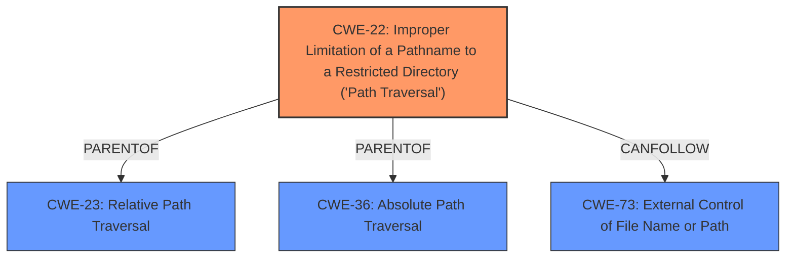

# Analysis Report for CVE-2024-6090

# Vulnerability Analysis Report: CVE-2024-6090

## Description

A **path traversal** vulnerability exists in gaizhenbiao/chuanhuchatgpt version 20240410, allowing any user to delete other users chat histories. This vulnerability can also be exploited to delete any files ending in `.json` on the target system, leading to a denial of service as users are unable to authenticate.

## Vulnerability Description Key Phrases

- **Rootcause:** path traversal
- **Weakness:** path traversal vulnerability
- **Impact:** ['delete any files ending in `.json`', 'denial of service']
- **Attacker:** any user
- **Product:** gaizhenbiao/chuanhuchatgpt
- **Version:** 20240410

## Analysis (with Relationship Data)

# Summary

| CWE ID | CWE Name | Confidence | CWE Abstraction Level | CWE Vulnerability Mapping Label | CWE-Vulnerability Mapping Notes |
|---|---|---|---|---|---|
| CWE-22 | Improper Limitation of a Pathname to a Restricted Directory ('Path Traversal') | 1.0 | Base | Allowed | Primary CWE: This is the root cause of the vulnerability. |

## Evidence and Confidence

*   **Confidence Score:** 1.0
*   **Evidence Strength:** HIGH

## Relationship Analysis
The primary CWE is CWE-22, which represents the **path traversal** vulnerability directly mentioned in the description. The retriever results also highlight CWE-22 as the top candidate. CWE-22 has hierarchical relationships like `ParentOf` to CWE-23 (Relative Path Traversal) and CWE-36 (Absolute Path Traversal). Given that the description doesn't specify relative or absolute path traversal, sticking to the base CWE-22 is most appropriate. CWE-73 (External Control of File Name or Path) is a related CWE and can follow CWE-22.



## Vulnerability Chain
The vulnerability chain starts with CWE-22 (**path traversal**) which allows an attacker to delete arbitrary `.json` files, leading to a denial of service.

CWE-22 (Improper Limitation of a Pathname to a Restricted Directory ('Path Traversal')) -> Impact: Deletion of arbitrary .json files -> Denial of Service.

## Summary of Analysis
The analysis strongly supports CWE-22 as the primary weakness. The vulnerability description explicitly mentions "**path traversal**". The retriever results confirm this with a high score. The relationship analysis shows that CWE-22 is a base CWE with child CWEs for specific types of path traversal, but the description doesn't provide enough information to choose a more specific child. The chosen CWE is at the optimal level of specificity given the provided evidence.


## CWE Relationship Analysis

Current CWEs represent these abstraction levels: .


### Vulnerability Chain Analysis

**Chain starting from CWE-73:**
- 73 (External Control of File Name or Path) - ROOT


**Chain starting from CWE-23:**
- 23 (Relative Path Traversal) - ROOT


### CWE Relationship Diagram

```mermaid
graph TD
    classDef primary fill:#f96,stroke:#333,stroke-width:2px
    classDef secondary fill:#69f,stroke:#333
    classDef tertiary fill:#9e9,stroke:#333
```


*Report generated on 2025-07-14 01:13:20*
