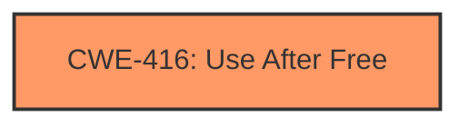

# Analysis Report for CVE-2024-6103

# Vulnerability Analysis Report: CVE-2024-6103

## Description

Use after free in Dawn in Google Chrome prior to 126.0.6478.114 allowed a remote attacker to potentially exploit heap corruption via a crafted HTML page. (Chromium security severity High)

## Vulnerability Description Key Phrases

- **Rootcause:** use after free
- **Impact:** potentially exploit heap corruption
- **Vector:** crafted HTML page
- **Attacker:** remote attacker
- **Product:** Google Chrome
- **Version:** prior to 126.0.6478.114
- **Component:** Dawn

## Analysis (with Relationship Data)

# Summary
| CWE ID  | CWE Name                                                                                     | Confidence | CWE Abstraction Level | CWE Vulnerability Mapping Label | CWE-Vulnerability Mapping Notes |
| :-------- | :------------------------------------------------------------------------------------------- | :---------- | :---------------------- | :------------------------------ | :------------------------------ |
| CWE-416 | Use After Free                                                                               | 1         | Variant                 | Primary                         | Allowed                       |

## Evidence and Confidence

*   **Confidence Score:** 1
*   **Evidence Strength:** HIGH

## Relationship Analysis
The primary identified weakness is CWE-416 **Use After Free**, which is a variant level CWE. There are other CWEs that can follow Use After Free such as CWE-754, CWE-364, CWE-362, and CWE-1265. Also, CWE-123 **Write-what-where Condition** can follow CWE-416.



## Vulnerability Chain
The vulnerability chain starts with a **use after free** condition (CWE-416) within the Dawn graphics library in Google Chrome. The impact is potential heap corruption, which could lead to arbitrary code execution. The vulnerability is triggered by a crafted HTML page, making it exploitable by a remote attacker.

## Summary of Analysis
The primary weakness identified is CWE-416 **Use After Free**, which occurs when memory is accessed after it has been freed. This aligns with the vulnerability description, which explicitly states "Use after free in Dawn in Google Chrome." The CVE Reference Links Content Summary also supports this classification, stating: "**Root Cause:** Use-after-free vulnerability in the Dawn graphics library" and "**Weaknesses/Vulnerabilities:** Use-after-free: The vulnerability occurs because memory is accessed after it has been freed."

I considered other CWEs from the Retriever Results, such as CWE-366 **Race Condition within a Thread**, CWE-843 **Access of Resource Using Incompatible Type ('Type Confusion')**, and CWE-415 **Double Free**. However, the evidence strongly supports CWE-416 **Use After Free** as the primary weakness. CWE-416 is at the Variant level of abstraction, which is a preferred level of abstraction for mapping to the root causes of vulnerabilities.

The selection of CWE-416 is based on direct evidence from the vulnerability description and CVE reference links. The relationship analysis confirms that CWE-416 is a well-supported classification.

Relevant CWE Information:
# Enhanced Context (25 CWEs)
The following CWEs were identified as potentially relevant to this vulnerability:

## CWE-416: Use After Free
**Abstraction Level**: Variant
**Similarity Score**: 0.77
**Source**: dense

**Description**:
The product reuses or references memory after it has been freed. At some point afterward, the memory may be allocated again and saved in another pointer, while the original pointer references a location somewhere within the new allocation. Any operations using the original pointer are no longer valid because the memory "belongs" to the code that operates on the new pointer.

**Mapping Guidance**:
- Usage: Allowed
- Rationale: This CWE entry is at the Variant level of abstraction, which is a preferred level of abstraction for mapping to the root causes of vulnerabilities.


## CWE Relationship Analysis

Current CWEs represent these abstraction levels: .


### Vulnerability Chain Analysis

**Chain starting from CWE-123:**
- 123 (Write-what-where Condition) - ROOT


**Chain starting from CWE-416:**
- 416 (Use After Free) - ROOT


### CWE Relationship Diagram

```mermaid
graph TD
    classDef primary fill:#f96,stroke:#333,stroke-width:2px
    classDef secondary fill:#69f,stroke:#333
    classDef tertiary fill:#9e9,stroke:#333
```


*Report generated on 2025-07-14 01:14:13*
