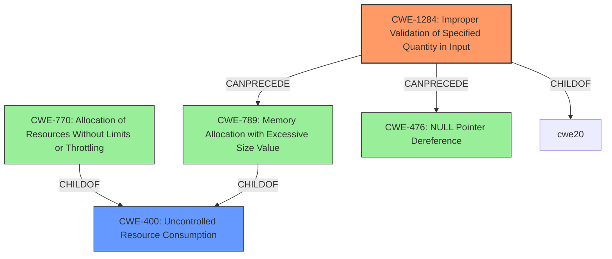

# Analysis for CVE-2024-6126

# Summary

| CWE ID    | CWE Name                                                                                                            | Confidence | CWE Abstraction Level | CWE Vulnerability Mapping Label | CWE-Vulnerability Mapping Notes |
| :-------- | :------------------------------------------------------------------------------------------------------------------ | :--------- | :---------------------- | :------------------------------ | :------------------------------ |
| **CWE-1284** | **Improper Validation of Specified Quantity in Input**                                                                          | 0.9        | Base                    | Primary                         | Allowed                       |
| CWE-400   | Uncontrolled Resource Consumption                                                                                 | 0.7        | Class                   | Secondary                       | Discouraged                    |

## Evidence and Confidence

*   **Confidence Score:** 0.8
*   **Evidence Strength:** HIGH

## Relationship Analysis

The primary relationship influencing the selection was the child-of relationship between CWE-1284 and CWE-20 (Improper Input Validation). The vulnerability description clearly indicates improper validation as the root cause. Additionally, CWE-1284 can precede CWE-789 (Memory Allocation with Excessive Size Value), and CWE-476 (NULL Pointer Dereference), suggesting a possible vulnerability chain. The decision favored the base-level CWE-1284 to accurately represent the **improper validation** of the `SSH_AGENT_PID` environment variable's content. CWE-400 is a parent of CWE-770 (Allocation of Resources Without Limits or Throttling) and CWE-789, indicating a broader resource consumption issue, which is a potential impact of the **improper input validation**.

## Vulnerability Chain

The vulnerability chain starts with **improper validation** of the `SSH_AGENT_PID` environment variable (CWE-1284). This leads to an attacker's ability to manipulate the PID, potentially leading to the killing of arbitrary processes, and resulting in a denial of service (DoS). The chain is:

1.  CWE-1284: Improper Validation of Specified Quantity in Input (**Root Cause**)
2.  CWE-400: Uncontrolled Resource Consumption (DoS - **Impact**)

## Summary of Analysis

The analysis is heavily based on the provided evidence, specifically the CVE Reference Links Content Summary, which clearly states that the vulnerability stems from **improper input validation** of the `SSH_AGENT_PID` environment variable. The `atoi()` function is used without error checking, allowing for manipulated input to be processed as a valid PID.

The hierarchical relationships influenced the selection, favoring the base-level CWE-1284 for its specificity in addressing the **improper input validation**. While CWE-400 is a potential impact, CWE-1284 better represents the root cause.

The decision to select CWE-1284 is justified by the evidence: "Improper input validation of the `SSH_AGENT_PID` environment variable within the `pam-ssh-add` component."

The selected CWEs are at the optimal level of specificity because CWE-1284 directly addresses the **improper validation** issue, while CWE-400 reflects the resulting denial-of-service impact.

Relevant CWE Information:

*   CWE-1284: Improper Validation of Specified Quantity in Input perfectly matches the description. The product receives input (SSH\_AGENT\_PID) expected to specify a quantity (PID), but does not validate or incorrectly validates that the quantity has the required properties.

CWEs Considered but Not Used:

*   CWE-789: Memory Allocation with Excessive Size Value was considered due to the potential for `atoi()` to return a very large number, but this isn't explicitly stated as leading to a memory allocation issue. The primary problem is the lack of validation, not necessarily excessive memory allocation.
*   CWE-476: NULL Pointer Dereference was also considered but does not directly apply to this vulnerability.
*   CWE-770: Allocation of Resources Without Limits or Throttling was considered because the manipulated PID could potentially lead to resource exhaustion, but this is more of a consequence than a direct root cause.
*   CWE-755: Improper Handling of Exceptional Conditions was considered but is too general. The more specific CWE-1284 is a better fit.
*   CWE-74: Improper Neutralization of Special Elements in Output Used by a Downstream Component ('Injection') was also considered but does not apply because the vulnerability is due to **improper validation**, not neutralization.
*   CWE-252: Unchecked Return Value was considered, since `atoi` return value wasn't checked, however the core issue is **improper input validation**, which makes CWE-1284 a better fit.