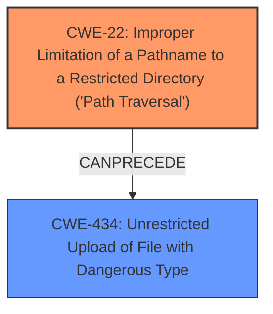

# Analysis Report for CVE-2024-6127

# Vulnerability Analysis Report: CVE-2024-6127

## Description

BC Security Empire before 5.9.3 is vulnerable to a **path traversal** issue that can lead to remote code execution. A remote, unauthenticated attacker can exploit this vulnerability over HTTP by acting as a normal agent, completing all cryptographic handshakes, and then triggering an upload of payload data containing a malicious path.

## Vulnerability Description Key Phrases

- **Weakness:** path traversal
- **Impact:** remote code execution
- **Vector:** upload of payload data containing a malicious path
- **Attacker:** remote unauthenticated attacker
- **Product:** BC Security Empire
- **Version:** before 5.9.3

## Analysis (with Relationship Data)

# Summary
| CWE ID | CWE Name | Confidence | CWE Abstraction Level | CWE Vulnerability Mapping Label | CWE-Vulnerability Mapping Notes |
|---|---|---|---|---|---|
| CWE-22 | Improper Limitation of a Pathname to a Restricted Directory ('Path Traversal') | 1.0 | Base | Primary | Allowed |
| CWE-434 | Unrestricted Upload of File with Dangerous Type | 0.7 | Base | Secondary | Allowed |

## Evidence and Confidence

*   **Confidence Score:** 0.9
*   **Evidence Strength:** HIGH

## Relationship Analysis
The primary relationship influencing the selection is that CWE-22 is a specific type of path traversal vulnerability. CWE-434 is related because the vulnerability involves uploading a file with a dangerous type, which is made possible due to the path traversal issue. CWE-22 and CWE-434 can be chained, where the path traversal allows writing a malicious file via upload to an arbitrary location, leading to code execution.



## Vulnerability Chain
The vulnerability chain starts with the **path traversal** (**CWE-22**) which allows an attacker to upload a file with a dangerous type (**CWE-434**) to an arbitrary location, leading to remote code execution.

## Summary of Analysis
The initial analysis identified CWE-22 as the primary weakness due to the **path traversal** issue described in the vulnerability. This is supported by the vulnerability description key phrases and the CVE reference links content summary. The retriever results also ranked CWE-22 as the top candidate.

The selection of CWE-22 is based on the evidence provided in the vulnerability description, which specifically mentions a **path traversal** issue. The CVE reference links content summary also confirms the presence of a **path traversal** vulnerability.
The description states: "BC Security Empire before 5.9.3 is vulnerable to a **path traversal** issue that can lead to remote code execution. A remote, unauthenticated attacker can exploit this vulnerability over HTTP by acting as a normal agent, completing all cryptographic handshakes, and then triggering an upload of payload data containing a malicious path."

I am also including CWE-434 as a secondary weakness because the vulnerability involves uploading a file with a dangerous type, which is made possible due to the path traversal issue. The description refers to "triggering an upload of payload data containing a malicious path"

My selected CWEs are at the optimal level of specificity, as CWE-22 is a base-level CWE that directly describes the **path traversal** issue, and CWE-434 describes the unrestricted upload of dangerous file type.

CWE-23 (Relative Path Traversal) and CWE-36 (Absolute Path Traversal) were considered as more specific variants of CWE-22. However, the provided information does not specify whether the path traversal is relative or absolute, so the more general CWE-22 was chosen. CWE-73 (External Control of File Name or Path) was also considered, but CWE-22 is more specific to the path traversal issue.
CWE-20 (Improper Input Validation) was not selected because it is a high-level class and the vulnerability description provides more specific details about the **path traversal** issue.
CWE-306 (Missing Authentication for Critical Function) was not selected because, while the attacker is unauthenticated, the primary weakness is the path traversal itself.
CWE-98 (Improper Control of Filename for Include/Require Statement in PHP Program ('PHP Remote File Inclusion')) was not selected because the vulnerability is not specific to PHP.


## CWE Relationship Analysis

Current CWEs represent these abstraction levels: .


### Vulnerability Chain Analysis

**Chain starting from CWE-22:**
- 22 (Improper Limitation of a Pathname to a Restricted Directory ('Path Traversal')) - ROOT


**Chain starting from CWE-73:**
- 73 (External Control of File Name or Path) - ROOT


### CWE Relationship Diagram

```mermaid
graph TD
    classDef primary fill:#f96,stroke:#333,stroke-width:2px
    classDef secondary fill:#69f,stroke:#333
    classDef tertiary fill:#9e9,stroke:#333
```


*Report generated on 2025-07-14 01:15:04*
