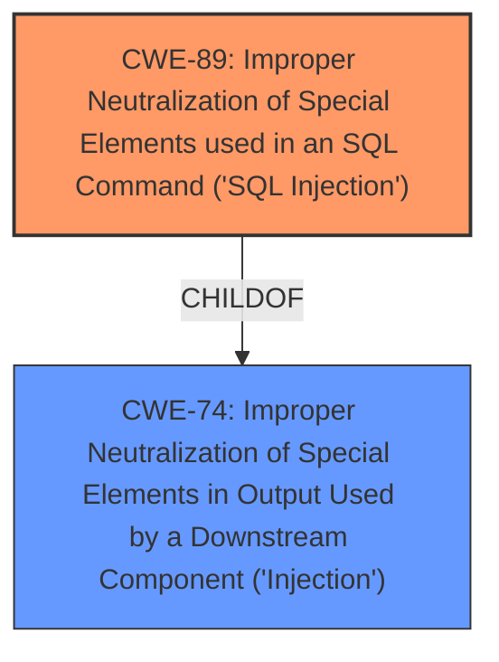

# Analysis for CVE-2024-6166

# Summary
| CWE ID | CWE Name | Confidence | CWE Abstraction Level | CWE Vulnerability Mapping Label | CWE-Vulnerability Mapping Notes |
|---|---|---|---|---|---|
| CWE-89 | Improper Neutralization of Special Elements used in an SQL Command ('SQL Injection') | 1 | Base | Allowed | Primary CWE |

## Evidence and Confidence

*   **Confidence Score:** 1
*   **Evidence Strength:** HIGH

## Relationship Analysis
The primary relationship that influenced the CWE selection was the ChildOf relationship between CWE-89 and CWE-74. While CWE-74 is a broader class of injection vulnerabilities, the specific vulnerability description clearly indicates SQL injection, making CWE-89 the more appropriate and specific choice.

## Vulnerability Chain
The vulnerability chain starts with **insufficient escaping** and **lack of sufficient preparation** of the SQL query, leading to the **time-based SQL Injection** vulnerability. The ultimate impact is the ability to extract sensitive information from the database.

## Summary of Analysis
The analysis is based on the provided evidence, which includes the vulnerability description, key phrases, and CVE reference links content summary. The vulnerability description explicitly mentions **"time-based SQL Injection"** and attributes it to **"insufficient escaping on the user supplied parameter and lack of sufficient preparation on the existing SQL query"**. The CVE reference links content summary further confirms that the root cause is **insufficient input sanitization/escaping** and **lack of prepared statements**, resulting in a time-based SQL injection vulnerability that allows for sensitive data extraction. The retriever results also strongly suggest CWE-89 as the most relevant CWE.

The selected CWE, CWE-89, is at the optimal level of specificity as it directly addresses the identified SQL injection vulnerability.

Relevant CWE Information:

# Enhanced Context (25 CWEs)
The following CWEs were identified as potentially relevant to this vulnerability:

## CWE-89: Improper Neutralization of Special Elements used in an SQL Command ('SQL Injection')
**Abstraction Level**: Base
**Similarity Score**: 0.80
**Source**: alternate_terms

**Description**:
The product constructs all or part of an SQL command using externally-influenced input from an upstream component, but it does not neutralize or incorrectly neutralizes special elements that could modify the intended SQL command when it is sent to a downstream component. Without sufficient removal or quoting of SQL syntax in user-controllable inputs, the generated SQL query can cause those inputs to be interpreted as SQL instead of ordinary user data.

**Mapping Guidance**:
- Usage: Allowed
- Rationale: This CWE entry is at the Base level of abstraction, which is a preferred level of abstraction for mapping to the root causes of vulnerabilities.

# Complete CWE Specifications

CWE-89: Improper Neutralization of Special Elements used in an SQL Command ('SQL Injection')
**Abstraction Level**: base

**Description**:
CWE-89: Improper Neutralization of Special Elements used in an SQL Command ('SQL Injection')

**Mapping Guidance**:
- Usage: Allowed
- Rationale: This CWE entry is at the Base level of abstraction, which is a preferred level of abstraction for mapping to the root causes of vulnerabilities.

**Relationships**:
- PARENTOF -> CWE-564
- CANFOLLOW -> CWE-456
- CHILDOF -> CWE-74
- CHILDOF -> CWE-943
- PARENTOF -> CWE-89

The vulnerability description clearly points to an SQL Injection vulnerability due to **insufficient escaping** and **lack of sufficient preparation** on the SQL query. Therefore, CWE-89 is the most appropriate choice.

CWEs Considered but Not Used:

*   CWE-74: Improper Neutralization of Special Elements in Output Used by a Downstream Component ('Injection') - While this is a parent of CWE-89, it is too general for this specific case of SQL Injection.
*   CWE-116: Improper Encoding or Escaping of Output - This is related to the **insufficient escaping**, but CWE-89 more accurately captures the vulnerability.
*   CWE-863: Incorrect Authorization and CWE-862: Missing Authorization - These CWEs are related to authorization issues, but the vulnerability is primarily due to SQL injection.
*   CWE-91: XML Injection (aka Blind XPath Injection) - This is specific to XML injection, which is not the case here.