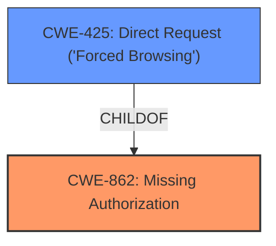

# Raw Analyzer Response for CVE-2024-6167

# Summary
| CWE ID | CWE Name | Confidence | CWE Abstraction Level | CWE Vulnerability Mapping Label | CWE-Vulnerability Mapping Notes |
|---|---|---|---|---|---|
| CWE-862 | Missing Authorization | 1.0 | Class | Primary | Allowed-with-Review |
| CWE-425 | Direct Request ('Forced Browsing') | 0.7 | Base | Secondary | Allowed |

## Evidence and Confidence

*   **Confidence Score:** 0.9
*   **Evidence Strength:** HIGH

## Relationship Analysis
The primary relationship that impacted the decision was the parent-child relationship between CWE-862 (Missing Authorization) and its potential base-level children. While a more specific child CWE might exist, the provided information doesn't give enough detail to pinpoint it. CWE-425 (Direct Request) was considered due to the network-accessible AJAX endpoints, which suggests a direct request to resources that lack proper authorization.

## Vulnerability Chain
The vulnerability chain starts with the **missing capability check** (**missing authorization**) on AJAX functions. This allows an authenticated user (subscriber or higher) to make direct requests to resources or functionalities that are intended for administrators, leading to unauthorized access and manipulation of data.

## Summary of Analysis
The initial analysis strongly pointed to CWE-862 (Missing Authorization) as the primary weakness due to the explicit mention of a **missing capability check** in the vulnerability description and CVE summary. The secondary consideration was CWE-425 (Direct Request), given the vulnerability is exploitable via network requests to AJAX endpoints.

The decision is based on the evidence provided, mainly the "Vulnerability Description Key Phrases" and "CVE Reference Links Content Summary". The vulnerability description states a "**missing capability check** on several AJAX functions," which is direct evidence for CWE-862. The CVE summary further reinforces this by mentioning the "absence of proper capability checks."

CWE-862 is selected as the primary CWE because it directly represents the **root cause**: the **lack of authorization checks**. CWE-425 is secondary since the AJAX endpoints lack authorization checks and are directly accessible via HTTP requests.

Relevant CWE Information:

# Enhanced Context (25 CWEs)
The following CWEs were identified as potentially relevant to this vulnerability:

## CWE-352: Cross-Site Request Forgery (CSRF)
**Abstraction Level**: Compound
**Similarity Score**: 0.74
**Source**: dense

**Description**:
The web application does not, or can not, sufficiently verify whether a well-formed, valid, consistent request was intentionally provided by the user who submitted the request.

**Mapping Guidance**:
- Usage: Allowed
- Rationale: This is a well-known Composite of multiple weaknesses that must all occur simultaneously, although it is attack-oriented in nature.

*Not Selected:* CSRF requires the exploitation of trust between the user and the application, which is not explicitly stated here. The primary issue is authorization, not forged requests.

## CWE-472: External Control of Assumed-Immutable Web Parameter
**Abstraction Level**: Base
**Similarity Score**: 0.69
**Source**: dense

**Description**:
The web application does not sufficiently verify inputs that are assumed to be immutable but are actually externally controllable, such as hidden form fields.

**Mapping Guidance**:
- Usage: Allowed
- Rationale: This CWE entry is at the Base level of abstraction, which is a preferred level of abstraction for mapping to the root causes of vulnerabilities.

*Not Selected:* This CWE relates to the manipulation of parameters assumed to be immutable, which isn't the core issue here. The vulnerability stems from the lack of authorization checks, not parameter manipulation.

## CWE-425: Direct Request ('Forced Browsing')
**Abstraction Level**: Base
**Similarity Score**: 0.69
**Source**: dense

**Description**:
The web application does not adequately enforce appropriate authorization on all restricted URLs, scripts, or files.

**Mapping Guidance**:
- Usage: Allowed
- Rationale: This CWE entry is at the Base level of abstraction, which is a preferred level of abstraction for mapping to the root causes of vulnerabilities.

*Selected as Secondary:* The vulnerability is accessible over the network via HTTP requests to the vulnerable AJAX endpoints. This suggests that the application does not adequately enforce appropriate authorization on all restricted URLs, scripts, or files.

## CWE-639: Authorization Bypass Through User-Controlled Key
**Abstraction Level**: Base
**Similarity Score**: 0.68
**Source**: dense

**Description**:
The system's authorization functionality does not prevent one user from gaining access to another user's data or record by modifying the key value identifying the data.

**Mapping Guidance**:
- Usage: Allowed
- Rationale: This CWE entry is at the Base level of abstraction, which is a preferred level of abstraction for mapping to the root causes of vulnerabilities.

*Not Selected:* The vulnerability does not specifically mention the modification of a key value to gain access to another user's data. The core issue is a **missing authorization check** for certain functionalities.

## CWE-862: Missing Authorization
**Abstraction Level**: Class
**Similarity Score**: 0.68
**Source**: dense

**Description**:
The product does not perform an authorization check when an actor attempts to access a resource or perform an action.

**Mapping Guidance**:
- Usage: Allowed-with-Review
- Rationale: This CWE entry is a Class and might have Base-level children that would be more appropriate

*Selected as Primary:* The vulnerability description explicitly states a **missing capability check**, indicating a **lack of authorization** when an authenticated user attempts to access certain functionalities.

## CWE-434: Unrestricted Upload of File with Dangerous Type
**Abstraction Level**: Base
**Similarity Score**: 0.67
**Source**: dense

**Description**:
The product allows the upload or transfer of dangerous file types that are automatically processed within its environment.

**Mapping Guidance**:
- Usage: Allowed
- Rationale: This CWE entry is at the Base level of abstraction, which is a preferred level of abstraction for mapping to the root causes of vulnerabilities.

*Not Selected:* File uploads are not mentioned in the vulnerability description.

## CWE-201: Insertion of Sensitive Information Into Sent Data
**Abstraction Level**: Base
**Similarity Score**: 0.66
**Source**: dense

**Description**:
The code transmits data to another actor, but a portion of the data includes sensitive information that should not be accessible to that actor.

**Mapping Guidance**:
- Usage: Allowed
- Rationale: This CWE entry is at the Base level of abstraction, which is a preferred level of abstraction for mapping to the root causes of vulnerabilities.

*Not Selected:* The vulnerability is about authorization bypass, not the disclosure of sensitive information.

## CWE-502: Deserialization of Untrusted Data
**Abstraction Level**: Base
**Similarity Score**: 0.65
**Source**: dense

**Description**:
The product deserializes untrusted data without sufficiently ensuring that the resulting data will be valid.

**Mapping Guidance**:
- Usage: Allowed
- Rationale: This CWE entry is at the Base level of abstraction, which is a preferred level of abstraction for mapping to the root causes of vulnerabilities.

*Not Selected:* Deserialization is not mentioned in the vulnerability description.

## CWE-116: Improper Encoding or Escaping of Output
**Abstraction Level**: Class
**Similarity Score**: 0.65
**Source**: dense

**Description**:
The product prepares a structured message for communication with another component, but encoding or escaping of the data is either missing or done incorrectly. As a result, the intended structure of the message is not preserved.

**Mapping Guidance**:
- Usage: Allowed-with-Review
- Rationale: This CWE entry is a Class and might have Base-level children that would be more appropriate

*Not Selected:* Encoding/escaping issues are not related to the identified vulnerability.

## CWE-79: Improper Neutralization of Input During Web Page Generation ('Cross-site Scripting')
**Abstraction Level**: Base
**Similarity Score**: 0.65
**Source**: dense

**Description**:
The product does not neutralize or incorrectly neutralizes user-controllable input before it is placed in output that is used as a web page that is served to other users.

**Mapping Guidance**:
- Usage: Allowed
- Rationale: This CWE entry is at the Base level of abstraction, which is a preferred level of abstraction for mapping to the root causes of vulnerabilities.

*Not Selected:* XSS is not mentioned and is not the primary issue.

## CWE-862: Missing Authorization
**Abstraction Level**: Class
**Similarity Score**: 1017.25
**Source**: sparse

**Description**:
The product does not perform an authorization check when an actor attempts to access a resource or perform an