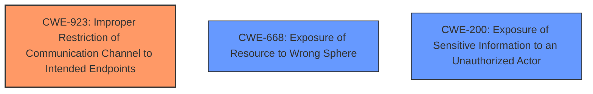

# Raw Analyzer Response for CVE-2024-6221

# Summary

| CWE ID | CWE Name | Confidence | CWE Abstraction Level | CWE Vulnerability Mapping Label | CWE-Vulnerability Mapping Notes |
|---|---|---|---|---|---|
| CWE-923 | Improper Restriction of Communication Channel to Intended Endpoints | 0.9 | Class | Allowed-with-Review | Primary CWE |
| CWE-668 | Exposure of Resource to Wrong Sphere | 0.7 | Class | Discouraged | Secondary Candidate |
| CWE-200 | Exposure of Sensitive Information to an Unauthorized Actor | 0.6 | Class | Discouraged | Secondary Candidate |

## Evidence and Confidence

*   **Confidence Score:** 0.8
*   **Evidence Strength:** MEDIUM

## Relationship Analysis
The primary relationship influencing the decision is that CWE-923 is a Class-level CWE that captures the **improper restriction of a communication channel**, which aligns well with the default `Access-Control-Allow-Private-Network` CORS header being set to true without proper configuration. CWE-668 and CWE-200 are considered but deemed less specific.

## Vulnerability Chain
The chain starts with the **weakness** of "Access-Control-Allow-Private-Network CORS header set to true by default", which results in the impact of exposing private network resources to unauthorized external access, data breaches, unauthorized access to sensitive information, and potential network intrusions.
  - **Root Cause:** **Access-Control-Allow-Private-Network CORS header set to true by default**
  - **Impact:** Expose private network resources to unauthorized external access
  - **Impact:** Data breaches
  - **Impact:** Unauthorized access to sensitive information
  - **Impact:** Potential network intrusions

## Summary of Analysis
The primary CWE selected is CWE-923 (Improper Restriction of Communication Channel to Intended Endpoints) because the vulnerability description highlights that the `Access-Control-Allow-Private-Network` CORS header is set to true by default. This **incorrectly allows communication** with private network resources from unintended endpoints.

The vulnerability description clearly states: "A vulnerability in corydolphin/flask-cors version 4.0.1 allows the `Access-Control-Allow-Private-Network` CORS header to be set to true by default, without any configuration option. This behavior can expose private network resources to unauthorized external access, leading to significant security risks such as data breaches, unauthorized access to sensitive information, and potential network intrusions."

CWE-668 (Exposure of Resource to Wrong Sphere) and CWE-200 (Exposure of Sensitive Information to an Unauthorized Actor) were considered but deemed less specific. CWE-668 is discouraged for being too high-level, and CWE-200 focuses more on the exposure of sensitive *information* rather than the communication channel itself. The optimal level of specificity is achieved with CWE-923, as it directly addresses the **improper restriction** of the communication channel.