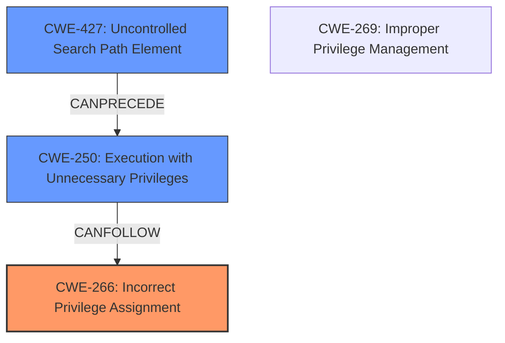

# Raw Analyzer Response for CVE-2024-6240

# Summary
| CWE ID | CWE Name | Confidence | CWE Abstraction Level | CWE Vulnerability Mapping Label | CWE-Vulnerability Mapping Notes |
|---|---|---|---|---|---|
| CWE-266 | Incorrect Privilege Assignment | 0.9 | Base | Primary | Allowed |
| CWE-250 | Execution with Unnecessary Privileges | 0.7 | Base | Secondary Candidate | Allowed |
| CWE-427 | Uncontrolled Search Path Element | 0.6 | Base | Secondary Candidate | Allowed |

## Evidence and Confidence

*   **Confidence Score:** 0.8
*   **Evidence Strength:** HIGH

## Relationship Analysis
The primary relationship is between CWE-266, representing the **incorrect privilege assignment**, and CWE-250, representing **execution with unnecessary privileges**. CWE-266 directly contributes to the condition where the application starts with elevated privileges, allowing the injected script to execute with those privileges. CWE-427 could be a factor if the environment variable points to a location where an attacker has control and the application trusts the search path. The abstraction levels are all Base, reflecting specific, actionable weaknesses.

## Vulnerability Chain
The vulnerability chain starts with the **improper privilege assignment** (CWE-266) allowing an attacker to add a malicious script. Because of the **improper privilege management**, the application executes this script with **unnecessary privileges** (CWE-250), leading to privilege escalation. **Uncontrolled search path element** (CWE-427) is a potential factor as well.

## Summary of Analysis
The primary CWE is CWE-266 (Incorrect Privilege Assignment). The application incorrectly allows the BASH_ENV variable to influence its startup environment, leading to the execution of attacker-controlled code with elevated privileges. This assessment is strongly based on the provided evidence, particularly the "CVE Reference Links Content Summary" section, which states "**Root cause of vulnerability**: **Improper privilege management** in Parallels Desktop. An attacker can add malicious code to a script and set the BASH_ENV environment variable to point to it. This script then executes upon application startup." The selection of CWE-266 is further supported by the keyword matches and the privilege vs. permissions guidance, which recommends CWE-266 for role misassignments.

CWE-250 (Execution with Unnecessary Privileges) is considered a secondary factor, as the application's design allows it to run with higher privileges than necessary, amplifying the impact of the injected script.

CWE-427 (Uncontrolled Search Path Element) is also a candidate because the application uses an environment variable to find the script. If the attacker can control the search path, it could influence which script is executed.

CWE-269 (Improper Privilege Management) was considered but deemed too high-level.

Relevant CWE Information:

# Enhanced Context (25 CWEs)

## CWE-266: Incorrect Privilege Assignment
**Abstraction Level**: Base
**Similarity Score**: 0.79
**Source**: dense

**Description**:
A product incorrectly assigns a privilege to a particular actor, creating an unintended sphere of control for that actor.

**Mapping Guidance**:
- Usage: Allowed
- Rationale: This CWE entry is at the Base level of abstraction, which is a preferred level of abstraction for mapping to the root causes of vulnerabilities.

## CWE-250: Execution with Unnecessary Privileges
**Abstraction Level**: base
**Similarity Score**: 2.47
**Source**: graph

**Description**:
CWE-250: Execution with Unnecessary Privileges

**Mapping Guidance**:
- Usage: Allowed
- Rationale: This CWE entry is at the Base level of abstraction, which is a preferred level of abstraction for mapping to the root causes of vulnerabilities.

## CWE-427: Uncontrolled Search Path Element
**Abstraction Level**: base
**Similarity Score**: 2.47
**Source**: graph

**Description**:
CWE-427: Uncontrolled Search Path Element

**Mapping Guidance**:
- Usage: Allowed
- Rationale: This CWE entry is at the Base level of abstraction, which is a preferred level of abstraction for mapping to the root causes of vulnerabilities.