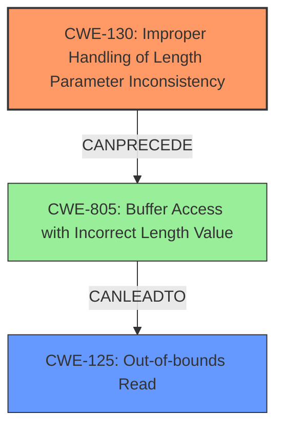

# Raw Analyzer Response for CVE-2024-6258

# Summary
| CWE ID | CWE Name | Confidence | CWE Abstraction Level | CWE Vulnerability Mapping Label | CWE-Vulnerability Mapping Notes |
|---|---|---|---|---|---|
| CWE-130 | Improper Handling of Length Parameter Inconsistency | 0.9 | Base | Allowed | Primary CWE - Root cause is a **missing length check** |
| CWE-125 | Out-of-bounds Read | 0.7 | Base | Allowed | Secondary CWE - Result of the **missing length check**|

## Evidence and Confidence

*   **Confidence Score:** 0.8
*   **Evidence Strength:** HIGH

## Relationship Analysis
The primary CWE is CWE-130, which represents the **improper handling of length parameter inconsistency**. This is directly supported by the vulnerability description stating "**Missing length checks of net_buf**". CWE-130 can lead to CWE-805 (Buffer Access with Incorrect Length Value) and subsequently to CWE-125 (Out-of-bounds Read). The relationship highlights how an initial flaw in handling length parameters propagates to cause a read beyond buffer boundaries.

## Vulnerability Chain
The vulnerability chain starts with the **missing length checks** (CWE-130). This leads to a scenario where the buffer is accessed with an incorrect length value (CWE-805), ultimately resulting in an out-of-bounds read (CWE-125) when `net_buf_pull_u8(buf)` is called with insufficient buffer length.

## Summary of Analysis
The primary vulnerability lies in the **missing length checks** within the `rfcomm_handle_data` function, as explicitly stated in the vulnerability description and CVE reference. This aligns directly with CWE-130 (Improper Handling of Length Parameter Inconsistency). The subsequent out-of-bounds read is a consequence of this primary weakness.

The evidence supports the classification of CWE-130 as the primary root cause because the vulnerability description states "**Missing length checks of net_buf**".
The CVE Reference Links Content Summary also supports this: "**Missing Length Check:** The `rfcomm_handle_data` function lacks sufficient length checks on the `net_buf` (`buf`)."
CWE-125 Out-of-bounds Read is a secondary effect of the primary rootcause.

Relevant CWE Information:

# Enhanced Context (25 CWEs)
The following CWEs were identified as potentially relevant to this vulnerability:

## CWE-130: Improper Handling of Length Parameter Inconsistency
**Abstraction Level**: Base
**Similarity Score**: 0.71
**Source**: dense

**Description**:
The product parses a formatted message or structure, but it does not handle or incorrectly handles a length field that is inconsistent with the actual length of the associated data.

**Mapping Guidance**:
- Usage: Allowed
- Rationale: This CWE entry is at the Base level of abstraction, which is a preferred level of abstraction for mapping to the root causes of vulnerabilities.

## CWE-125: Out-of-bounds Read
**Abstraction Level**: Base
**Similarity Score**: 750.71
**Source**: sparse

**Description**:
The product reads data past the end, or before the beginning, of the intended buffer.

**Mapping Guidance**:
- Usage: Allowed
- Rationale: This CWE entry is at the Base level of abstraction, which is a preferred level of abstraction for mapping to the root causes of vulnerabilities.