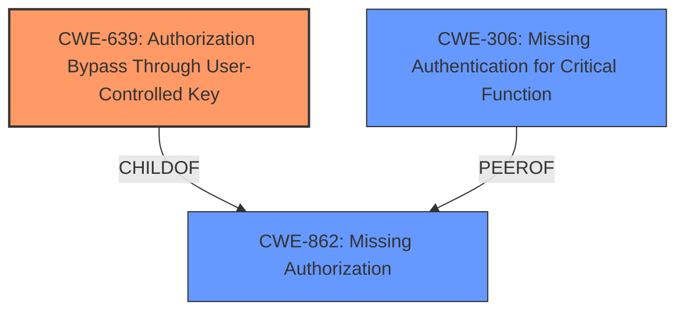

# Analysis for CVE-2024-6289

# Summary

| CWE ID | CWE Name | Confidence | CWE Abstraction Level | CWE Vulnerability Mapping Label | CWE-Vulnerability Mapping Notes |
|---|---|---|---|---|---|
| CWE-639 | Authorization Bypass Through User-Controlled Key | 0.75 | Base | Allowed | Primary CWE |
| CWE-306 | Missing Authentication for Critical Function | 0.5 | Base | Allowed | Secondary Candidate |
| CWE-862 | Missing Authorization | 0.4 | Class | Allowed-with-Review | Secondary Candidate |

## Evidence and Confidence

*   **Confidence Score:** 0.7
*   **Evidence Strength:** MEDIUM

## Relationship Analysis
The primary relationship that influenced the CWE selection was the child-of relationship, specifically how CWE-639 Authorization Bypass Through User-Controlled Key is a child of CWE-862 Missing Authorization. The vulnerability description explicitly points to a bypass of the intended hiding mechanism through manipulation of the `auth_redirect` function, and thus a more precise CWE was desired.

## Vulnerability Chain
The vulnerability chain starts with the **improper handling of redirects** via the `auth_redirect` function, leading to an authorization bypass and ultimately allowing access to the hidden login page.

1.  **Root Cause:** Failure to properly prevent redirects to the login page via the `auth_redirect` WordPress function (**CWE-639: Authorization Bypass Through User-Controlled Key**)
2.  **Impact:** Access to the hidden login page (Sensitive Data Disclosure).

## Summary of Analysis
The initial analysis focused on identifying the root cause of the vulnerability based on the provided descriptions. The key evidence comes from the "Vulnerability Description Key Phrases" that indicated the **rootcause** as "**not preventing redirects to the login page via the auth_redirect WordPress function**". The "CVE Reference Links Content Summary" further supports this by stating that "The vulnerability stems from the "WPS Hide Login" plugin's failure to properly prevent redirects to the login page through the WordPress `auth_redirect` function."

The selection of CWE-639 is based on the fact that the vulnerability allows an unauthenticated user to access a protected resource (the hidden login page) by manipulating the redirect mechanism. This aligns with the description of CWE-639 which focuses on authorization bypass through user-controlled keys (in this case, the redirect parameters).

CWE-306 and CWE-862 were considered because they both relate to missing authentication or authorization. However, CWE-639 is more specific as it describes how the bypass is achieved through a user-controlled key, providing a more accurate representation of the vulnerability.

The chosen CWEs are at the optimal level of specificity because they directly address the root cause (CWE-639) and potential higher-level causes (CWE-306 and CWE-862) of the vulnerability. The analysis is heavily based on the provided evidence, specifically the vulnerability description and the CVE reference summary.

Relevant CWE Information:

# Enhanced Context (25 CWEs)
The following CWEs were identified as potentially relevant to this vulnerability:

## CWE-352: Cross-Site Request Forgery (CSRF)
**Abstraction Level**: Compound
**Similarity Score**: 0.74
**Source**: dense

**Description**:
The web application does not, or can not, sufficiently verify whether a well-formed, valid, consistent request was intentionally provided by the user who submitted the request.

**Mapping Guidance**:
- Usage: Allowed
- Rationale: This is a well-known Composite of multiple weaknesses that must all occur simultaneously, although it is attack-oriented in nature.

*Not Used:* CSRF is not the primary weakness.

## CWE-425: Direct Request ('Forced Browsing')
**Abstraction Level**: Base
**Similarity Score**: 0.73
**Source**: dense

**Description**:
The web application does not adequately enforce appropriate authorization on all restricted URLs, scripts, or files.

**Mapping Guidance**:
- Usage: Allowed
- Rationale: This CWE entry is at the Base level of abstraction, which is a preferred level of abstraction for mapping to the root causes of vulnerabilities.

*Not Used:* While related, this CWE is too broad. The issue is more specific than just a failure to enforce authorization.

## CWE-472: External Control of Assumed-Immutable Web Parameter
**Abstraction Level**: Base
**Similarity Score**: 0.71
**Source**: dense

**Description**:
The web application does not sufficiently verify inputs that are assumed to be immutable but are actually externally controllable, such as hidden form fields.

**Mapping Guidance**:
- Usage: Allowed
- Rationale: This CWE entry is at the Base level of abstraction, which is a preferred level of abstraction for mapping to the root causes of vulnerabilities.

*Not Used:* While related, it is not as accurate as CWE-639. The problem is with the redirect, not with assumed immutable parameters.

## CWE-288: Authentication Bypass Using an Alternate Path or Channel
**Abstraction Level**: Base
**Similarity Score**: 0.70
**Source**: dense

**Description**:
The product requires authentication, but the product has an alternate path or channel that does not require authentication.

**Mapping Guidance**:
- Usage: Allowed
- Rationale: This CWE entry is at the Base level of abstraction, which is a preferred level of abstraction for mapping to the root causes of vulnerabilities.

*Not Used:* Similar to CWE-425, but CWE-639 is more accurate.

## CWE-639: Authorization Bypass Through User-Controlled Key
**Abstraction Level**: Base
**Similarity Score**: 0.69
**Source**: dense

**Description**:
The system's authorization functionality does not prevent one user from gaining access to another user's data or record by modifying the key value identifying the data.

**Mapping Guidance**:
- Usage: Allowed
- Rationale: This CWE entry is at the Base level of abstraction, which is a preferred level of abstraction for mapping to the root causes of vulnerabilities.

*Used:* This is the primary CWE. The vulnerability allows bypassing the intended login page hiding mechanism by manipulating the redirect function (`auth_redirect`). This aligns with the CWE's focus on authorization bypass through user-controlled keys.

## CWE-178: Improper Handling of Case Sensitivity
**Abstraction Level**: Base
**Similarity Score**: 0.68
**Source**: dense

**Description**:
The product does not properly account for differences in case sensitivity when accessing or determining the properties of a resource, leading to inconsistent results.

**Mapping Guidance**:
- Usage: Allowed
- Rationale: This CWE entry is at the Base level of abstraction, which is a preferred level of abstraction for mapping to the root causes of vulnerabilities.

*Not Used:* Not relevant to this vulnerability.

## CWE-290: Authentication Bypass by Spoofing
**Abstraction Level**: Base
**Similarity Score**: 0.68
**Source**: dense

**Description**:
This attack-focused weakness is caused by incorrectly implemented authentication schemes that are subject to spoofing attacks.

**Mapping Guidance**:
- Usage: Allowed
- Rationale: This CWE entry is at the Base level of abstraction, which is a preferred level of abstraction for mapping to the root causes of vulnerabilities.

*Not Used:* Not relevant to this vulnerability.

## CWE-862: Missing Authorization
**Abstraction Level**: Class
**Similarity Score**: 0.68
**Source**: dense

**Description**:
The product does not perform an authorization check when an actor attempts to access a resource or perform an action.

**Mapping Guidance**:
- Usage: Allowed-with-Review
- Rationale: This CWE entry is a Class and might have Base-level children that would be more appropriate

*Used:* Considered as a secondary CWE. While CWE-639 is more specific, CWE-862 represents the broader category of missing authorization.

## CWE-434: Unrestricted Upload of File with Dangerous Type
**Abstraction Level**: Base
**Similarity Score**: 0.67
**Source**: dense

**Description**:
The product allows the upload or transfer of dangerous file types that are automatically processed within its environment.

**Mapping Guidance**:
- Usage: Allowed
- Rationale: This CWE entry is at the Base level of abstraction, which is a preferred level of abstraction for mapping to the root causes of vulnerabilities.

*Not Used:* Not relevant to this vulnerability.

## CWE-306: Missing Authentication for Critical Function
**Abstraction Level**: Base
**Similarity Score**: 0.67
**