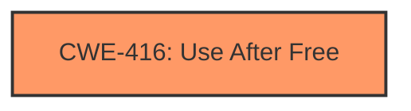

# Raw Analyzer Response for CVE-2024-6292

# Summary
| CWE ID | CWE Name | Confidence | CWE Abstraction Level | CWE Vulnerability Mapping Label | CWE-Vulnerability Mapping Notes |
|---|---|---|---|---|---|
| CWE-416 | Use After Free | 1.0 | Variant | Primary CWE | Allowed |

## Evidence and Confidence

*   **Confidence Score:** 1.0
*   **Evidence Strength:** HIGH

## Relationship Analysis
The primary relationship that influenced the decision was the direct match of the vulnerability description to **CWE-416 (Use After Free)**. While other CWEs like **CWE-415 (Double Free)** and **CWE-787 (Out-of-bounds Write)** were considered, they did not align as directly with the explicit mention of "use after free" in the vulnerability description. The **CWE-416 (Use After Free)** is a variant, which is a preferred level of abstraction.

## Vulnerability Chain
The vulnerability chain starts with the **CWE-416 (Use After Free)** condition, which leads to heap corruption.
  - Root Cause: **CWE-416 (Use After Free)** - Memory is accessed after it has been freed.
  - Impact: Heap corruption, potentially leading to arbitrary code execution.

## Summary of Analysis
The analysis is based on the explicit mention of "use after free" in the vulnerability description and CVE Reference Links Content Summary. The **CWE-416 (Use After Free)** is the most appropriate mapping because it directly reflects the root cause of the vulnerability. The evidence is strong, and the confidence level is high.

The alternative CWEs considered, such as **CWE-415 (Double Free)**, **CWE-787 (Out-of-bounds Write)**, **CWE-366 (Race Condition within a Thread)**, and **CWE-843 (Access of Resource Using Incompatible Type ('Type Confusion'))**, were not selected because they did not directly match the stated **rootcause** of the vulnerability, which is a **use after free**.

# Enhanced Context (25 CWEs)
The following CWEs were identified as potentially relevant to this vulnerability:

## CWE-416: Use After Free
**Abstraction Level**: Variant
**Similarity Score**: 0.77
**Source**: dense

**Description**:
The product reuses or references memory after it has been freed. At some point afterward, the memory may be allocated again and saved in another pointer, while the original pointer references a location somewhere within the new allocation. Any operations using the original pointer are no longer valid because the memory "belongs" to the code that operates on the new pointer.

**Mapping Guidance**:
- Usage: Allowed
- Rationale: This CWE entry is at the Variant level of abstraction, which is a preferred level of abstraction for mapping to the root causes of vulnerabilities.