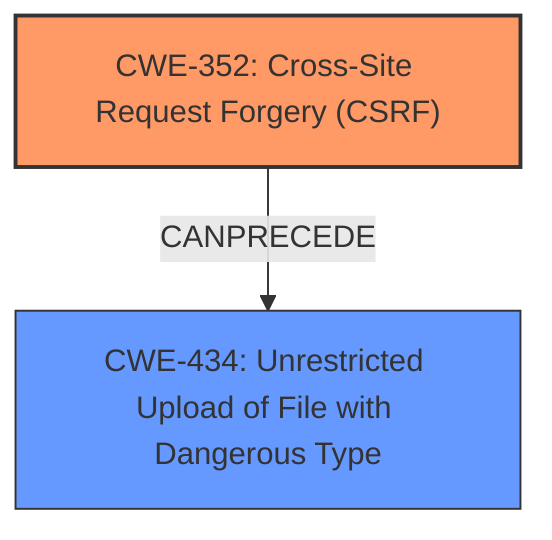

# Analysis for CVE-2024-6310

# Summary
| CWE ID | CWE Name | Confidence | CWE Abstraction Level | CWE Vulnerability Mapping Label | CWE-Vulnerability Mapping Notes |
|---|---|---|---|---|---|
| CWE-352 | Cross-Site Request Forgery (CSRF) | 1.0 | Compound | Primary | Allowed |
| CWE-434 | Unrestricted Upload of File with Dangerous Type | 0.9 | Base | Secondary | Allowed |

## Evidence and Confidence

*   **Confidence Score:** 0.95
*   **Evidence Strength:** HIGH

## Relationship Analysis
The primary weakness is CWE-352 [CWE-352: Cross-Site Request Forgery (CSRF)], which enables the **arbitrary file upload** due to **missing nonce validation**. This leads to CWE-434 [CWE-434: Unrestricted Upload of File with Dangerous Type] because there is **missing file type validation**. These weaknesses are related in that the CSRF vulnerability allows an attacker to bypass intended access controls, and the lack of file type validation allows them to upload malicious files.

## Vulnerability Chain
The vulnerability chain begins with **missing nonce validation** in the `admin_init_AAPL` function, leading to CWE-352 [CWE-352: Cross-Site Request Forgery (CSRF)]. This allows an attacker to forge requests. Subsequently, the **missing file type validation** in the `AAPL_options_validate` function, leading to CWE-434 [CWE-434: Unrestricted Upload of File with Dangerous Type], enables the attacker to upload arbitrary files, potentially leading to remote code execution.

## Summary of Analysis
The initial analysis identified CWE-352 [CWE-352: Cross-Site Request Forgery (CSRF)] as the primary weakness due to the **missing nonce validation**, and CWE-434 [CWE-434: Unrestricted Upload of File with Dangerous Type] as a secondary weakness due to the **missing file type validation**.

The vulnerability description states: "This is due to **missing nonce validation** in the admin_init_AAPL function and **missing file type validation** in the AAPL_options_validate function. This makes it possible for unauthenticated attackers to upload arbitrary files on the affected sites server which may make remote code execution possible via a forged request granted they can trick a site administrator into performing an action such as clicking on a link."

CWE-352 [CWE-352: Cross-Site Request Forgery (CSRF)] is selected as the primary CWE because the **missing nonce validation** allows an attacker to perform actions on behalf of an administrator. CWE-434 [CWE-434: Unrestricted Upload of File with Dangerous Type] is chosen as a secondary CWE because it directly enables the **arbitrary file upload** due to the **missing file type validation**.

Other CWEs were considered but not selected because they did not directly address the root causes described in the vulnerability description. For instance, CWE-862 [CWE-862: Missing Authorization] was considered, but the **missing nonce validation** more specifically points to a CSRF issue rather than a general authorization bypass. CWE-79 [CWE-79: Improper Neutralization of Input During Web Page Generation ('Cross-site Scripting')] and CWE-89 [CWE-89: Improper Neutralization of Special Elements used in an SQL Command ('SQL Injection')] were also considered but deemed irrelevant as the vulnerability does not involve script injection or SQL injection.